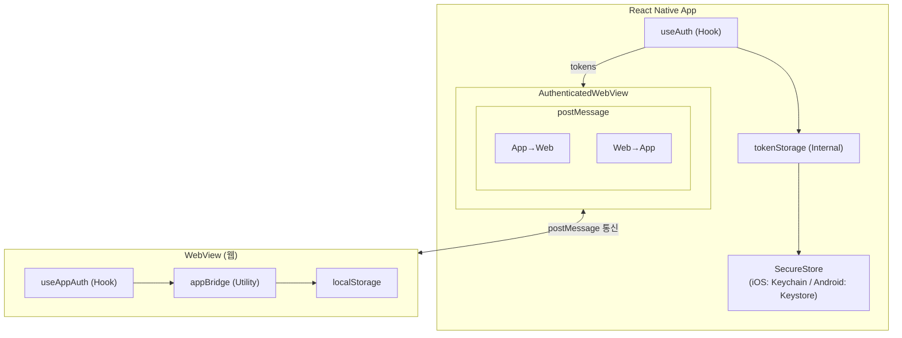
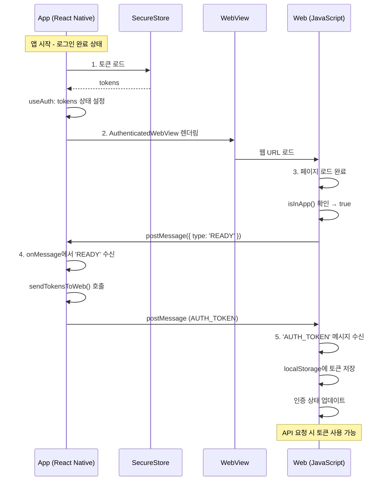
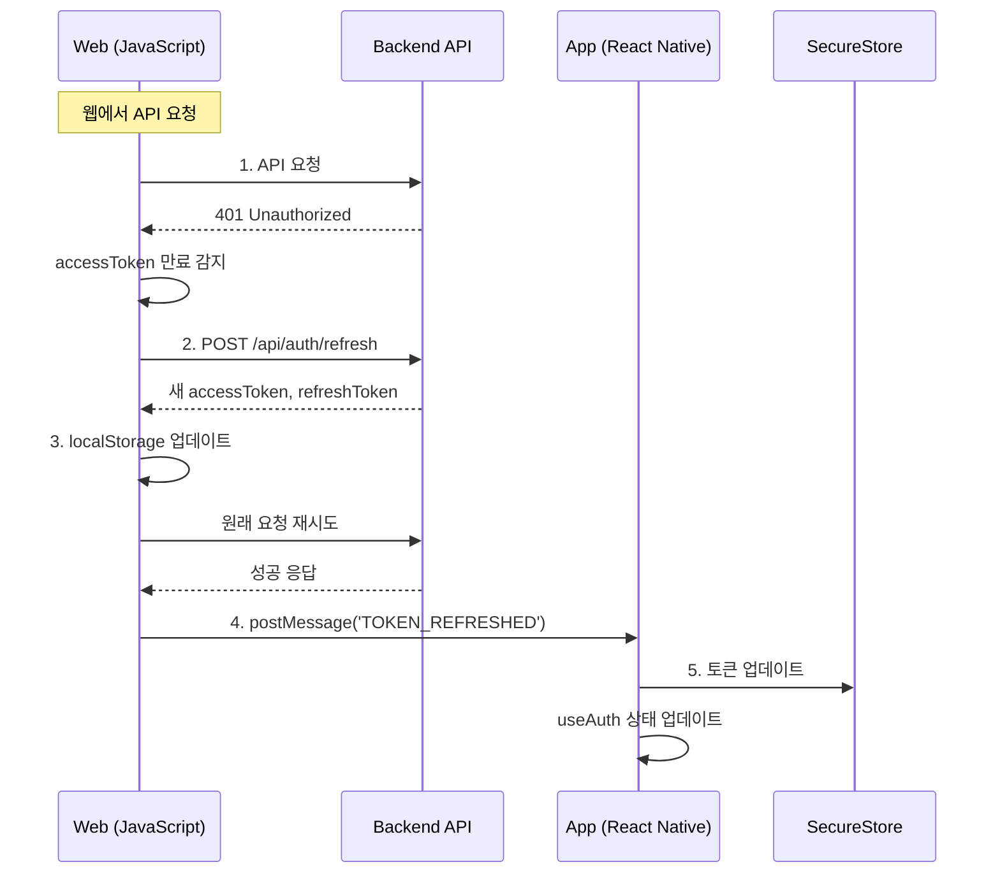
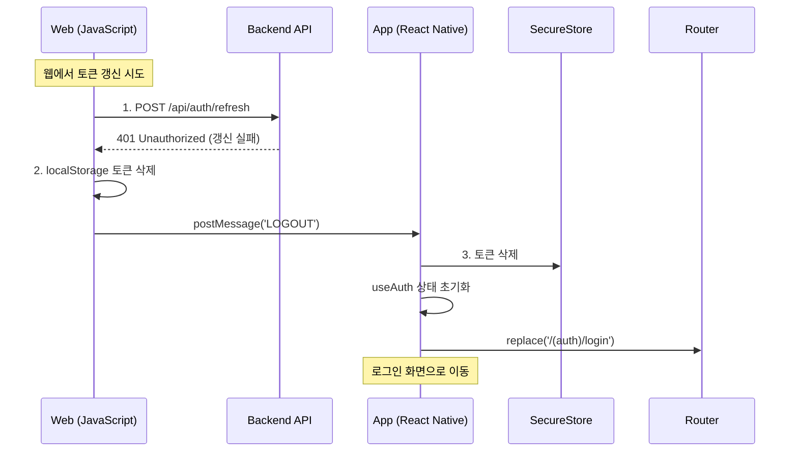
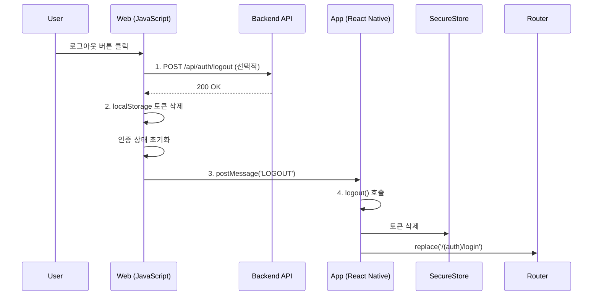
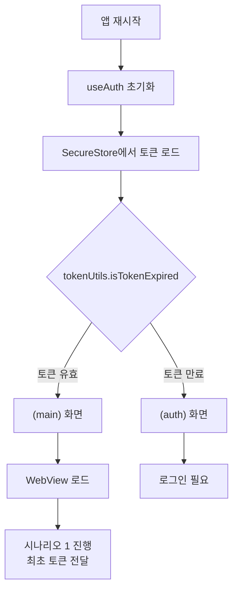
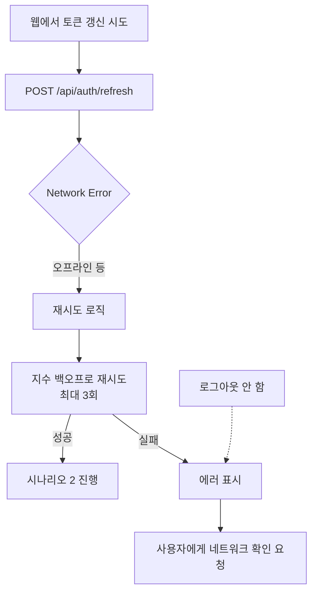
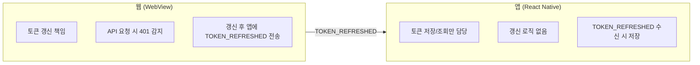

# WebView-App 토큰 플로우

## 개요

앱(React Native)과 WebView(웹) 간의 토큰 관리 플로우를 정의합니다. 양측이 동일한 인증 상태를 유지하고, 토큰 갱신/만료/로그아웃 등의 상황을 올바르게 처리하기 위한 가이드입니다.

## 아키텍처



## 메시지 프로토콜

### 메시지 타입 정의

| 방향 | 타입 | 페이로드 | 설명 |
|------|------|----------|------|
| 웹 → 앱 | `READY` | - | 웹 페이지 로드 완료, 토큰 요청 |
| 앱 → 웹 | `AUTH_TOKEN` | `{ accessToken, refreshToken }` | 토큰 전달 |
| 웹 → 앱 | `TOKEN_REFRESHED` | `{ accessToken, refreshToken }` | 웹에서 토큰 갱신됨 |
| 웹 → 앱 | `LOGOUT` | - | 웹에서 로그아웃 요청 |

### 메시지 구조

```typescript
interface WebViewMessage<T = unknown> {
  type: 'READY' | 'AUTH_TOKEN' | 'TOKEN_REFRESHED' | 'LOGOUT';
  payload?: T;
}

interface TokenPayload {
  accessToken: string;
  refreshToken: string;
}
```

## 시나리오별 플로우

### 시나리오 1: 앱 시작 - 최초 토큰 전달

사용자가 앱에서 로그인 완료 후 WebView가 로드되는 상황입니다.



**앱 측 코드:**

```typescript
// AuthenticatedWebView.tsx
const sendTokensToWeb = useCallback(() => {
  if (!tokens) return;

  const message = createMessage<TokenPayload>(MESSAGE_TYPES.AUTH_TOKEN, {
    accessToken: tokens.accessToken,
    refreshToken: tokens.refreshToken,
  });

  webViewRef.current?.injectJavaScript(`
    window.dispatchEvent(new MessageEvent('message', {
      data: ${message}
    }));
    true;
  `);
}, [tokens]);

const handleMessage = useCallback(async (event: WebViewMessageEvent) => {
  const message = parseMessage(event.nativeEvent.data);
  if (!message) return;

  if (message.type === MESSAGE_TYPES.READY) {
    sendTokensToWeb();
  }
}, [sendTokensToWeb]);
```

**웹 측 코드:**

```typescript
// hooks/useAppAuth.ts
useEffect(() => {
  if (!isInApp()) return;

  // 앱에 준비 완료 알림
  sendToApp('READY');

  // 앱에서 토큰 수신
  const unsubscribe = onAppMessage((message) => {
    if (message.type === 'AUTH_TOKEN' && message.payload) {
      const { accessToken, refreshToken } = message.payload;
      localStorage.setItem('accessToken', accessToken);
      localStorage.setItem('refreshToken', refreshToken);
    }
  });

  return unsubscribe;
}, []);
```

### 시나리오 2: 웹에서 토큰 갱신

웹에서 API 요청 중 accessToken 만료로 인해 refreshToken으로 새 토큰을 발급받는 상황입니다.



**웹 측 코드:**

```typescript
// api/client.ts (axios interceptor 예시)
axiosInstance.interceptors.response.use(
  (response) => response,
  async (error) => {
    const originalRequest = error.config;

    if (error.response?.status === 401 && !originalRequest._retry) {
      originalRequest._retry = true;

      const refreshToken = localStorage.getItem('refreshToken');
      const response = await axios.post('/api/auth/refresh', { refreshToken });

      const { accessToken, refreshToken: newRefreshToken } = response.data;

      // localStorage 업데이트
      localStorage.setItem('accessToken', accessToken);
      localStorage.setItem('refreshToken', newRefreshToken);

      // 앱에 알림
      notifyTokenRefresh(accessToken, newRefreshToken);

      // 원래 요청 재시도
      originalRequest.headers.Authorization = `Bearer ${accessToken}`;
      return axiosInstance(originalRequest);
    }

    return Promise.reject(error);
  }
);

// utils/appBridge.ts
export const notifyTokenRefresh = (accessToken: string, refreshToken: string) => {
  if (!isInApp()) return;
  sendToApp('TOKEN_REFRESHED', { accessToken, refreshToken });
};
```

**앱 측 코드:**

```typescript
// AuthenticatedWebView.tsx
case MESSAGE_TYPES.TOKEN_REFRESHED:
  const payload = message.payload as TokenPayload;
  if (payload?.accessToken && payload?.refreshToken) {
    const newTokens: Tokens = {
      accessToken: payload.accessToken,
      refreshToken: payload.refreshToken,
    };
    if (user) {
      await login(newTokens, user);  // SecureStore + 상태 업데이트
    }
  }
  break;
```

### 시나리오 3: 토큰 갱신 실패 (refreshToken 만료)

refreshToken도 만료되어 갱신이 불가능한 상황입니다.



**웹 측 코드:**

```typescript
// api/client.ts
axiosInstance.interceptors.response.use(
  (response) => response,
  async (error) => {
    if (error.response?.status === 401) {
      const originalRequest = error.config;

      // 이미 재시도한 요청이거나 refresh 요청 자체가 실패한 경우
      if (originalRequest._retry || originalRequest.url?.includes('/auth/refresh')) {
        // 완전 로그아웃
        localStorage.removeItem('accessToken');
        localStorage.removeItem('refreshToken');
        notifyLogout();
        return Promise.reject(error);
      }

      // ... 토큰 갱신 로직
    }
    return Promise.reject(error);
  }
);
```

### 시나리오 4: 웹에서 로그아웃

사용자가 웹 UI에서 로그아웃 버튼을 클릭하는 상황입니다.



**웹 측 코드:**

```typescript
// components/LogoutButton.tsx
const handleLogout = async () => {
  // 서버에 로그아웃 알림 (선택적)
  await fetch('/api/auth/logout', { method: 'POST' });

  // 로컬 정리
  localStorage.removeItem('accessToken');
  localStorage.removeItem('refreshToken');

  // 앱에 알림
  notifyLogout();

  // 웹 라우팅 (앱에서 처리하므로 불필요할 수 있음)
  // router.push('/login');
};
```

### 시나리오 5: 앱 재시작 (토큰 있음)

앱을 종료 후 다시 시작했을 때 기존 토큰이 유효한 상황입니다.



### 시나리오 6: 네트워크 오류

토큰 갱신 API 호출 시 네트워크 오류가 발생하는 상황입니다.



**웹 측 코드:**

```typescript
// utils/retry.ts
const retryWithBackoff = async <T>(
  fn: () => Promise<T>,
  maxRetries: number = 3
): Promise<T> => {
  for (let i = 0; i < maxRetries; i++) {
    try {
      return await fn();
    } catch (error) {
      if (i === maxRetries - 1) throw error;

      // 지수 백오프: 1초, 2초, 4초
      await new Promise((resolve) =>
        setTimeout(resolve, Math.pow(2, i) * 1000)
      );
    }
  }
  throw new Error('Max retries exceeded');
};
```

## 동시성 처리

### 문제: 앱과 웹 동시 토큰 갱신

앱과 웹이 동시에 같은 refreshToken으로 갱신을 시도하면 충돌이 발생할 수 있습니다.

### 해결 방안: 웹에서만 갱신



**이유:**
- 웹이 실제 API 요청을 수행하므로 토큰 만료를 먼저 감지
- 단일 책임으로 동시성 문제 방지
- 앱은 SecureStore 저장만 담당

## 에러 처리 가이드

| 상황 | 처리 방법 |
|------|----------|
| `READY` 후 토큰 없음 | 앱에서 로그인 화면으로 이동 |
| `AUTH_TOKEN` 파싱 실패 | 웹에서 `READY` 재전송 |
| `TOKEN_REFRESHED` 저장 실패 | 앱에서 로그 기록, 다음 갱신 시 재시도 |
| 네트워크 오류 | 지수 백오프 재시도, 실패 시 사용자 알림 |
| refreshToken 만료 | 로그아웃 처리 |

## 보안 고려사항

1. **토큰 저장**
   - 앱: SecureStore (암호화된 저장소)
   - 웹: localStorage (WebView 내부이므로 앱과 동일한 보안 수준)

2. **토큰 전송**
   - postMessage 사용 (URL에 토큰 노출 없음)
   - JSON 직렬화로 타입 안전성 확보

3. **토큰 유효성**
   - 앱 시작 시 만료 확인
   - 웹에서 API 요청 시 401로 만료 감지

## 파일 구조

```
# 앱 (React Native)
src/lib/auth/
├── useAuth/
│   ├── index.ts          # Public API
│   ├── useAuth.ts        # 인증 상태 Hook
│   ├── tokenStorage.ts   # SecureStore (내부 전용)
│   └── tokenUtils.ts     # JWT 유틸 (내부 전용)
└── webviewBridge.ts      # postMessage 헬퍼

src/components/
└── AuthenticatedWebView.tsx

# 웹
src/utils/
└── appBridge.ts          # postMessage 헬퍼

src/hooks/
└── useAppAuth.ts         # 앱 인증 연동 Hook

src/api/
└── client.ts             # axios 인터셉터 (토큰 갱신)
```

## 참고 링크

- [react-native-webview - Communicating between JS and Native](https://github.com/react-native-webview/react-native-webview/blob/master/docs/Guide.md#communicating-between-js-and-native)
- [expo-secure-store](https://docs.expo.dev/versions/latest/sdk/securestore/)
- [MDN - Window.postMessage()](https://developer.mozilla.org/en-US/docs/Web/API/Window/postMessage)
