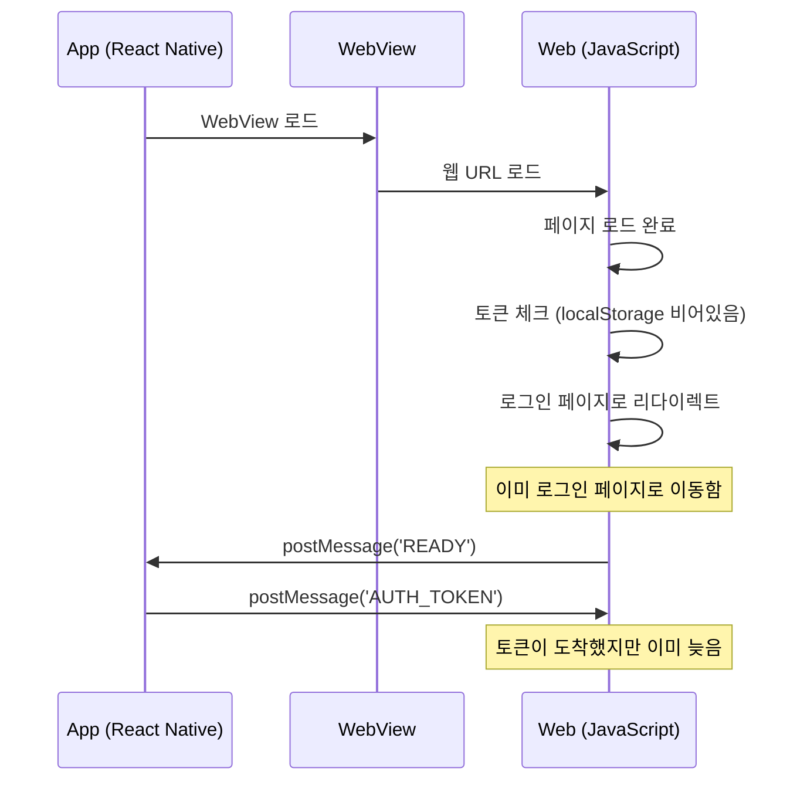
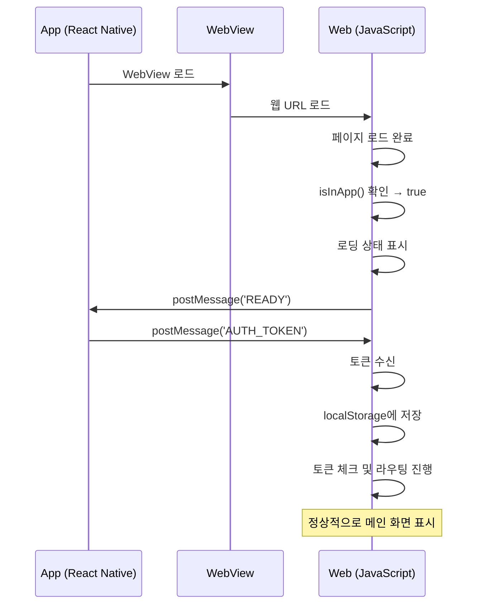

# WebView 앱 환경에서 토큰 대기 처리

## 개요

웹이 앱 내 WebView로 실행될 때, 자체 토큰 체크 전에 앱에서 토큰을 받을 때까지 대기해야 합니다. 이 문서는 웹 팀이 구현해야 할 토큰 대기 로직을 설명합니다.

## 문제 상황

### 토큰 대기 없이 구현할 경우



**문제:** 웹이 토큰 체크를 먼저 수행하면, 앱에서 토큰이 도착하기 전에 로그인 페이지로 리다이렉트됩니다.

## 해결 방안

### 앱 환경일 때 토큰 대기 후 라우팅



## 구현 가이드

### 1. 앱 환경 감지 유틸리티

```typescript
// utils/appBridge.ts

export const isInApp = (): boolean => {
  return typeof window !== 'undefined' &&
         window.ReactNativeWebView !== undefined;
};

export const sendToApp = (type: string, payload?: unknown): void => {
  if (!isInApp()) return;
  window.ReactNativeWebView.postMessage(JSON.stringify({ type, payload }));
};

export const onAppMessage = (
  callback: (message: { type: string; payload?: unknown }) => void
): (() => void) => {
  const handler = (event: MessageEvent) => {
    if (typeof event.data === 'object' && event.data.type) {
      callback(event.data);
    }
  };
  window.addEventListener('message', handler);
  return () => window.removeEventListener('message', handler);
};
```

### 2. 토큰 대기 Promise

```typescript
// utils/appBridge.ts

export const waitForAppToken = (): Promise<{
  accessToken: string;
  refreshToken: string;
}> => {
  return new Promise((resolve, reject) => {
    const timeout = setTimeout(() => {
      cleanup();
      reject(new Error('토큰 수신 타임아웃'));
    }, 5000); // 5초 타임아웃

    const cleanup = onAppMessage((message) => {
      if (message.type === 'AUTH_TOKEN' && message.payload) {
        clearTimeout(timeout);
        cleanup();
        resolve(message.payload as { accessToken: string; refreshToken: string });
      }
    });

    // 앱에 준비 완료 알림
    sendToApp('READY');
  });
};
```

### 3. 인증 초기화 Hook

```typescript
// hooks/useAuthInit.ts

import { useState, useEffect } from 'react';
import { isInApp, waitForAppToken } from '@/utils/appBridge';

interface AuthInitResult {
  isLoading: boolean;
  isAuthenticated: boolean;
  error: Error | null;
}

export const useAuthInit = (): AuthInitResult => {
  const [state, setState] = useState<AuthInitResult>({
    isLoading: true,
    isAuthenticated: false,
    error: null,
  });

  useEffect(() => {
    const initAuth = async () => {
      try {
        if (isInApp()) {
          // 앱 환경: 앱에서 토큰 받을 때까지 대기
          const tokens = await waitForAppToken();
          localStorage.setItem('accessToken', tokens.accessToken);
          localStorage.setItem('refreshToken', tokens.refreshToken);
        }

        // 토큰 체크
        const accessToken = localStorage.getItem('accessToken');
        setState({
          isLoading: false,
          isAuthenticated: !!accessToken,
          error: null,
        });
      } catch (error) {
        setState({
          isLoading: false,
          isAuthenticated: false,
          error: error as Error,
        });
      }
    };

    initAuth();
  }, []);

  return state;
};
```

### 4. 앱 레이아웃에서 사용

```typescript
// app/layout.tsx 또는 _app.tsx

import { useAuthInit } from '@/hooks/useAuthInit';
import { useRouter } from 'next/router'; // 또는 사용 중인 라우터

export default function RootLayout({ children }) {
  const { isLoading, isAuthenticated, error } = useAuthInit();
  const router = useRouter();

  // 로딩 중
  if (isLoading) {
    return <LoadingSpinner />;
  }

  // 에러 발생 (타임아웃 등)
  if (error) {
    return <ErrorScreen message="인증 초기화 실패" />;
  }

  // 인증되지 않음 → 로그인 페이지로 (공개 페이지가 아닌 경우)
  if (!isAuthenticated && !isPublicRoute(router.pathname)) {
    router.replace('/login');
    return null;
  }

  return <>{children}</>;
}
```

## 플로우 비교

### Before (문제 발생)

```
웹 로드 → 토큰 체크 (없음) → 로그인 페이지 → READY → AUTH_TOKEN (늦음)
```

### After (정상 동작)

```
웹 로드 → isInApp() 확인 → READY → AUTH_TOKEN 대기 → 토큰 저장 → 토큰 체크 → 메인 화면
```

## 타임아웃 처리

앱에서 토큰이 오지 않는 경우를 대비해 타임아웃을 설정합니다:

| 상황 | 처리 |
|------|------|
| 정상 | 토큰 수신 후 메인 화면 이동 |
| 타임아웃 (5초) | 에러 화면 표시 또는 로그인 페이지 이동 |
| 앱이 아닌 환경 | 기존 토큰 체크 로직 그대로 실행 |

## 핵심 포인트

1. **`isInApp()` 체크가 최우선**: 웹 로드 시 가장 먼저 앱 환경인지 확인
2. **토큰 체크 전에 대기**: 앱 환경이면 `AUTH_TOKEN` 받을 때까지 라우팅 로직 실행 안 함
3. **로딩 UI 표시**: 대기 중에는 로딩 스피너 표시 (UX)
4. **타임아웃 설정**: 무한 대기 방지

## 참고

- [WebView-App 토큰 플로우](./2025-02-21-webview-app-토큰-플로우.md) - 전체 토큰 플로우 문서
