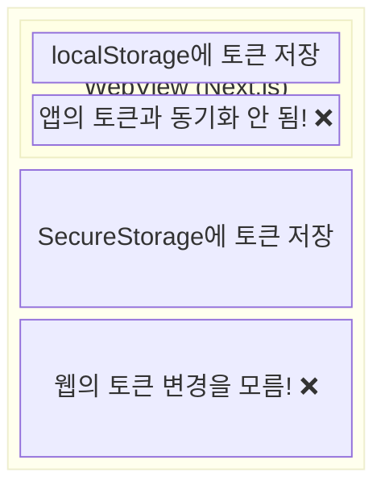
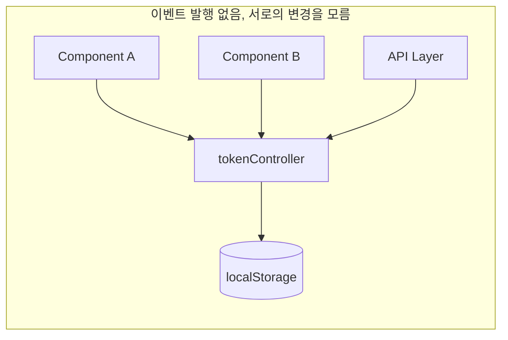
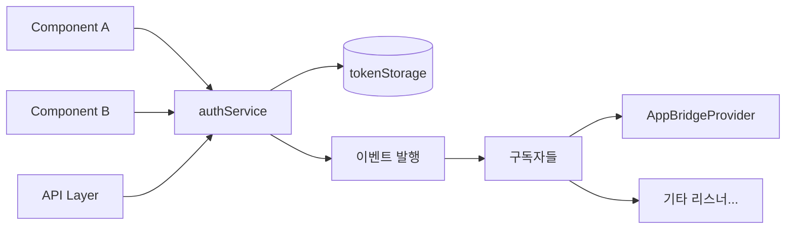
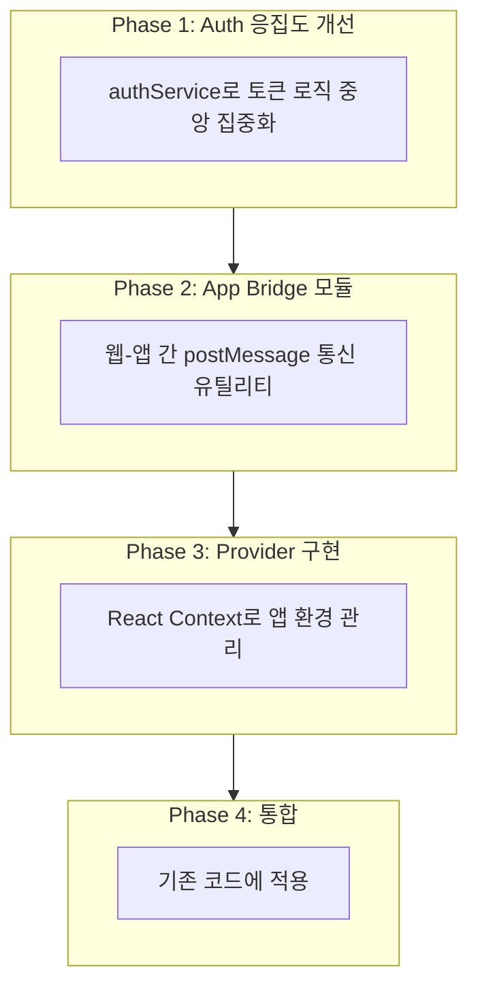
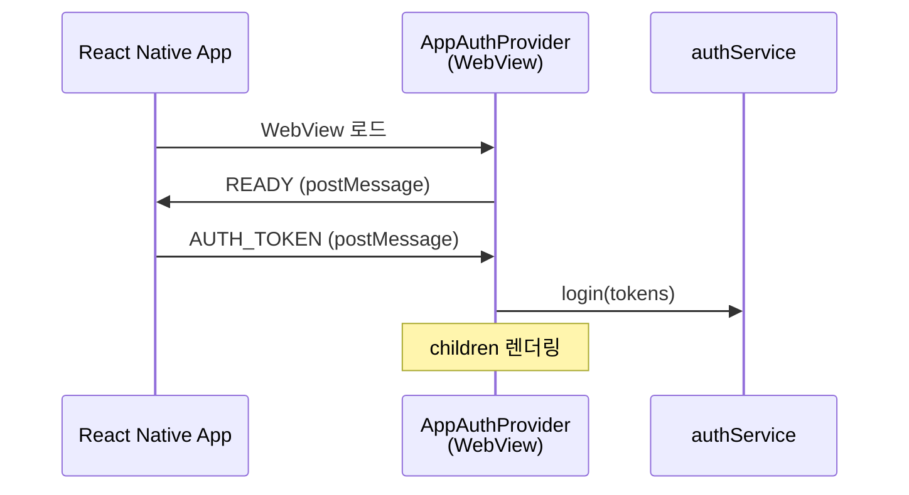
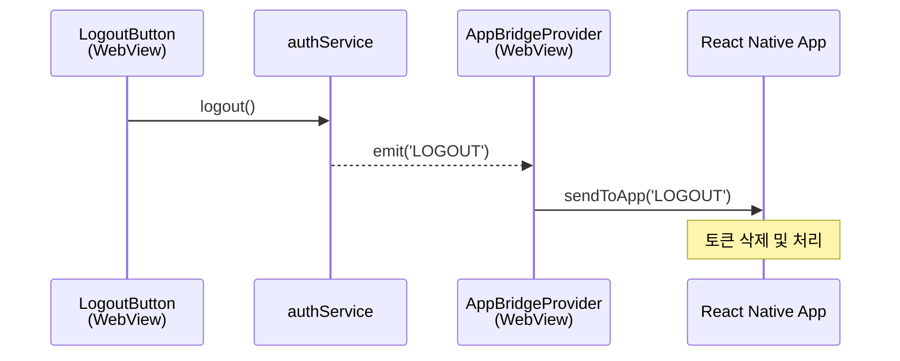
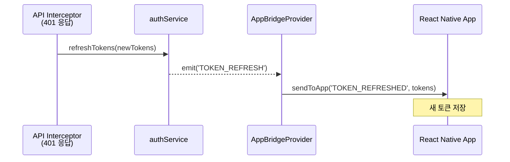
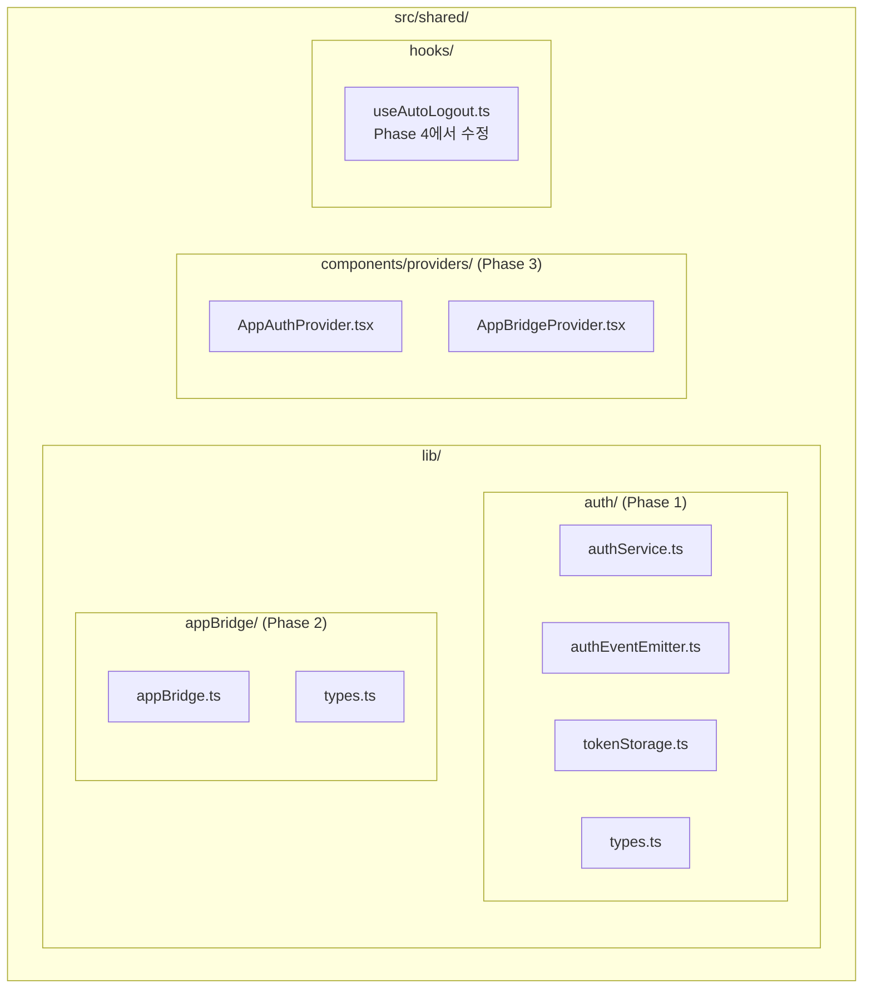

# React Native WebView와 Next.js 간 App Bridge 구현기

## 들어가며

모바일 앱을 개발할 때, 기존 웹 서비스를 WebView로 감싸서 하이브리드 앱으로 출시하는 경우가 많습니다. 이 방식은 빠른 출시가 가능하지만, 웹과 앱 간의 통신이라는 새로운 과제를 안게 됩니다.

이 글에서는 React Native WebView와 Next.js 웹 앱 사이에서 **인증 토큰을 안전하게 동기화**하는 App Bridge를 구현한 경험을 공유합니다.

---

## 문제 상황

### 기존 웹 앱의 인증 구조

기존 웹 앱은 `localStorage`에 토큰을 저장하고, 각 컴포넌트에서 직접 `tokenController`를 호출하는 구조였습니다:

```typescript
// tokenController - 단순한 localStorage 래퍼
export const tokenController = {
  setTokens(accessToken: string, refreshToken: string) {
    localStorage.setItem('accessToken', accessToken);
    localStorage.setItem('refreshToken', refreshToken);
  },
  getAccessToken(): string | null {
    return localStorage.getItem('accessToken');
  },
  getRefreshToken(): string | null {
    return localStorage.getItem('refreshToken');
  },
  clearTokens() {
    localStorage.removeItem('accessToken');
    localStorage.removeItem('refreshToken');
  }
};
```

### 문제점 1: 토큰 조작 로직이 산재

10개 이상의 파일에서 `tokenController`를 직접 호출하고 있었습니다:

```typescript
// 1️⃣ 로그인 Hook에서 직접 호출
// src/composite/login/loginForm/hook.ts
export function useFetchLogin() {
  const login = async (email: string, password: string) => {
    const { accessToken, refreshToken } = await postLoginApi(email, password);
    tokenController.setTokens(accessToken, refreshToken);  // 직접 호출
  };
}

// 2️⃣ OAuth 콜백에서 직접 호출
// src/app/(auth)/oauth/callback/page.tsx
if (accessToken && refreshToken) {
  tokenController.setTokens(accessToken, refreshToken);  // 직접 호출
  router.replace('/home');
}

// 3️⃣ API Interceptor에서 직접 호출
// src/shared/lib/apiClient.ts
axiosInstance.interceptors.response.use(
  (response) => response,
  async (error) => {
    if (error.response?.status === 401) {
      // 토큰 재발급 후 직접 저장
      const { accessToken, refreshToken } = data.data;
      tokenController.setTokens(accessToken, refreshToken);  // 직접 호출
    }
    if (error.response?.status === 403) {
      tokenController.clearTokens();  // 직접 호출
      window.location.href = '/login';
    }
  }
);

// 4️⃣ 로그인 폼 컴포넌트에서 직접 호출
// src/composite/login/loginForm/component.tsx
useEffect(() => {
  const accessToken = tokenController.getAccessToken();
  const refreshToken = tokenController.getRefreshToken();
  if (accessToken && refreshToken) {  // 두 개의 메서드를 각각 호출
    router.push('/home');
  }
}, []);

// 5️⃣ 로그아웃 버튼에서 직접 호출
// src/feature/auth/logoutButton/component.tsx
const handleLogout = () => {
  tokenController.clearTokens();  // 직접 호출
  router.push('/login');
};
```

**왜 문제인가?**
- 토큰 저장 방식을 변경하려면 모든 파일을 수정해야 함
- 새로운 요구사항(예: 앱에 알림) 추가 시 모든 호출 지점을 찾아서 수정 필요
- 실수로 일부 파일에서 누락하면 버그 발생

### 문제점 2: 이벤트 발행 없음

토큰이 변경되어도 다른 컴포넌트에서 알 수 없었습니다:

```typescript
// API Interceptor에서 토큰이 갱신됨
tokenController.setTokens(newAccessToken, newRefreshToken);
// → 하지만 이걸 알아야 하는 다른 컴포넌트는 모름!

// 로그아웃됨
tokenController.clearTokens();
// → 하지만 앱에 알릴 방법이 없음!
```

**왜 문제인가?**
- 토큰 갱신 시 앱에 새 토큰을 전달할 방법이 없음
- 로그아웃 시 앱에 알릴 방법이 없음
- 새로운 기능(예: 로그인 후 사용자 정보 로드)을 추가하려면 모든 토큰 조작 코드를 수정해야 함

### 문제점 3: 앱 환경 미고려

WebView 환경에서는 앱과 웹이 각각 토큰을 관리해야 했습니다:



### 앱 연동 시 추가 요구사항

WebView로 앱을 감쌀 때 다음 요구사항이 생겼습니다:

1. **앱 → 웹**: 앱이 보유한 토큰을 웹에 전달
2. **웹 → 앱**: 웹에서 토큰 갱신/로그아웃 시 앱에 알림
3. **토큰 대기**: 웹이 앱에서 토큰을 받을 때까지 렌더링 지연

---

## 해결 전략

### 왜 AuthService를 도입했는가?

기존 문제를 해결하기 위해 **모든 토큰 조작을 한 곳으로 모으고, 이벤트를 발행**하는 구조가 필요했습니다:

**기존 구조:**



**새로운 구조:**



### 왜 이벤트 기반인가?

이벤트 기반 설계를 선택한 이유:

1. **확장성**: 토큰 변경에 반응해야 하는 새 기능을 기존 코드 수정 없이 추가 가능
2. **분리**: 토큰 저장 로직과 토큰 변경 반응 로직을 분리
3. **앱 연동**: 앱 브릿지 코드가 이벤트를 구독하여 앱에 알림

```typescript
// 이벤트 기반의 장점 - 새 기능을 기존 코드 수정 없이 추가
authService.onLogout(() => {
  appBridge.sendToApp('LOGOUT');  // 앱 브릿지: 앱에 알림
});

authService.onLogout(() => {
  analytics.track('user_logout');  // 분석: 로그아웃 추적
});

authService.onTokenRefresh((tokens) => {
  appBridge.sendToApp('TOKEN_REFRESHED', tokens);  // 앱에 새 토큰 전달
});
```

### 왜 Provider를 사용하는가?

React Context를 통한 Provider 패턴을 선택한 이유:

1. **초기화 제어**: 앱 환경에서 토큰을 받을 때까지 렌더링 지연
2. **전역 상태**: `isApp` 상태를 하위 컴포넌트에 쉽게 전달
3. **생명주기 관리**: useEffect로 이벤트 구독/해제 자동 관리

```typescript
// Provider 없이 구현하면?
function SomeComponent() {
  const [isApp, setIsApp] = useState(false);

  useEffect(() => {
    // 모든 컴포넌트에서 이 로직을 반복해야 함
    setIsApp(window.ReactNativeWebView !== undefined);
  }, []);

  // ...
}

// Provider로 구현하면?
function SomeComponent() {
  const { isApp } = useAppBridge();  // 한 줄로 끝
  // ...
}
```

### 아키텍처 설계

문제를 해결하기 위해 4단계 리팩토링을 계획했습니다:



### 핵심 설계 원칙

1. **단일 진입점**: 모든 토큰 조작은 `authService`를 통해서만 → 변경 시 한 곳만 수정
2. **이벤트 기반**: 토큰 변경 시 이벤트 발행 → 기존 코드 수정 없이 새 기능 추가 가능
3. **분리 용이성**: 앱 연동 코드는 언제든 제거 가능하도록 설계 → 앱 지원 중단 시 쉽게 제거

---

## 구현 과정

### Phase 1: AuthService - 토큰 로직 중앙 집중화

가장 먼저 흩어진 토큰 로직을 한 곳으로 모았습니다.

#### 이벤트 발행/구독 시스템

```typescript
// authEventEmitter.ts
class AuthEventEmitter {
  private listeners = new Map<AuthEventType, Set<Function>>();

  emit(type: AuthEventType, payload?: any) {
    this.listeners.get(type)?.forEach(listener => listener(payload));
  }

  on(type: AuthEventType, listener: Function): () => void {
    if (!this.listeners.has(type)) {
      this.listeners.set(type, new Set());
    }
    this.listeners.get(type)!.add(listener);
    return () => this.listeners.get(type)?.delete(listener);
  }
}

export const authEventEmitter = new AuthEventEmitter();
```

#### AuthService 구현

```typescript
// authService.ts
class AuthService {
  // 조회 메서드
  isAuthenticated(): boolean {
    return tokenStorage.hasTokens();
  }

  getAccessToken(): string | null {
    return tokenStorage.getAccessToken();
  }

  getRefreshToken(): string | null {
    return tokenStorage.getRefreshToken();
  }

  // 토큰 조작 + 이벤트 발행
  login(tokens: TokenPayload): void {
    tokenStorage.save(tokens.accessToken, tokens.refreshToken);
    authEventEmitter.emit('LOGIN', tokens);
  }

  logout(): void {
    tokenStorage.clear();
    authEventEmitter.emit('LOGOUT');
  }

  refreshTokens(tokens: TokenPayload): void {
    tokenStorage.save(tokens.accessToken, tokens.refreshToken);
    authEventEmitter.emit('TOKEN_REFRESH', tokens);
  }

  // 이벤트 구독 메서드
  onLogout(callback: () => void) {
    return authEventEmitter.on('LOGOUT', callback);
  }

  onTokenRefresh(callback: (tokens: TokenPayload) => void) {
    return authEventEmitter.on('TOKEN_REFRESH', callback);
  }
}

export const authService = new AuthService();
```

이제 토큰이 변경될 때마다 이벤트가 발행되고, 이를 구독하는 컴포넌트에서 반응할 수 있습니다.

#### 리팩토링 전후 비교

**로그인 Hook:**

```typescript
// ❌ Before: tokenController 직접 호출
export function useFetchLogin() {
  const login = async (email: string, password: string) => {
    const { accessToken, refreshToken } = await postLoginApi(email, password);
    tokenController.setTokens(accessToken, refreshToken);  // 이벤트 없음
  };
}

// ✅ After: authService 사용
export function useFetchLogin() {
  const login = async (email: string, password: string) => {
    const { accessToken, refreshToken } = await postLoginApi(email, password);
    authService.login({ accessToken, refreshToken });  // LOGIN 이벤트 발행됨
  };
}
```

**로그인 상태 확인:**

```typescript
// ❌ Before: 두 개의 메서드를 각각 호출
useEffect(() => {
  const accessToken = tokenController.getAccessToken();
  const refreshToken = tokenController.getRefreshToken();
  if (accessToken && refreshToken) {
    router.push('/home');
  }
}, []);

// ✅ After: 하나의 메서드로 통합
useEffect(() => {
  if (authService.isAuthenticated()) {
    router.push('/home');
  }
}, []);
```

**API Interceptor:**

```typescript
// ❌ Before: 토큰 변경을 외부에서 알 수 없음
if (error.response?.status === 401) {
  const { accessToken, refreshToken } = data.data;
  tokenController.setTokens(accessToken, refreshToken);  // 이벤트 없음
}
if (error.response?.status === 403) {
  tokenController.clearTokens();  // 이벤트 없음
}

// ✅ After: 토큰 변경 시 이벤트 발행 → 앱에 알림 가능
if (error.response?.status === 401) {
  const { accessToken, refreshToken } = data.data;
  authService.refreshTokens({ accessToken, refreshToken });  // TOKEN_REFRESH 이벤트 발행
}
if (error.response?.status === 403) {
  authService.logout();  // LOGOUT 이벤트 발행
}

### Phase 2: App Bridge - 웹-앱 통신

React Native WebView는 `postMessage`를 통해 웹과 통신합니다. 이를 추상화한 `appBridge` 모듈을 만들었습니다.

#### 타입 정의

```typescript
// types.ts
export type AppMessageType =
  | 'READY'           // Web → App: 웹 준비 완료
  | 'AUTH_TOKEN'      // App → Web: 토큰 전달
  | 'TOKEN_REFRESHED' // Web → App: 토큰 갱신됨
  | 'LOGOUT';         // Web → App: 로그아웃

export interface AppMessage<T = unknown> {
  type: AppMessageType;
  payload?: T;
}
```

#### AppBridge 구현

```typescript
// appBridge.ts
export const appBridge = {
  // 앱 환경인지 확인
  isInApp(): boolean {
    if (typeof window === 'undefined') return false;
    return window.ReactNativeWebView !== undefined;
  },

  // 앱으로 메시지 전송
  sendToApp<T>(type: AppMessageType, payload?: T) {
    if (!this.isInApp()) return;

    const message = { type, payload };
    window.ReactNativeWebView!.postMessage(JSON.stringify(message));
  },

  // 앱에서 메시지 수신
  onAppMessage<T>(callback: (message: AppMessage<T>) => void): () => void {
    const handler = (event: MessageEvent) => {
      // JSON 문자열 또는 객체로 올 수 있음
      if (typeof event.data === 'string') {
        try {
          const parsed = JSON.parse(event.data);
          if (parsed.type) callback(parsed);
        } catch { /* JSON 아님 - 무시 */ }
      } else if (event.data?.type) {
        callback(event.data);
      }
    };

    window.addEventListener('message', handler);
    return () => window.removeEventListener('message', handler);
  },

  // 앱에서 토큰 수신 대기 (Promise)
  waitForAppToken(timeout = 5000): Promise<AppTokenPayload> {
    return new Promise((resolve, reject) => {
      const timeoutId = setTimeout(() => {
        cleanup();
        reject(new Error(`토큰 수신 타임아웃 (${timeout}ms)`));
      }, timeout);

      const cleanup = this.onAppMessage<AppTokenPayload>((message) => {
        if (message.type === 'AUTH_TOKEN' && message.payload) {
          clearTimeout(timeoutId);
          cleanup();
          resolve(message.payload);
        }
      });

      // 앱에 준비 완료 알림
      this.sendToApp('READY');
    });
  },
};
```

### Phase 3: Provider - React와 통합

이제 위에서 만든 모듈들을 React 컴포넌트에서 쉽게 사용할 수 있도록 Provider를 만들었습니다.

#### AppAuthProvider - 토큰 수신 대기

앱 환경에서 진입 시, 앱에서 토큰을 받을 때까지 로딩 UI를 표시합니다:

```typescript
// AppAuthProvider.tsx
export function AppAuthProvider({
  children,
  loadingFallback,
  errorFallback,
  tokenTimeout = 5000,
}: AppAuthProviderProps) {
  const [state, setState] = useState({
    isInitialized: false,
    error: null as Error | null,
  });

  useEffect(() => {
    const initialize = async () => {
      // 웹 환경: 즉시 초기화
      if (!appBridge.isInApp()) {
        setState({ isInitialized: true, error: null });
        return;
      }

      // 앱 환경: 토큰 수신 대기
      try {
        const tokens = await appBridge.waitForAppToken(tokenTimeout);
        authService.login(tokens);
        setState({ isInitialized: true, error: null });
      } catch (error) {
        setState({ isInitialized: true, error: error as Error });
      }
    };

    initialize();
  }, [tokenTimeout]);

  if (!state.isInitialized) return <>{loadingFallback}</>;
  if (state.error) return <>{errorFallback}</>;
  return <>{children}</>;
}
```

#### AppBridgeProvider - 이벤트 → 앱 알림

웹에서 토큰 변경이 발생하면 앱에 자동으로 알립니다:

```typescript
// AppBridgeProvider.tsx
export function AppBridgeProvider({ children }: AppBridgeProviderProps) {
  const isApp = appBridge.isInApp();

  useEffect(() => {
    if (!isApp) return;

    // 로그아웃 시 앱에 알림
    const unsubLogout = authService.onLogout(() => {
      appBridge.sendToApp('LOGOUT');
    });

    // 토큰 갱신 시 앱에 알림
    const unsubRefresh = authService.onTokenRefresh((tokens) => {
      appBridge.sendToApp('TOKEN_REFRESHED', tokens);
    });

    return () => {
      unsubLogout();
      unsubRefresh();
    };
  }, [isApp]);

  return (
    <AppBridgeContext.Provider value={{ isApp }}>
      {children}
    </AppBridgeContext.Provider>
  );
}
```

### Phase 4: 통합

마지막으로 루트 레이아웃에 Provider를 적용했습니다:

```typescript
// layout.tsx
export default function RootLayout({ children }) {
  return (
    <html lang="ko">
      <body>
        <AppAuthProvider
          loadingFallback={<LoadingSpinner />}
          errorFallback={<AuthErrorScreen />}
        >
          <AppBridgeProvider>
            {/* 기존 Provider들 */}
            <TanstackQueryWrapper>
              <ToastProvider>
                {children}
              </ToastProvider>
            </TanstackQueryWrapper>
          </AppBridgeProvider>
        </AppAuthProvider>
      </body>
    </html>
  );
}
```

---

## 통신 플로우

### 앱 진입 시 토큰 전달



### 웹에서 로그아웃 시



### 웹에서 토큰 갱신 시



---

## 분리 용이성

이 구조의 장점 중 하나는 **앱 연동 코드를 쉽게 제거**할 수 있다는 것입니다.

만약 앱 지원을 중단한다면:

```bash
# 1. layout.tsx에서 Provider 제거
# 2. useAutoLogout에서 isApp 체크 제거
# 3. 폴더 삭제
rm -rf src/shared/lib/appBridge/
rm -rf src/shared/components/providers/App*.tsx
```

**authService는 그대로 유지** - 웹에서도 이벤트 기반 구조는 유용합니다.

---

## 마치며

### 배운 점

1. **리팩토링의 중요성**: 기존 코드의 응집도를 높이지 않았다면, 앱 연동은 훨씬 복잡해졌을 것입니다.

2. **이벤트 기반 설계의 장점**: 토큰 변경을 이벤트로 발행하니, 새로운 기능(앱 알림)을 기존 코드 수정 없이 추가할 수 있었습니다.

3. **분리 가능한 설계**: 앱 연동 코드를 별도 모듈로 분리하여, 나중에 쉽게 제거하거나 수정할 수 있습니다.

### 최종 폴더 구조



이 구조는 웹 단독으로도, 앱과 함께도 잘 동작하며, 필요에 따라 쉽게 확장하거나 축소할 수 있습니다.

---

## 참고 자료

- [React Native WebView Communication](https://github.com/react-native-webview/react-native-webview/blob/master/docs/Guide.md#communicating-between-js-and-native)
- [Next.js App Router](https://nextjs.org/docs/app)
