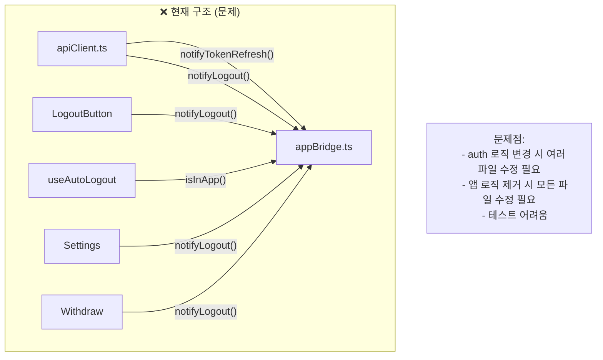
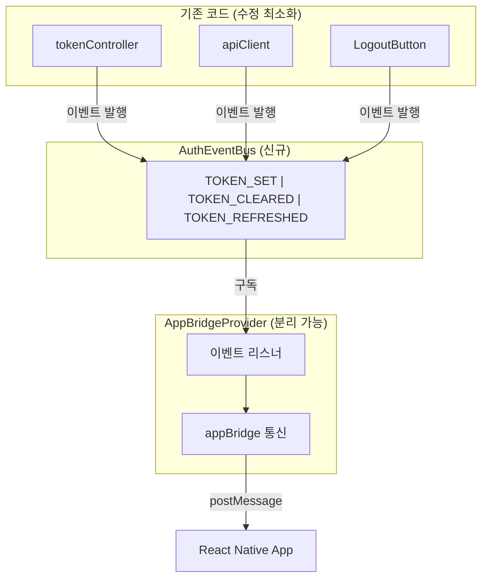
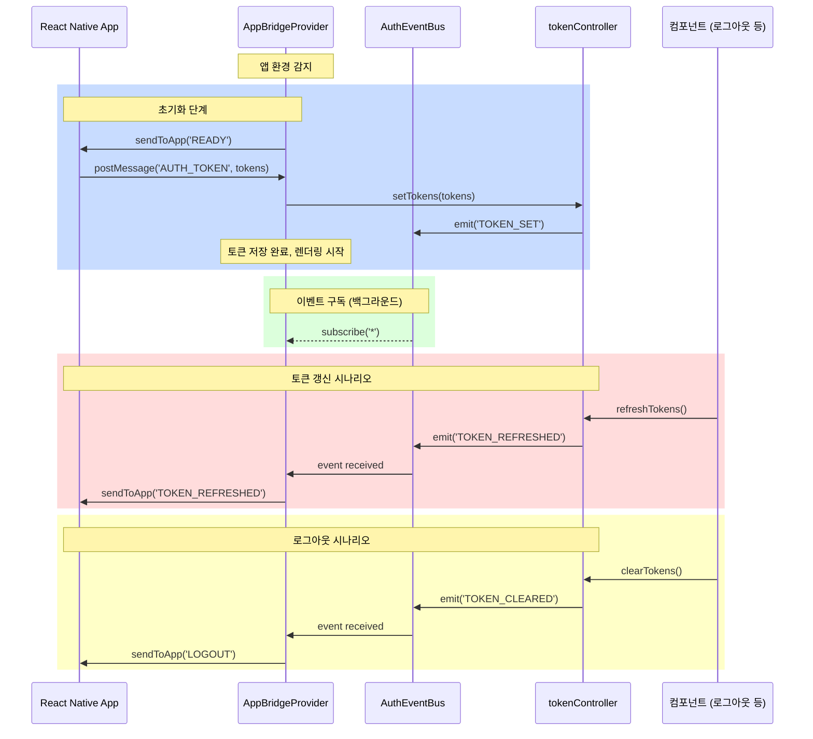
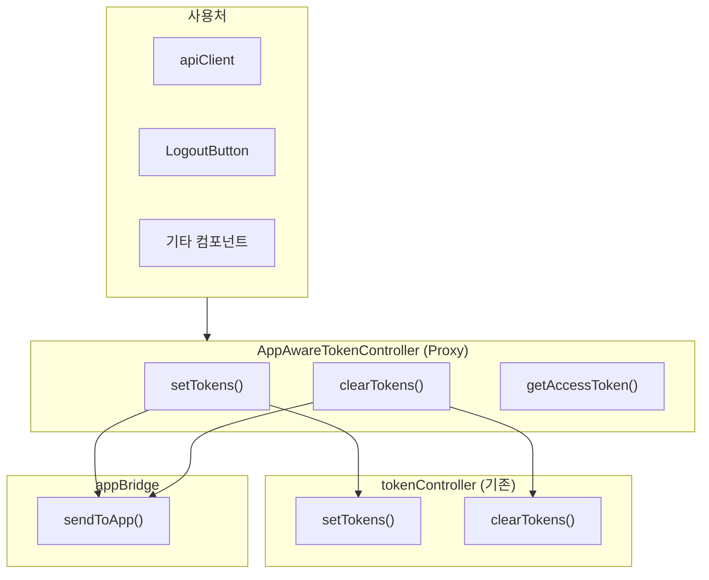
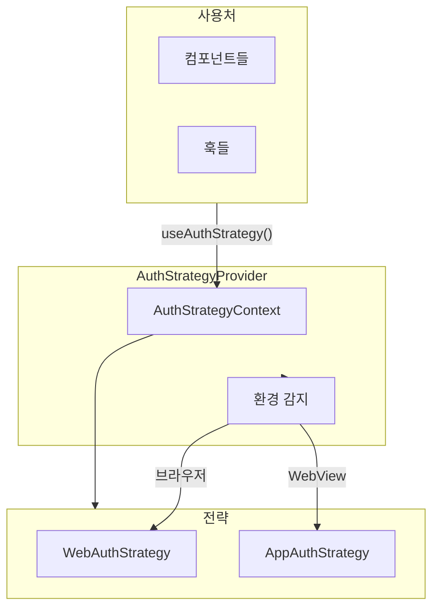
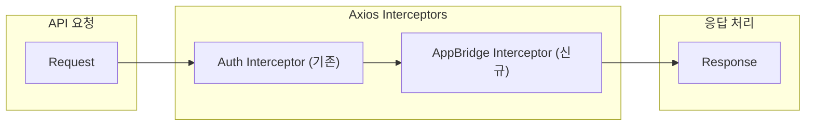
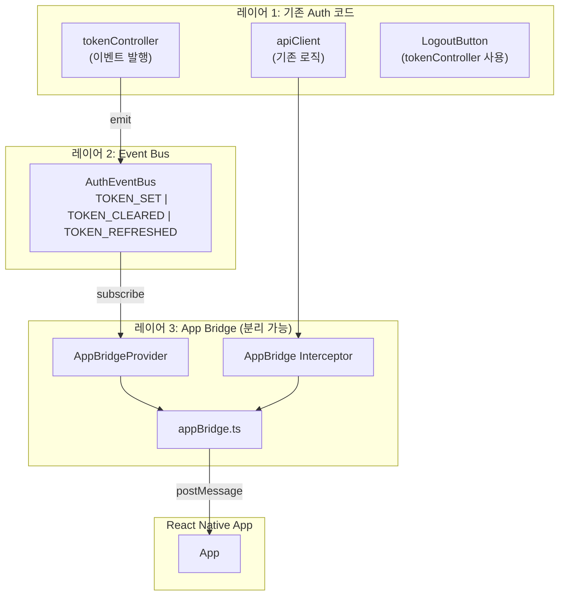
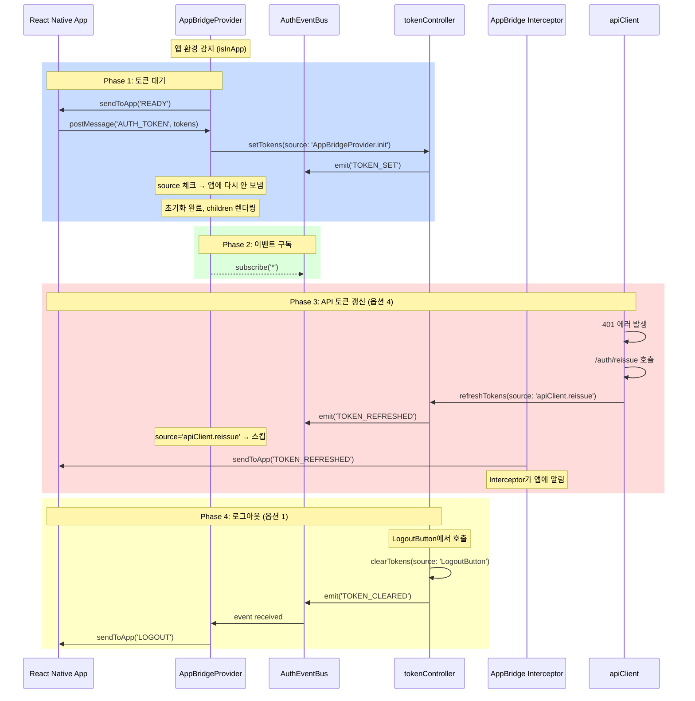
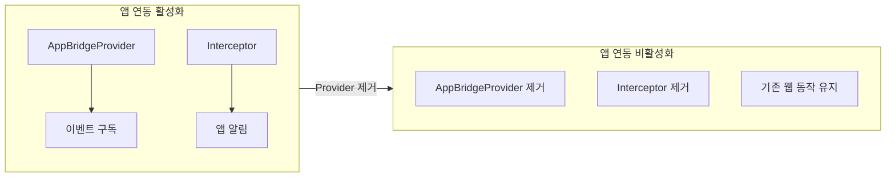

# App Bridge 아키텍처 옵션 분석

## 개요

App Bridge 구현 시, 기존 auth 관련 코드에 앱 로직이 산재되는 문제를 해결하기 위한 아키텍처 옵션을 분석합니다.

### 목표

1. **앱 관련 로직 분리**: 언제든 분리/제거 가능
2. **수정 용이성**: auth 로직 변경 시 앱 관련 코드 수정 최소화
3. **기존 코드 영향 최소화**: 웹 동작에 영향 없음

---

## 현재 구조의 문제점

### 문제: auth 로직 곳곳에 앱 관련 코드 산재



### 영향 받는 파일 목록

| 파일 | 수정 내용 | 문제점 |
|------|----------|--------|
| `apiClient.ts` | `notifyTokenRefresh()`, `notifyLogout()` 직접 호출 | 앱 로직 의존성 |
| `logoutButton/component.tsx` | `notifyLogout()` 직접 호출 | 앱 로직 의존성 |
| `useAutoLogout.ts` | `isInApp()` 직접 체크 | 앱 로직 의존성 |
| `mypage/settings` | `notifyLogout()` 직접 호출 | 앱 로직 의존성 |
| `mypage/withdraw` | `notifyLogout()` 직접 호출 | 앱 로직 의존성 |

---

## 아키텍처 옵션

---

## 옵션 1: Event-Driven Architecture (이벤트 기반)

### 아키텍처 다이어그램



### 핵심 원리

1. 기존 auth 코드는 **이벤트만 발행**
2. `AppBridgeProvider`가 **이벤트를 구독**하여 앱 통신 처리
3. Provider 제거 시 **앱 연동만 비활성화** (기존 웹 동작 유지)

### 장단점

| 장점 | 단점 |
|------|------|
| 기존 auth 코드 수정 최소화 | 이벤트 디버깅 어려움 |
| 앱 로직 완전 분리 | 이벤트 타입 관리 필요 |
| Provider 제거 시 앱 연동만 비활성화 | |
| 테스트 용이 | |

### 상세 구현

#### 파일 구조

```
src/shared/
├── lib/
│   ├── auth/
│   │   ├── authEventBus.ts      # 이벤트 버스
│   │   ├── authEvents.ts        # 이벤트 타입 정의
│   │   └── index.ts             # barrel export
│   ├── token.ts                 # 이벤트 발행 추가
│   └── appBridge.ts             # 앱 통신 유틸
├── hooks/
│   └── useAuthInit.ts           # 토큰 대기 훅
└── components/
    └── providers/
        └── AppBridgeProvider.tsx # 이벤트 구독 + 토큰 대기
```

#### Step 1: 이벤트 타입 정의

```typescript
// src/shared/lib/auth/authEvents.ts

/**
 * Auth 관련 이벤트 타입
 * - TOKEN_SET: 토큰이 설정됨 (로그인, 앱에서 토큰 수신)
 * - TOKEN_CLEARED: 토큰이 삭제됨 (로그아웃)
 * - TOKEN_REFRESHED: 토큰이 갱신됨 (API 401 → reissue)
 */
export type AuthEventType =
  | 'TOKEN_SET'
  | 'TOKEN_CLEARED'
  | 'TOKEN_REFRESHED';

export interface TokenPayload {
  accessToken: string;
  refreshToken: string;
}

export interface AuthEvent {
  type: AuthEventType;
  payload?: TokenPayload;
  /** 이벤트 발생 시각 (디버깅용) */
  timestamp: number;
  /** 이벤트 발생 소스 (디버깅용) */
  source?: string;
}

/**
 * 이벤트 생성 헬퍼
 */
export const createAuthEvent = (
  type: AuthEventType,
  payload?: TokenPayload,
  source?: string
): AuthEvent => ({
  type,
  payload,
  timestamp: Date.now(),
  source,
});
```

#### Step 2: AuthEventBus 구현

```typescript
// src/shared/lib/auth/authEventBus.ts

import type { AuthEvent, AuthEventType } from './authEvents';

type AuthEventListener = (event: AuthEvent) => void;

/**
 * Auth 이벤트 버스
 * - 싱글톤 패턴
 * - 타입별 구독 지원
 * - 디버그 모드 지원
 */
class AuthEventBus {
  private listeners: Map<AuthEventType | '*', Set<AuthEventListener>> = new Map();
  private debugMode: boolean = false;

  /**
   * 디버그 모드 활성화
   */
  enableDebug() {
    this.debugMode = true;
    console.log('[AuthEventBus] Debug mode enabled');
  }

  /**
   * 이벤트 발행
   */
  emit(event: AuthEvent) {
    if (this.debugMode) {
      console.log('[AuthEventBus] Emit:', event);
    }

    // 특정 타입 리스너 호출
    const typeListeners = this.listeners.get(event.type);
    if (typeListeners) {
      typeListeners.forEach((listener) => {
        try {
          listener(event);
        } catch (error) {
          console.error('[AuthEventBus] Listener error:', error);
        }
      });
    }

    // 와일드카드('*') 리스너 호출
    const allListeners = this.listeners.get('*');
    if (allListeners) {
      allListeners.forEach((listener) => {
        try {
          listener(event);
        } catch (error) {
          console.error('[AuthEventBus] Listener error:', error);
        }
      });
    }
  }

  /**
   * 이벤트 구독
   * @param type - 이벤트 타입 또는 '*' (모든 이벤트)
   * @param listener - 리스너 함수
   * @returns 구독 해제 함수
   */
  subscribe(
    type: AuthEventType | '*',
    listener: AuthEventListener
  ): () => void {
    if (!this.listeners.has(type)) {
      this.listeners.set(type, new Set());
    }

    this.listeners.get(type)!.add(listener);

    if (this.debugMode) {
      console.log(`[AuthEventBus] Subscribed to '${type}'`);
    }

    // 구독 해제 함수 반환
    return () => {
      const listeners = this.listeners.get(type);
      if (listeners) {
        listeners.delete(listener);
        if (this.debugMode) {
          console.log(`[AuthEventBus] Unsubscribed from '${type}'`);
        }
      }
    };
  }

  /**
   * 모든 구독 해제 (테스트용)
   */
  clearAllListeners() {
    this.listeners.clear();
  }

  /**
   * 현재 리스너 수 반환 (디버깅용)
   */
  getListenerCount(type?: AuthEventType | '*'): number {
    if (type) {
      return this.listeners.get(type)?.size ?? 0;
    }
    let total = 0;
    this.listeners.forEach((set) => (total += set.size));
    return total;
  }
}

// 싱글톤 인스턴스
export const authEventBus = new AuthEventBus();

// 개발 환경에서 디버그 모드 자동 활성화
if (process.env.NODE_ENV === 'development') {
  authEventBus.enableDebug();
}
```

#### Step 3: tokenController 수정

```typescript
// src/shared/lib/token.ts

import { authEventBus } from './auth/authEventBus';
import { createAuthEvent } from './auth/authEvents';

const ACCESS_TOKEN_KEY = 'accessToken';
const REFRESH_TOKEN_KEY = 'refreshToken';

export const tokenController = {
  /**
   * 토큰 저장
   * - localStorage에 저장
   * - TOKEN_SET 이벤트 발행
   */
  setTokens(accessToken: string, refreshToken: string, source?: string) {
    if (typeof window === 'undefined') return;

    localStorage.setItem(ACCESS_TOKEN_KEY, accessToken);
    localStorage.setItem(REFRESH_TOKEN_KEY, refreshToken);

    // 이벤트 발행 (앱 로직 없음 - AppBridgeProvider가 구독)
    authEventBus.emit(
      createAuthEvent(
        'TOKEN_SET',
        { accessToken, refreshToken },
        source ?? 'tokenController.setTokens'
      )
    );
  },

  /**
   * 토큰 삭제
   * - localStorage에서 삭제
   * - TOKEN_CLEARED 이벤트 발행
   */
  clearTokens(source?: string) {
    if (typeof window === 'undefined') return;

    localStorage.removeItem(ACCESS_TOKEN_KEY);
    localStorage.removeItem(REFRESH_TOKEN_KEY);

    // 이벤트 발행 (앱 로직 없음 - AppBridgeProvider가 구독)
    authEventBus.emit(
      createAuthEvent(
        'TOKEN_CLEARED',
        undefined,
        source ?? 'tokenController.clearTokens'
      )
    );
  },

  /**
   * 토큰 갱신
   * - localStorage에 저장
   * - TOKEN_REFRESHED 이벤트 발행
   */
  refreshTokens(accessToken: string, refreshToken: string, source?: string) {
    if (typeof window === 'undefined') return;

    localStorage.setItem(ACCESS_TOKEN_KEY, accessToken);
    localStorage.setItem(REFRESH_TOKEN_KEY, refreshToken);

    // 이벤트 발행 (앱 로직 없음 - AppBridgeProvider가 구독)
    authEventBus.emit(
      createAuthEvent(
        'TOKEN_REFRESHED',
        { accessToken, refreshToken },
        source ?? 'tokenController.refreshTokens'
      )
    );
  },

  /**
   * Access Token 조회
   */
  getAccessToken(): string | null {
    if (typeof window === 'undefined') return null;
    return localStorage.getItem(ACCESS_TOKEN_KEY);
  },

  /**
   * Refresh Token 조회
   */
  getRefreshToken(): string | null {
    if (typeof window === 'undefined') return null;
    return localStorage.getItem(REFRESH_TOKEN_KEY);
  },

  /**
   * 토큰 존재 여부 확인
   */
  hasTokens(): boolean {
    return !!(this.getAccessToken() && this.getRefreshToken());
  },
};
```

#### Step 4: appBridge 유틸리티

```typescript
// src/shared/lib/appBridge.ts

/**
 * WebView 메시지 타입
 */
export type AppMessageType =
  | 'READY'           // 웹 → 앱: 준비 완료
  | 'AUTH_TOKEN'      // 앱 → 웹: 토큰 전달
  | 'TOKEN_REFRESHED' // 웹 → 앱: 토큰 갱신됨
  | 'LOGOUT';         // 웹 → 앱: 로그아웃

export interface AppMessage<T = unknown> {
  type: AppMessageType;
  payload?: T;
}

export interface TokenPayload {
  accessToken: string;
  refreshToken: string;
}

/**
 * 앱 환경(WebView) 여부 확인
 */
export const isInApp = (): boolean => {
  if (typeof window === 'undefined') return false;
  return window.ReactNativeWebView !== undefined;
};

/**
 * 앱으로 메시지 전송
 */
export const sendToApp = <T = unknown>(
  type: AppMessageType,
  payload?: T
): void => {
  if (!isInApp()) {
    if (process.env.NODE_ENV === 'development') {
      console.log('[AppBridge] Not in app, skipping sendToApp:', { type, payload });
    }
    return;
  }

  const message: AppMessage<T> = { type, payload };

  try {
    window.ReactNativeWebView!.postMessage(JSON.stringify(message));

    if (process.env.NODE_ENV === 'development') {
      console.log('[AppBridge] Sent to app:', message);
    }
  } catch (error) {
    console.error('[AppBridge] Failed to send message:', error);
  }
};

/**
 * 앱에서 메시지 수신 리스너 등록
 * @returns 구독 해제 함수
 */
export const onAppMessage = <T = unknown>(
  callback: (message: AppMessage<T>) => void
): (() => void) => {
  const handler = (event: MessageEvent) => {
    // 앱에서 injectJavaScript로 보낸 메시지 처리
    if (typeof event.data === 'object' && event.data?.type) {
      callback(event.data as AppMessage<T>);
      return;
    }

    // JSON 문자열로 온 경우
    if (typeof event.data === 'string') {
      try {
        const parsed = JSON.parse(event.data);
        if (parsed.type) {
          callback(parsed as AppMessage<T>);
        }
      } catch {
        // JSON 파싱 실패 - 무시
      }
    }
  };

  window.addEventListener('message', handler);

  if (process.env.NODE_ENV === 'development') {
    console.log('[AppBridge] Message listener registered');
  }

  return () => {
    window.removeEventListener('message', handler);
    if (process.env.NODE_ENV === 'development') {
      console.log('[AppBridge] Message listener removed');
    }
  };
};

/**
 * 앱에서 토큰 수신 대기 (Promise)
 * @param timeout - 타임아웃 (ms), 기본 5000ms
 */
export const waitForAppToken = (
  timeout: number = 5000
): Promise<TokenPayload> => {
  return new Promise((resolve, reject) => {
    // 타임아웃 설정
    const timeoutId = setTimeout(() => {
      cleanup();
      reject(new Error(`토큰 수신 타임아웃 (${timeout}ms)`));
    }, timeout);

    // 메시지 리스너 등록
    const cleanup = onAppMessage<TokenPayload>((message) => {
      if (message.type === 'AUTH_TOKEN' && message.payload) {
        clearTimeout(timeoutId);
        cleanup();

        if (process.env.NODE_ENV === 'development') {
          console.log('[AppBridge] Token received from app');
        }

        resolve(message.payload);
      }
    });

    // 앱에 준비 완료 알림
    sendToApp('READY');
  });
};
```

#### Step 5: Global Type 선언

```typescript
// src/shared/type/global.d.ts

interface Window {
  /**
   * React Native WebView에서 주입하는 객체
   * - postMessage: 앱으로 메시지 전송
   */
  ReactNativeWebView?: {
    postMessage: (message: string) => void;
  };
}
```

#### Step 6: AppBridgeProvider 구현

```typescript
// src/shared/components/providers/AppBridgeProvider.tsx

'use client';

import { useEffect, useState, createContext, useContext, ReactNode } from 'react';
import { authEventBus } from '@/shared/lib/auth/authEventBus';
import type { AuthEvent } from '@/shared/lib/auth/authEvents';
import {
  isInApp,
  sendToApp,
  waitForAppToken,
  type TokenPayload,
} from '@/shared/lib/appBridge';
import { tokenController } from '@/shared/lib/token';

// ============================================
// Context 정의
// ============================================

interface AppBridgeContextValue {
  /** 앱 환경 여부 */
  isAppEnvironment: boolean;
  /** 초기화 완료 여부 */
  isInitialized: boolean;
  /** 초기화 중 에러 */
  error: Error | null;
}

const AppBridgeContext = createContext<AppBridgeContextValue>({
  isAppEnvironment: false,
  isInitialized: true,
  error: null,
});

export const useAppBridge = () => useContext(AppBridgeContext);

// ============================================
// Provider 컴포넌트
// ============================================

interface AppBridgeProviderProps {
  children: ReactNode;
  /** 토큰 대기 중 표시할 UI */
  loadingFallback?: ReactNode;
  /** 에러 발생 시 표시할 UI */
  errorFallback?: ReactNode;
  /** 토큰 대기 타임아웃 (ms) */
  tokenTimeout?: number;
}

export function AppBridgeProvider({
  children,
  loadingFallback,
  errorFallback,
  tokenTimeout = 5000,
}: AppBridgeProviderProps) {
  const [state, setState] = useState<{
    isInitialized: boolean;
    error: Error | null;
  }>({
    isInitialized: false,
    error: null,
  });

  const isAppEnvironment = isInApp();

  // ============================================
  // 1. 앱 환경: 토큰 대기
  // ============================================
  useEffect(() => {
    const initializeAppAuth = async () => {
      // 웹 환경이면 즉시 초기화 완료
      if (!isAppEnvironment) {
        setState({ isInitialized: true, error: null });
        return;
      }

      try {
        // 앱에서 토큰 수신 대기
        const tokens = await waitForAppToken(tokenTimeout);

        // 토큰 저장 (이벤트 발행됨)
        tokenController.setTokens(
          tokens.accessToken,
          tokens.refreshToken,
          'AppBridgeProvider.init'
        );

        setState({ isInitialized: true, error: null });
      } catch (error) {
        console.error('[AppBridgeProvider] Token wait failed:', error);
        setState({
          isInitialized: true,
          error: error instanceof Error ? error : new Error('Unknown error'),
        });
      }
    };

    initializeAppAuth();
  }, [isAppEnvironment, tokenTimeout]);

  // ============================================
  // 2. 앱 환경: Auth 이벤트 구독 → 앱에 알림
  // ============================================
  useEffect(() => {
    // 웹 환경이면 구독 안 함
    if (!isAppEnvironment) return;

    // 모든 Auth 이벤트 구독
    const unsubscribe = authEventBus.subscribe('*', (event: AuthEvent) => {
      handleAuthEvent(event);
    });

    return unsubscribe;
  }, [isAppEnvironment]);

  /**
   * Auth 이벤트 처리 → 앱으로 전달
   */
  const handleAuthEvent = (event: AuthEvent) => {
    switch (event.type) {
      case 'TOKEN_SET':
        // 앱에서 받은 토큰이면 다시 앱에 보내지 않음
        if (event.source === 'AppBridgeProvider.init') {
          return;
        }
        // 웹에서 자체 로그인한 경우 (해당 앱에서는 없음)
        if (event.payload) {
          sendToApp('TOKEN_REFRESHED', event.payload);
        }
        break;

      case 'TOKEN_REFRESHED':
        // API 갱신 결과를 앱에 알림
        if (event.payload) {
          sendToApp('TOKEN_REFRESHED', event.payload);
        }
        break;

      case 'TOKEN_CLEARED':
        // 로그아웃을 앱에 알림
        sendToApp('LOGOUT');
        break;
    }
  };

  // ============================================
  // 렌더링
  // ============================================

  // 초기화 중 (앱 환경에서 토큰 대기 중)
  if (!state.isInitialized) {
    return (
      <>
        {loadingFallback ?? (
          <div className="flex h-screen items-center justify-center bg-normal-alternative">
            <div className="animate-spin rounded-full h-8 w-8 border-b-2 border-white" />
          </div>
        )}
      </>
    );
  }

  // 에러 발생
  if (state.error) {
    return (
      <>
        {errorFallback ?? (
          <div className="flex h-screen flex-col items-center justify-center bg-normal-alternative text-white">
            <p className="text-lg mb-4">인증 초기화 실패</p>
            <p className="text-sm text-gray-400">{state.error.message}</p>
          </div>
        )}
      </>
    );
  }

  // 정상 렌더링
  return (
    <AppBridgeContext.Provider
      value={{
        isAppEnvironment,
        isInitialized: state.isInitialized,
        error: state.error,
      }}
    >
      {children}
    </AppBridgeContext.Provider>
  );
}
```

#### Step 7: useAutoLogout 수정

```typescript
// src/shared/hooks/useAutoLogout.ts

'use client';

import { useEffect } from 'react';
import { useRouter } from 'next/navigation';
import { tokenController } from '@/shared/lib/token';
import { useMockEnvironment } from './useMockEnvironment';
import { useAppBridge } from '@/shared/components/providers/AppBridgeProvider';

export function useAutoLogout() {
  const router = useRouter();
  const isMockEnvironment = useMockEnvironment();
  const { isAppEnvironment } = useAppBridge();

  useEffect(() => {
    // Mock 환경에서는 자동 로그아웃을 비활성화
    if (isMockEnvironment) {
      console.log('[useAutoLogout] Mock 환경 - 비활성화');
      return;
    }

    // 앱 환경에서는 AppBridgeProvider가 토큰 관리
    // → 토큰 체크 스킵 (조기 리다이렉트 방지)
    if (isAppEnvironment) {
      console.log('[useAutoLogout] 앱 환경 - 비활성화');
      return;
    }

    // 웹 환경: 토큰 없으면 로그인 페이지로
    const accessToken = tokenController.getAccessToken();
    const refreshToken = tokenController.getRefreshToken();

    if (!accessToken || !refreshToken) {
      router.push('/login');
    }
  }, [router, isMockEnvironment, isAppEnvironment]);
}
```

#### Step 8: layout.tsx 수정

```typescript
// src/app/layout.tsx

import { AppBridgeProvider } from '@/shared/components/providers/AppBridgeProvider';

export default function RootLayout({
  children,
}: {
  children: React.ReactNode;
}) {
  return (
    <html lang="ko">
      <body>
        {/* AppBridgeProvider가 가장 바깥에 위치 */}
        <AppBridgeProvider
          loadingFallback={
            <div className="flex h-screen items-center justify-center bg-normal-alternative">
              <div className="animate-spin rounded-full h-8 w-8 border-b-2 border-white" />
            </div>
          }
          errorFallback={
            <div className="flex h-screen flex-col items-center justify-center bg-normal-alternative text-white">
              <p>인증에 실패했습니다</p>
              <p className="text-sm text-gray-400 mt-2">앱을 다시 시작해주세요</p>
            </div>
          }
        >
          <MSWClientProvider>
            <TanstackQueryWrapper>
              <ToastProvider>
                {children}
              </ToastProvider>
            </TanstackQueryWrapper>
          </MSWClientProvider>
        </AppBridgeProvider>
      </body>
    </html>
  );
}
```

#### 전체 플로우 다이어그램



---

## 옵션 2: Proxy/Decorator Pattern (토큰 컨트롤러 래핑)

### 아키텍처 다이어그램



### 핵심 원리

1. 기존 `tokenController`를 래핑하는 Proxy 생성
2. 모든 토큰 작업이 Proxy를 통과하며 앱 알림 자동 처리
3. 앱 환경이 아니면 기존 로직만 실행

### 장단점

| 장점 | 단점 |
|------|------|
| 단일 진입점으로 관리 용이 | tokenController import 경로 변경 필요 |
| 기존 API 인터페이스 유지 | 초기 마이그레이션 필요 |
| 앱 로직 한 곳에 집중 | |

### 상세 구현

#### 파일 구조

```
src/shared/
├── lib/
│   ├── token/
│   │   ├── tokenController.ts       # 기존 토큰 컨트롤러
│   │   ├── appAwareTokenController.ts # Proxy
│   │   └── index.ts                 # barrel export (Proxy 노출)
│   └── appBridge.ts                 # 앱 통신 유틸
└── components/
    └── providers/
        └── AppBridgeProvider.tsx    # 토큰 대기만 담당
```

#### Step 1: 기존 tokenController 분리

```typescript
// src/shared/lib/token/tokenController.ts

const ACCESS_TOKEN_KEY = 'accessToken';
const REFRESH_TOKEN_KEY = 'refreshToken';

/**
 * 기본 토큰 컨트롤러 (내부용)
 * - localStorage 직접 접근
 * - 앱 연동 로직 없음
 */
export const baseTokenController = {
  setTokens(accessToken: string, refreshToken: string) {
    if (typeof window === 'undefined') return;
    localStorage.setItem(ACCESS_TOKEN_KEY, accessToken);
    localStorage.setItem(REFRESH_TOKEN_KEY, refreshToken);
  },

  clearTokens() {
    if (typeof window === 'undefined') return;
    localStorage.removeItem(ACCESS_TOKEN_KEY);
    localStorage.removeItem(REFRESH_TOKEN_KEY);
  },

  getAccessToken(): string | null {
    if (typeof window === 'undefined') return null;
    return localStorage.getItem(ACCESS_TOKEN_KEY);
  },

  getRefreshToken(): string | null {
    if (typeof window === 'undefined') return null;
    return localStorage.getItem(REFRESH_TOKEN_KEY);
  },

  hasTokens(): boolean {
    return !!(this.getAccessToken() && this.getRefreshToken());
  },
};
```

#### Step 2: AppAwareTokenController (Proxy) 구현

```typescript
// src/shared/lib/token/appAwareTokenController.ts

import { baseTokenController } from './tokenController';
import { isInApp, sendToApp, type TokenPayload } from '../appBridge';

/**
 * 앱 연동 기능이 추가된 토큰 컨트롤러 (Proxy)
 * - baseTokenController를 래핑
 * - 앱 환경에서 자동으로 앱에 알림
 */
export const tokenController = {
  /**
   * 토큰 저장
   * - 앱 환경: TOKEN_REFRESHED 메시지 전송
   */
  setTokens(
    accessToken: string,
    refreshToken: string,
    options?: { skipAppNotify?: boolean }
  ) {
    // 기존 로직 실행
    baseTokenController.setTokens(accessToken, refreshToken);

    // 앱 환경이고, 알림 스킵이 아니면 앱에 알림
    if (isInApp() && !options?.skipAppNotify) {
      sendToApp('TOKEN_REFRESHED', { accessToken, refreshToken });
    }
  },

  /**
   * 토큰 삭제
   * - 앱 환경: LOGOUT 메시지 전송
   */
  clearTokens(options?: { skipAppNotify?: boolean }) {
    // 기존 로직 실행
    baseTokenController.clearTokens();

    // 앱 환경이고, 알림 스킵이 아니면 앱에 알림
    if (isInApp() && !options?.skipAppNotify) {
      sendToApp('LOGOUT');
    }
  },

  /**
   * Access Token 조회
   */
  getAccessToken(): string | null {
    return baseTokenController.getAccessToken();
  },

  /**
   * Refresh Token 조회
   */
  getRefreshToken(): string | null {
    return baseTokenController.getRefreshToken();
  },

  /**
   * 토큰 존재 여부 확인
   */
  hasTokens(): boolean {
    return baseTokenController.hasTokens();
  },
};
```

#### Step 3: Barrel Export

```typescript
// src/shared/lib/token/index.ts

// Proxy 버전을 기본으로 export
export { tokenController } from './appAwareTokenController';

// 필요 시 기본 버전도 export
export { baseTokenController } from './tokenController';
```

#### Step 4: AppBridgeProvider (토큰 대기만 담당)

```typescript
// src/shared/components/providers/AppBridgeProvider.tsx

'use client';

import { useEffect, useState, ReactNode } from 'react';
import { isInApp, waitForAppToken } from '@/shared/lib/appBridge';
import { tokenController } from '@/shared/lib/token';

interface AppBridgeProviderProps {
  children: ReactNode;
  loadingFallback?: ReactNode;
  errorFallback?: ReactNode;
  tokenTimeout?: number;
}

export function AppBridgeProvider({
  children,
  loadingFallback,
  errorFallback,
  tokenTimeout = 5000,
}: AppBridgeProviderProps) {
  const [state, setState] = useState<{
    isInitialized: boolean;
    error: Error | null;
  }>({
    isInitialized: false,
    error: null,
  });

  useEffect(() => {
    const initializeAppAuth = async () => {
      // 웹 환경이면 즉시 완료
      if (!isInApp()) {
        setState({ isInitialized: true, error: null });
        return;
      }

      try {
        // 앱에서 토큰 수신 대기
        const tokens = await waitForAppToken(tokenTimeout);

        // 토큰 저장 (앱에 다시 알리지 않음)
        tokenController.setTokens(
          tokens.accessToken,
          tokens.refreshToken,
          { skipAppNotify: true }
        );

        setState({ isInitialized: true, error: null });
      } catch (error) {
        setState({
          isInitialized: true,
          error: error instanceof Error ? error : new Error('Unknown error'),
        });
      }
    };

    initializeAppAuth();
  }, [tokenTimeout]);

  if (!state.isInitialized) {
    return <>{loadingFallback ?? <DefaultLoading />}</>;
  }

  if (state.error) {
    return <>{errorFallback ?? <DefaultError error={state.error} />}</>;
  }

  return <>{children}</>;
}

function DefaultLoading() {
  return (
    <div className="flex h-screen items-center justify-center bg-normal-alternative">
      <div className="animate-spin rounded-full h-8 w-8 border-b-2 border-white" />
    </div>
  );
}

function DefaultError({ error }: { error: Error }) {
  return (
    <div className="flex h-screen flex-col items-center justify-center bg-normal-alternative text-white">
      <p className="text-lg mb-4">인증 초기화 실패</p>
      <p className="text-sm text-gray-400">{error.message}</p>
    </div>
  );
}
```

#### 사용 예시

```typescript
// 기존 코드 수정 불필요 - import 경로만 확인
// src/feature/auth/logoutButton/component.tsx

import { tokenController } from '@/shared/lib/token'; // Proxy 버전

const handleLogout = () => {
  // clearTokens() 호출 시 자동으로 앱에 LOGOUT 메시지 전송
  tokenController.clearTokens();
  router.push('/login');
};
```

---

## 옵션 3: Context + Strategy Pattern (환경별 전략)

### 아키텍처 다이어그램



### 핵심 원리

1. 환경에 따라 다른 인증 전략 주입
2. 컴포넌트는 전략 인터페이스만 사용
3. 전략 교체로 동작 변경

### 장단점

| 장점 | 단점 |
|------|------|
| 환경별 완전 분리 | 구현 복잡도 높음 |
| 테스트 매우 용이 (Mock 전략) | 오버엔지니어링 가능성 |
| 확장성 좋음 | 학습 곡선 |

### 상세 구현

#### 파일 구조

```
src/shared/
├── lib/
│   ├── auth/
│   │   ├── types.ts              # Strategy 인터페이스
│   │   ├── webAuthStrategy.ts    # 웹 전략
│   │   ├── appAuthStrategy.ts    # 앱 전략
│   │   └── index.ts
│   ├── token.ts
│   └── appBridge.ts
└── components/
    └── providers/
        └── AuthStrategyProvider.tsx
```

#### Step 1: Strategy 인터페이스 정의

```typescript
// src/shared/lib/auth/types.ts

export interface TokenPayload {
  accessToken: string;
  refreshToken: string;
}

/**
 * 인증 전략 인터페이스
 * - 환경별로 다른 구현 제공
 */
export interface AuthStrategy {
  /** 전략 이름 (디버깅용) */
  readonly name: string;

  /** 토큰 설정 시 추가 동작 */
  onTokenSet(tokens: TokenPayload): void;

  /** 토큰 삭제 시 추가 동작 */
  onTokenCleared(): void;

  /** 토큰 갱신 시 추가 동작 */
  onTokenRefreshed(tokens: TokenPayload): void;

  /** 자동 로그아웃 스킵 여부 */
  shouldSkipAutoLogout(): boolean;

  /** 초기 토큰 로드 방식 */
  loadInitialTokens(): Promise<TokenPayload | null>;
}
```

#### Step 2: Web 전략 구현

```typescript
// src/shared/lib/auth/webAuthStrategy.ts

import type { AuthStrategy, TokenPayload } from './types';

/**
 * 웹 환경 인증 전략
 * - 추가 동작 없음 (기본 동작만)
 */
export const webAuthStrategy: AuthStrategy = {
  name: 'WebAuthStrategy',

  onTokenSet(tokens: TokenPayload) {
    // 웹에서는 추가 동작 없음
    if (process.env.NODE_ENV === 'development') {
      console.log('[WebAuthStrategy] Token set');
    }
  },

  onTokenCleared() {
    // 웹에서는 추가 동작 없음
    if (process.env.NODE_ENV === 'development') {
      console.log('[WebAuthStrategy] Token cleared');
    }
  },

  onTokenRefreshed(tokens: TokenPayload) {
    // 웹에서는 추가 동작 없음
    if (process.env.NODE_ENV === 'development') {
      console.log('[WebAuthStrategy] Token refreshed');
    }
  },

  shouldSkipAutoLogout() {
    // 웹에서는 auto logout 동작
    return false;
  },

  async loadInitialTokens() {
    // 웹에서는 localStorage에서 바로 로드 (대기 없음)
    const accessToken = localStorage.getItem('accessToken');
    const refreshToken = localStorage.getItem('refreshToken');

    if (accessToken && refreshToken) {
      return { accessToken, refreshToken };
    }

    return null;
  },
};
```

#### Step 3: App 전략 구현

```typescript
// src/shared/lib/auth/appAuthStrategy.ts

import type { AuthStrategy, TokenPayload } from './types';
import { sendToApp, waitForAppToken } from '../appBridge';

/**
 * 앱(WebView) 환경 인증 전략
 * - 토큰 변경 시 앱에 알림
 * - 초기 토큰은 앱에서 수신
 */
export const appAuthStrategy: AuthStrategy = {
  name: 'AppAuthStrategy',

  onTokenSet(tokens: TokenPayload) {
    // 앱에서 받은 초기 토큰이면 다시 알리지 않음
    // (loadInitialTokens에서 처리)
    if (process.env.NODE_ENV === 'development') {
      console.log('[AppAuthStrategy] Token set');
    }
  },

  onTokenCleared() {
    // 앱에 로그아웃 알림
    sendToApp('LOGOUT');

    if (process.env.NODE_ENV === 'development') {
      console.log('[AppAuthStrategy] Token cleared, notified app');
    }
  },

  onTokenRefreshed(tokens: TokenPayload) {
    // 앱에 갱신된 토큰 알림
    sendToApp('TOKEN_REFRESHED', tokens);

    if (process.env.NODE_ENV === 'development') {
      console.log('[AppAuthStrategy] Token refreshed, notified app');
    }
  },

  shouldSkipAutoLogout() {
    // 앱 환경에서는 auto logout 스킵
    // (AppBridgeProvider가 토큰 관리)
    return true;
  },

  async loadInitialTokens() {
    // 앱에서 토큰 수신 대기
    try {
      const tokens = await waitForAppToken(5000);
      return tokens;
    } catch (error) {
      console.error('[AppAuthStrategy] Failed to load initial tokens:', error);
      throw error;
    }
  },
};
```

#### Step 4: AuthStrategyProvider 구현

```typescript
// src/shared/components/providers/AuthStrategyProvider.tsx

'use client';

import {
  createContext,
  useContext,
  useState,
  useEffect,
  ReactNode,
} from 'react';
import type { AuthStrategy, TokenPayload } from '@/shared/lib/auth/types';
import { webAuthStrategy } from '@/shared/lib/auth/webAuthStrategy';
import { appAuthStrategy } from '@/shared/lib/auth/appAuthStrategy';
import { isInApp } from '@/shared/lib/appBridge';
import { tokenController } from '@/shared/lib/token';

// ============================================
// Context 정의
// ============================================

interface AuthStrategyContextValue {
  strategy: AuthStrategy;
  isInitialized: boolean;
  error: Error | null;
}

const AuthStrategyContext = createContext<AuthStrategyContextValue>({
  strategy: webAuthStrategy,
  isInitialized: false,
  error: null,
});

export const useAuthStrategy = () => useContext(AuthStrategyContext);

// ============================================
// Provider 컴포넌트
// ============================================

interface AuthStrategyProviderProps {
  children: ReactNode;
  loadingFallback?: ReactNode;
  errorFallback?: ReactNode;
}

export function AuthStrategyProvider({
  children,
  loadingFallback,
  errorFallback,
}: AuthStrategyProviderProps) {
  // 환경에 따른 전략 선택
  const strategy = isInApp() ? appAuthStrategy : webAuthStrategy;

  const [state, setState] = useState<{
    isInitialized: boolean;
    error: Error | null;
  }>({
    isInitialized: false,
    error: null,
  });

  // 초기 토큰 로드
  useEffect(() => {
    const initialize = async () => {
      try {
        // 전략에 따른 초기 토큰 로드
        const tokens = await strategy.loadInitialTokens();

        if (tokens) {
          // 토큰 저장 (전략의 onTokenSet은 호출하지 않음 - 초기 로드이므로)
          tokenController.setTokens(
            tokens.accessToken,
            tokens.refreshToken,
            'AuthStrategyProvider.init'
          );
        }

        setState({ isInitialized: true, error: null });
      } catch (error) {
        setState({
          isInitialized: true,
          error: error instanceof Error ? error : new Error('Unknown error'),
        });
      }
    };

    initialize();
  }, [strategy]);

  // 로딩 중
  if (!state.isInitialized) {
    return (
      <>
        {loadingFallback ?? (
          <div className="flex h-screen items-center justify-center bg-normal-alternative">
            <div className="animate-spin rounded-full h-8 w-8 border-b-2 border-white" />
          </div>
        )}
      </>
    );
  }

  // 에러
  if (state.error) {
    return (
      <>
        {errorFallback ?? (
          <div className="flex h-screen flex-col items-center justify-center bg-normal-alternative text-white">
            <p className="text-lg mb-4">인증 초기화 실패</p>
            <p className="text-sm text-gray-400">{state.error.message}</p>
          </div>
        )}
      </>
    );
  }

  return (
    <AuthStrategyContext.Provider
      value={{
        strategy,
        isInitialized: state.isInitialized,
        error: state.error,
      }}
    >
      {children}
    </AuthStrategyContext.Provider>
  );
}
```

#### Step 5: tokenController에서 전략 사용

```typescript
// src/shared/lib/token.ts

import { authStrategyRef } from './auth/strategyRef';

export const tokenController = {
  setTokens(accessToken: string, refreshToken: string, source?: string) {
    if (typeof window === 'undefined') return;

    localStorage.setItem('accessToken', accessToken);
    localStorage.setItem('refreshToken', refreshToken);

    // 초기 로드가 아닌 경우에만 전략 콜백 호출
    if (source !== 'AuthStrategyProvider.init') {
      const strategy = authStrategyRef.current;
      if (strategy) {
        strategy.onTokenSet({ accessToken, refreshToken });
      }
    }
  },

  clearTokens() {
    if (typeof window === 'undefined') return;

    localStorage.removeItem('accessToken');
    localStorage.removeItem('refreshToken');

    // 전략 콜백 호출
    const strategy = authStrategyRef.current;
    if (strategy) {
      strategy.onTokenCleared();
    }
  },

  refreshTokens(accessToken: string, refreshToken: string) {
    if (typeof window === 'undefined') return;

    localStorage.setItem('accessToken', accessToken);
    localStorage.setItem('refreshToken', refreshToken);

    // 전략 콜백 호출
    const strategy = authStrategyRef.current;
    if (strategy) {
      strategy.onTokenRefreshed({ accessToken, refreshToken });
    }
  },

  // ... 나머지 메서드
};
```

#### Step 6: useAutoLogout에서 전략 사용

```typescript
// src/shared/hooks/useAutoLogout.ts

'use client';

import { useEffect } from 'react';
import { useRouter } from 'next/navigation';
import { tokenController } from '@/shared/lib/token';
import { useMockEnvironment } from './useMockEnvironment';
import { useAuthStrategy } from '@/shared/components/providers/AuthStrategyProvider';

export function useAutoLogout() {
  const router = useRouter();
  const isMockEnvironment = useMockEnvironment();
  const { strategy } = useAuthStrategy();

  useEffect(() => {
    if (isMockEnvironment) {
      console.log('[useAutoLogout] Mock 환경 - 비활성화');
      return;
    }

    // 전략에 위임
    if (strategy.shouldSkipAutoLogout()) {
      console.log(`[useAutoLogout] ${strategy.name} - 비활성화`);
      return;
    }

    const accessToken = tokenController.getAccessToken();
    const refreshToken = tokenController.getRefreshToken();

    if (!accessToken || !refreshToken) {
      router.push('/login');
    }
  }, [router, isMockEnvironment, strategy]);
}
```

---

## 옵션 4: Middleware Pattern (인터셉터 확장)

### 아키텍처 다이어그램



### 핵심 원리

1. axios 인터셉터 체인에 AppBridge 인터셉터 추가
2. 토큰 갱신/에러 시 앱에 자동 알림
3. 인터셉터 제거로 앱 연동 비활성화

### 장단점

| 장점 | 단점 |
|------|------|
| axios 구조 활용 | API 레벨만 커버 |
| 추가/제거 용이 | 로그아웃 버튼 등 별도 처리 필요 |
| 기존 코드 수정 최소화 | |

### 상세 구현

#### Step 1: AppBridge Interceptor

```typescript
// src/shared/lib/appBridgeInterceptor.ts

import {
  AxiosInstance,
  AxiosResponse,
  AxiosError,
  InternalAxiosRequestConfig,
} from 'axios';
import { isInApp, sendToApp, type TokenPayload } from './appBridge';

interface AppBridgeInterceptorOptions {
  /** 토큰 갱신 API 경로 패턴 */
  refreshUrlPattern?: RegExp;
  /** 앱에 알릴 에러 상태 코드 */
  logoutStatusCodes?: number[];
  /** 디버그 모드 */
  debug?: boolean;
}

const defaultOptions: AppBridgeInterceptorOptions = {
  refreshUrlPattern: /\/auth\/reissue/,
  logoutStatusCodes: [401, 403],
  debug: process.env.NODE_ENV === 'development',
};

/**
 * AppBridge Interceptor 설정
 * - 앱 환경에서만 동작
 * - 토큰 갱신 시 앱에 알림
 * - 인증 실패 시 앱에 알림
 *
 * @returns 인터셉터 제거 함수
 */
export function setupAppBridgeInterceptor(
  axiosInstance: AxiosInstance,
  options: AppBridgeInterceptorOptions = {}
): () => void {
  const opts = { ...defaultOptions, ...options };

  // 앱 환경이 아니면 설정하지 않음
  if (!isInApp()) {
    if (opts.debug) {
      console.log('[AppBridgeInterceptor] Not in app, skipping setup');
    }
    return () => {}; // no-op
  }

  if (opts.debug) {
    console.log('[AppBridgeInterceptor] Setting up interceptors');
  }

  // Response Interceptor
  const responseInterceptorId = axiosInstance.interceptors.response.use(
    (response: AxiosResponse) => {
      // 토큰 갱신 응답 감지
      if (opts.refreshUrlPattern?.test(response.config.url || '')) {
        const data = response.data;

        // 응답 구조에 따라 토큰 추출
        const accessToken = data.accessToken || data.data?.accessToken;
        const refreshToken = data.refreshToken || data.data?.refreshToken;

        if (accessToken && refreshToken) {
          sendToApp('TOKEN_REFRESHED', { accessToken, refreshToken });

          if (opts.debug) {
            console.log('[AppBridgeInterceptor] Token refresh detected, notified app');
          }
        }
      }

      return response;
    },
    (error: AxiosError) => {
      // 인증 실패 감지
      const status = error.response?.status;

      if (status && opts.logoutStatusCodes?.includes(status)) {
        // 토큰 갱신 요청 자체가 실패한 경우만 LOGOUT 전송
        // (일반 401은 갱신 후 재시도하므로)
        const isRefreshRequest = opts.refreshUrlPattern?.test(
          error.config?.url || ''
        );

        if (isRefreshRequest) {
          sendToApp('LOGOUT');

          if (opts.debug) {
            console.log('[AppBridgeInterceptor] Refresh failed, notified app to logout');
          }
        }
      }

      return Promise.reject(error);
    }
  );

  // 인터셉터 제거 함수 반환
  return () => {
    axiosInstance.interceptors.response.eject(responseInterceptorId);

    if (opts.debug) {
      console.log('[AppBridgeInterceptor] Interceptors removed');
    }
  };
}
```

#### Step 2: apiClient에 적용

```typescript
// src/shared/lib/apiClient.ts

import axios, { AxiosError } from 'axios';
import { tokenController } from '@/shared/lib/token';
import { setupAppBridgeInterceptor } from './appBridgeInterceptor';
import { ROUTES } from '@/shared/constants/routes';

// API 클라이언트 생성
const apiClient = axios.create({
  baseURL: process.env.NEXT_PUBLIC_API_URL,
  timeout: 10000,
  headers: {
    'Content-Type': 'application/json',
  },
});

// ============================================
// 기존 인터셉터들
// ============================================

// Request Interceptor: 토큰 추가
apiClient.interceptors.request.use((config) => {
  const token = tokenController.getAccessToken();
  if (token) {
    config.headers.Authorization = `Bearer ${token}`;
  }
  return config;
});

// Response Interceptor: 에러 처리 및 토큰 갱신
apiClient.interceptors.response.use(
  (response) => response,
  async (error: AxiosError) => {
    const originalRequest = error.config as any;

    // 403 에러: 강제 로그아웃
    if (error.response?.status === 403) {
      tokenController.clearTokens();
      if (typeof window !== 'undefined') {
        window.location.href = ROUTES.LOGIN;
      }
      return Promise.reject(error);
    }

    // 401 에러: 토큰 갱신 시도
    if (error.response?.status === 401 && !originalRequest._retry) {
      originalRequest._retry = true;

      try {
        const refreshToken = tokenController.getRefreshToken();
        if (!refreshToken) {
          throw new Error('No refresh token');
        }

        const response = await axios.post(
          `${process.env.NEXT_PUBLIC_API_URL}/auth/reissue`,
          { refreshToken }
        );

        const { accessToken, refreshToken: newRefreshToken } = response.data;
        tokenController.setTokens(accessToken, newRefreshToken);

        originalRequest.headers.Authorization = `Bearer ${accessToken}`;
        return apiClient(originalRequest);
      } catch (refreshError) {
        tokenController.clearTokens();
        if (typeof window !== 'undefined') {
          window.location.href = ROUTES.LOGIN;
        }
        return Promise.reject(refreshError);
      }
    }

    return Promise.reject(error);
  }
);

// ============================================
// AppBridge Interceptor 추가
// ============================================

// 클라이언트 사이드에서만 설정
if (typeof window !== 'undefined') {
  setupAppBridgeInterceptor(apiClient, {
    refreshUrlPattern: /\/auth\/reissue/,
    logoutStatusCodes: [401, 403],
  });
}

export default apiClient;
```

---

## 추천 아키텍처: 옵션 1 + 4 조합

### 최종 구조



### 조합 이유

| 역할 | 담당 | 이유 |
|------|------|------|
| 토큰 저장/삭제 알림 | Event-Driven (옵션 1) | 다양한 컴포넌트에서 발생 |
| API 토큰 갱신 알림 | Interceptor (옵션 4) | axios 레벨에서 처리 |
| 토큰 대기 | AppBridgeProvider | 앱 진입 시 필요 |

### 파일 구조

```
src/shared/
├── lib/
│   ├── auth/
│   │   ├── authEventBus.ts       # 이벤트 버스
│   │   ├── authEvents.ts         # 이벤트 타입
│   │   └── index.ts
│   ├── token.ts                  # 이벤트 발행 추가
│   ├── appBridge.ts              # 앱 통신 유틸
│   ├── appBridgeInterceptor.ts   # axios 인터셉터
│   └── apiClient.ts              # 인터셉터 적용
├── hooks/
│   ├── useAuthInit.ts            # (필요 시)
│   └── useAutoLogout.ts          # isInApp() 체크 추가
├── type/
│   └── global.d.ts               # Window 타입 확장
└── components/
    └── providers/
        └── AppBridgeProvider.tsx  # 이벤트 구독 + 토큰 대기
```

### 상세 구현 (옵션 1 + 4 조합)

#### 전체 파일 구조

```
src/shared/
├── lib/
│   ├── auth/
│   │   ├── authEventBus.ts       # Step 1: 이벤트 버스
│   │   ├── authEvents.ts         # Step 2: 이벤트 타입
│   │   └── index.ts              # Step 3: barrel export
│   ├── token.ts                  # Step 4: 이벤트 발행 추가
│   ├── appBridge.ts              # Step 5: 앱 통신 유틸
│   ├── appBridgeInterceptor.ts   # Step 6: axios 인터셉터
│   └── apiClient.ts              # Step 7: 인터셉터 적용
├── type/
│   └── global.d.ts               # Step 8: Window 타입 확장
├── hooks/
│   └── useAutoLogout.ts          # Step 9: 앱 환경 체크 추가
└── components/
    └── providers/
        └── AppBridgeProvider.tsx  # Step 10: 이벤트 구독 + 토큰 대기
```

---

#### Step 1: 이벤트 타입 정의

```typescript
// src/shared/lib/auth/authEvents.ts

/**
 * Auth 관련 이벤트 타입
 */
export type AuthEventType =
  | 'TOKEN_SET'       // 토큰 설정 (로그인, 앱에서 수신)
  | 'TOKEN_CLEARED'   // 토큰 삭제 (로그아웃)
  | 'TOKEN_REFRESHED'; // 토큰 갱신 (API reissue)

export interface TokenPayload {
  accessToken: string;
  refreshToken: string;
}

export interface AuthEvent {
  type: AuthEventType;
  payload?: TokenPayload;
  timestamp: number;
  source?: string;
}

export const createAuthEvent = (
  type: AuthEventType,
  payload?: TokenPayload,
  source?: string
): AuthEvent => ({
  type,
  payload,
  timestamp: Date.now(),
  source,
});
```

---

#### Step 2: AuthEventBus 구현

```typescript
// src/shared/lib/auth/authEventBus.ts

import type { AuthEvent, AuthEventType } from './authEvents';

type AuthEventListener = (event: AuthEvent) => void;

class AuthEventBus {
  private listeners: Map<AuthEventType | '*', Set<AuthEventListener>> = new Map();
  private debugMode: boolean = process.env.NODE_ENV === 'development';

  emit(event: AuthEvent) {
    if (this.debugMode) {
      console.log('[AuthEventBus] Emit:', event.type, event.source);
    }

    // 특정 타입 리스너 호출
    this.listeners.get(event.type)?.forEach((listener) => {
      try {
        listener(event);
      } catch (error) {
        console.error('[AuthEventBus] Listener error:', error);
      }
    });

    // 와일드카드 리스너 호출
    this.listeners.get('*')?.forEach((listener) => {
      try {
        listener(event);
      } catch (error) {
        console.error('[AuthEventBus] Listener error:', error);
      }
    });
  }

  subscribe(type: AuthEventType | '*', listener: AuthEventListener): () => void {
    if (!this.listeners.has(type)) {
      this.listeners.set(type, new Set());
    }
    this.listeners.get(type)!.add(listener);

    return () => {
      this.listeners.get(type)?.delete(listener);
    };
  }

  clearAllListeners() {
    this.listeners.clear();
  }
}

export const authEventBus = new AuthEventBus();
```

---

#### Step 3: Barrel Export

```typescript
// src/shared/lib/auth/index.ts

export { authEventBus } from './authEventBus';
export { createAuthEvent } from './authEvents';
export type { AuthEvent, AuthEventType, TokenPayload } from './authEvents';
```

---

#### Step 4: tokenController 수정 (이벤트 발행 추가)

```typescript
// src/shared/lib/token.ts

import { authEventBus } from './auth/authEventBus';
import { createAuthEvent } from './auth/authEvents';

const ACCESS_TOKEN_KEY = 'accessToken';
const REFRESH_TOKEN_KEY = 'refreshToken';

export const tokenController = {
  /**
   * 토큰 저장 + TOKEN_SET 이벤트 발행
   */
  setTokens(accessToken: string, refreshToken: string, source?: string) {
    if (typeof window === 'undefined') return;

    localStorage.setItem(ACCESS_TOKEN_KEY, accessToken);
    localStorage.setItem(REFRESH_TOKEN_KEY, refreshToken);

    // 이벤트 발행 (AppBridgeProvider가 구독)
    authEventBus.emit(
      createAuthEvent('TOKEN_SET', { accessToken, refreshToken }, source)
    );
  },

  /**
   * 토큰 삭제 + TOKEN_CLEARED 이벤트 발행
   */
  clearTokens(source?: string) {
    if (typeof window === 'undefined') return;

    localStorage.removeItem(ACCESS_TOKEN_KEY);
    localStorage.removeItem(REFRESH_TOKEN_KEY);

    // 이벤트 발행 (AppBridgeProvider가 구독)
    authEventBus.emit(
      createAuthEvent('TOKEN_CLEARED', undefined, source)
    );
  },

  /**
   * 토큰 갱신 + TOKEN_REFRESHED 이벤트 발행
   */
  refreshTokens(accessToken: string, refreshToken: string, source?: string) {
    if (typeof window === 'undefined') return;

    localStorage.setItem(ACCESS_TOKEN_KEY, accessToken);
    localStorage.setItem(REFRESH_TOKEN_KEY, refreshToken);

    // 이벤트 발행 (AppBridgeProvider가 구독)
    authEventBus.emit(
      createAuthEvent('TOKEN_REFRESHED', { accessToken, refreshToken }, source)
    );
  },

  getAccessToken(): string | null {
    if (typeof window === 'undefined') return null;
    return localStorage.getItem(ACCESS_TOKEN_KEY);
  },

  getRefreshToken(): string | null {
    if (typeof window === 'undefined') return null;
    return localStorage.getItem(REFRESH_TOKEN_KEY);
  },

  hasTokens(): boolean {
    return !!(this.getAccessToken() && this.getRefreshToken());
  },
};
```

---

#### Step 5: appBridge 유틸리티

```typescript
// src/shared/lib/appBridge.ts

export type AppMessageType = 'READY' | 'AUTH_TOKEN' | 'TOKEN_REFRESHED' | 'LOGOUT';

export interface AppMessage<T = unknown> {
  type: AppMessageType;
  payload?: T;
}

export interface TokenPayload {
  accessToken: string;
  refreshToken: string;
}

/**
 * 앱 환경(WebView) 여부 확인
 */
export const isInApp = (): boolean => {
  if (typeof window === 'undefined') return false;
  return window.ReactNativeWebView !== undefined;
};

/**
 * 앱으로 메시지 전송
 */
export const sendToApp = <T = unknown>(type: AppMessageType, payload?: T): void => {
  if (!isInApp()) return;

  const message: AppMessage<T> = { type, payload };
  window.ReactNativeWebView!.postMessage(JSON.stringify(message));

  if (process.env.NODE_ENV === 'development') {
    console.log('[AppBridge] Sent:', message);
  }
};

/**
 * 앱에서 메시지 수신 리스너 등록
 */
export const onAppMessage = <T = unknown>(
  callback: (message: AppMessage<T>) => void
): (() => void) => {
  const handler = (event: MessageEvent) => {
    // 객체로 온 경우
    if (typeof event.data === 'object' && event.data?.type) {
      callback(event.data as AppMessage<T>);
      return;
    }
    // JSON 문자열로 온 경우
    if (typeof event.data === 'string') {
      try {
        const parsed = JSON.parse(event.data);
        if (parsed.type) callback(parsed as AppMessage<T>);
      } catch {}
    }
  };

  window.addEventListener('message', handler);
  return () => window.removeEventListener('message', handler);
};

/**
 * 앱에서 토큰 수신 대기 (Promise)
 */
export const waitForAppToken = (timeout: number = 5000): Promise<TokenPayload> => {
  return new Promise((resolve, reject) => {
    const timeoutId = setTimeout(() => {
      cleanup();
      reject(new Error(`토큰 수신 타임아웃 (${timeout}ms)`));
    }, timeout);

    const cleanup = onAppMessage<TokenPayload>((message) => {
      if (message.type === 'AUTH_TOKEN' && message.payload) {
        clearTimeout(timeoutId);
        cleanup();
        resolve(message.payload);
      }
    });

    // 앱에 준비 완료 알림
    sendToApp('READY');
  });
};
```

---

#### Step 6: AppBridge Interceptor (옵션 4)

```typescript
// src/shared/lib/appBridgeInterceptor.ts

import { AxiosInstance, AxiosResponse, AxiosError } from 'axios';
import { isInApp, sendToApp } from './appBridge';

interface AppBridgeInterceptorOptions {
  refreshUrlPattern?: RegExp;
  logoutStatusCodes?: number[];
}

const defaultOptions: AppBridgeInterceptorOptions = {
  refreshUrlPattern: /\/auth\/reissue/,
  logoutStatusCodes: [401, 403],
};

/**
 * AppBridge Interceptor 설정
 * - API 레벨에서 토큰 갱신/실패 감지
 * - 앱에 자동 알림
 */
export function setupAppBridgeInterceptor(
  axiosInstance: AxiosInstance,
  options: AppBridgeInterceptorOptions = {}
): () => void {
  const opts = { ...defaultOptions, ...options };

  // 앱 환경이 아니면 설정하지 않음
  if (!isInApp()) {
    return () => {};
  }

  console.log('[AppBridgeInterceptor] Setting up');

  const interceptorId = axiosInstance.interceptors.response.use(
    (response: AxiosResponse) => {
      // 토큰 갱신 응답 감지 → 앱에 알림
      if (opts.refreshUrlPattern?.test(response.config.url || '')) {
        const data = response.data;
        const accessToken = data.accessToken || data.data?.accessToken;
        const refreshToken = data.refreshToken || data.data?.refreshToken;

        if (accessToken && refreshToken) {
          sendToApp('TOKEN_REFRESHED', { accessToken, refreshToken });
          console.log('[AppBridgeInterceptor] Token refresh → notified app');
        }
      }
      return response;
    },
    (error: AxiosError) => {
      const status = error.response?.status;

      // 토큰 갱신 실패 → 앱에 로그아웃 알림
      if (status && opts.logoutStatusCodes?.includes(status)) {
        const isRefreshRequest = opts.refreshUrlPattern?.test(error.config?.url || '');

        if (isRefreshRequest) {
          sendToApp('LOGOUT');
          console.log('[AppBridgeInterceptor] Refresh failed → notified app');
        }
      }

      return Promise.reject(error);
    }
  );

  // 인터셉터 제거 함수 반환
  return () => {
    axiosInstance.interceptors.response.eject(interceptorId);
    console.log('[AppBridgeInterceptor] Removed');
  };
}
```

---

#### Step 7: apiClient에 인터셉터 적용

```typescript
// src/shared/lib/apiClient.ts

import axios, { AxiosError } from 'axios';
import { tokenController } from '@/shared/lib/token';
import { setupAppBridgeInterceptor } from './appBridgeInterceptor';

const apiClient = axios.create({
  baseURL: process.env.NEXT_PUBLIC_API_URL,
  timeout: 10000,
  headers: { 'Content-Type': 'application/json' },
});

// Request: 토큰 추가
apiClient.interceptors.request.use((config) => {
  const token = tokenController.getAccessToken();
  if (token) {
    config.headers.Authorization = `Bearer ${token}`;
  }
  return config;
});

// Response: 에러 처리 및 토큰 갱신
apiClient.interceptors.response.use(
  (response) => response,
  async (error: AxiosError) => {
    const originalRequest = error.config as any;

    // 403: 강제 로그아웃
    if (error.response?.status === 403) {
      tokenController.clearTokens('apiClient.403');
      window.location.href = '/login';
      return Promise.reject(error);
    }

    // 401: 토큰 갱신 시도
    if (error.response?.status === 401 && !originalRequest._retry) {
      originalRequest._retry = true;

      try {
        const refreshToken = tokenController.getRefreshToken();
        if (!refreshToken) throw new Error('No refresh token');

        const response = await axios.post(
          `${process.env.NEXT_PUBLIC_API_URL}/auth/reissue`,
          { refreshToken }
        );

        const { accessToken, refreshToken: newRefreshToken } = response.data;

        // refreshTokens 호출 → TOKEN_REFRESHED 이벤트 발행
        tokenController.refreshTokens(accessToken, newRefreshToken, 'apiClient.reissue');

        originalRequest.headers.Authorization = `Bearer ${accessToken}`;
        return apiClient(originalRequest);
      } catch {
        tokenController.clearTokens('apiClient.reissue.failed');
        window.location.href = '/login';
        return Promise.reject(error);
      }
    }

    return Promise.reject(error);
  }
);

// ============================================
// AppBridge Interceptor 추가 (옵션 4)
// ============================================
if (typeof window !== 'undefined') {
  setupAppBridgeInterceptor(apiClient, {
    refreshUrlPattern: /\/auth\/reissue/,
    logoutStatusCodes: [401, 403],
  });
}

export default apiClient;
```

---

#### Step 8: Window 타입 확장

```typescript
// src/shared/type/global.d.ts

interface Window {
  ReactNativeWebView?: {
    postMessage: (message: string) => void;
  };
}
```

---

#### Step 9: useAutoLogout 수정

```typescript
// src/shared/hooks/useAutoLogout.ts

'use client';

import { useEffect } from 'react';
import { useRouter } from 'next/navigation';
import { tokenController } from '@/shared/lib/token';
import { useMockEnvironment } from './useMockEnvironment';
import { useAppBridge } from '@/shared/components/providers/AppBridgeProvider';

export function useAutoLogout() {
  const router = useRouter();
  const isMockEnvironment = useMockEnvironment();
  const { isAppEnvironment } = useAppBridge();

  useEffect(() => {
    // Mock 환경: 비활성화
    if (isMockEnvironment) return;

    // 앱 환경: AppBridgeProvider가 토큰 관리하므로 스킵
    if (isAppEnvironment) return;

    // 웹 환경: 토큰 없으면 로그인 페이지로
    if (!tokenController.hasTokens()) {
      router.push('/login');
    }
  }, [router, isMockEnvironment, isAppEnvironment]);
}
```

---

#### Step 10: AppBridgeProvider 구현 (핵심)

```typescript
// src/shared/components/providers/AppBridgeProvider.tsx

'use client';

import {
  useEffect,
  useState,
  createContext,
  useContext,
  ReactNode,
} from 'react';
import { authEventBus } from '@/shared/lib/auth/authEventBus';
import type { AuthEvent } from '@/shared/lib/auth/authEvents';
import {
  isInApp,
  sendToApp,
  waitForAppToken,
} from '@/shared/lib/appBridge';
import { tokenController } from '@/shared/lib/token';

// ============================================
// Context
// ============================================
interface AppBridgeContextValue {
  isAppEnvironment: boolean;
  isInitialized: boolean;
  error: Error | null;
}

const AppBridgeContext = createContext<AppBridgeContextValue>({
  isAppEnvironment: false,
  isInitialized: true,
  error: null,
});

export const useAppBridge = () => useContext(AppBridgeContext);

// ============================================
// Provider
// ============================================
interface AppBridgeProviderProps {
  children: ReactNode;
  loadingFallback?: ReactNode;
  errorFallback?: ReactNode;
  tokenTimeout?: number;
}

export function AppBridgeProvider({
  children,
  loadingFallback,
  errorFallback,
  tokenTimeout = 5000,
}: AppBridgeProviderProps) {
  const [state, setState] = useState({
    isInitialized: false,
    error: null as Error | null,
  });

  const isAppEnvironment = isInApp();

  // ============================================
  // 1. 앱 환경: 토큰 대기 (옵션 1의 토큰 대기 부분)
  // ============================================
  useEffect(() => {
    const initialize = async () => {
      // 웹 환경: 즉시 완료
      if (!isAppEnvironment) {
        setState({ isInitialized: true, error: null });
        return;
      }

      try {
        // 앱에서 토큰 수신 대기
        const tokens = await waitForAppToken(tokenTimeout);

        // 토큰 저장 (source로 구분하여 무한 루프 방지)
        tokenController.setTokens(
          tokens.accessToken,
          tokens.refreshToken,
          'AppBridgeProvider.init'
        );

        setState({ isInitialized: true, error: null });
      } catch (error) {
        setState({
          isInitialized: true,
          error: error instanceof Error ? error : new Error('Unknown'),
        });
      }
    };

    initialize();
  }, [isAppEnvironment, tokenTimeout]);

  // ============================================
  // 2. 앱 환경: Auth 이벤트 구독 → 앱에 알림 (옵션 1 핵심)
  // ============================================
  useEffect(() => {
    if (!isAppEnvironment) return;

    // 모든 Auth 이벤트 구독
    const unsubscribe = authEventBus.subscribe('*', (event: AuthEvent) => {
      handleAuthEvent(event);
    });

    return unsubscribe;
  }, [isAppEnvironment]);

  /**
   * Auth 이벤트 → 앱으로 전달
   */
  const handleAuthEvent = (event: AuthEvent) => {
    // 앱에서 받은 초기 토큰이면 다시 앱에 보내지 않음
    if (event.source === 'AppBridgeProvider.init') {
      return;
    }

    switch (event.type) {
      case 'TOKEN_SET':
        // 웹에서 자체 로그인 (현재 앱에서는 없음)
        if (event.payload) {
          sendToApp('TOKEN_REFRESHED', event.payload);
        }
        break;

      case 'TOKEN_REFRESHED':
        // API 갱신 결과 → 앱에 알림
        // ⚠️ 옵션 4 Interceptor에서도 처리하므로 중복 방지 필요
        // source가 'apiClient.reissue'면 Interceptor가 이미 처리
        if (event.payload && event.source !== 'apiClient.reissue') {
          sendToApp('TOKEN_REFRESHED', event.payload);
        }
        break;

      case 'TOKEN_CLEARED':
        // 로그아웃 → 앱에 알림
        sendToApp('LOGOUT');
        break;
    }
  };

  // ============================================
  // 렌더링
  // ============================================
  if (!state.isInitialized) {
    return (
      <>
        {loadingFallback ?? (
          <div className="flex h-screen items-center justify-center bg-normal-alternative">
            <div className="animate-spin rounded-full h-8 w-8 border-b-2 border-white" />
          </div>
        )}
      </>
    );
  }

  if (state.error) {
    return (
      <>
        {errorFallback ?? (
          <div className="flex h-screen flex-col items-center justify-center bg-normal-alternative text-white">
            <p className="text-lg mb-4">인증 초기화 실패</p>
            <p className="text-sm text-gray-400">{state.error.message}</p>
          </div>
        )}
      </>
    );
  }

  return (
    <AppBridgeContext.Provider
      value={{
        isAppEnvironment,
        isInitialized: state.isInitialized,
        error: state.error,
      }}
    >
      {children}
    </AppBridgeContext.Provider>
  );
}
```

---

#### Step 11: layout.tsx에 Provider 적용

```typescript
// src/app/layout.tsx

import { AppBridgeProvider } from '@/shared/components/providers/AppBridgeProvider';
import { MSWClientProvider } from '@/shared/components/providers/MSWClientProvider';
import { TanstackQueryWrapper } from '@/shared/components/providers/TanstackQueryWrapper';
import { ToastProvider } from '@/shared/components/providers/ToastProvider';

export default function RootLayout({
  children,
}: {
  children: React.ReactNode;
}) {
  return (
    <html lang="ko">
      <body>
        {/* AppBridgeProvider가 가장 바깥 (토큰 대기 후 렌더링) */}
        <AppBridgeProvider
          loadingFallback={
            <div className="flex h-screen items-center justify-center bg-normal-alternative">
              <div className="animate-spin rounded-full h-8 w-8 border-b-2 border-white" />
            </div>
          }
          errorFallback={
            <div className="flex h-screen flex-col items-center justify-center bg-normal-alternative text-white">
              <p>인증에 실패했습니다</p>
              <p className="text-sm text-gray-400 mt-2">앱을 다시 시작해주세요</p>
            </div>
          }
        >
          <MSWClientProvider>
            <TanstackQueryWrapper>
              <ToastProvider>
                {children}
              </ToastProvider>
            </TanstackQueryWrapper>
          </MSWClientProvider>
        </AppBridgeProvider>
      </body>
    </html>
  );
}
```

---

#### 전체 플로우 다이어그램 (옵션 1 + 4 통합)



---

#### 옵션 1과 옵션 4의 역할 분담

| 상황 | 담당 | 이유 |
|------|------|------|
| **토큰 대기 (앱 진입)** | AppBridgeProvider | Provider 레벨에서 처리 |
| **로그아웃 버튼 클릭** | EventBus (옵션 1) | 컴포넌트에서 `tokenController.clearTokens()` 호출 |
| **회원 탈퇴** | EventBus (옵션 1) | 컴포넌트에서 `tokenController.clearTokens()` 호출 |
| **세션 만료 (useAutoLogout)** | EventBus (옵션 1) | 훅에서 `tokenController.clearTokens()` 호출 |
| **API 401 → 토큰 갱신** | Interceptor (옵션 4) | axios 레벨에서 처리 |
| **API 갱신 실패** | Interceptor (옵션 4) | axios 레벨에서 처리 |

---

#### 중복 방지 메커니즘

```typescript
// tokenController.refreshTokens 호출 시
tokenController.refreshTokens(accessToken, newRefreshToken, 'apiClient.reissue');
                                                             ↑ source 지정

// AppBridgeProvider에서 이벤트 수신 시
const handleAuthEvent = (event: AuthEvent) => {
  if (event.type === 'TOKEN_REFRESHED') {
    // apiClient.reissue 소스면 Interceptor가 이미 처리했으므로 스킵
    if (event.source === 'apiClient.reissue') return;

    sendToApp('TOKEN_REFRESHED', event.payload);
  }
};

// 결과: Interceptor만 앱에 알림 (중복 방지)
```

---

### 분리/제거 시



**제거 방법:**
1. `layout.tsx`에서 `AppBridgeProvider` 제거
2. `apiClient.ts`에서 `setupAppBridgeInterceptor` 호출 제거
3. 끝! (기존 auth 코드 수정 불필요)

---

## 결론

### 추천: 옵션 1 (Event-Driven) + 옵션 4 (Middleware) 조합

**이유:**
1. 기존 auth 코드 수정 최소화 (이벤트 발행만 추가)
2. 앱 로직 완전 분리 (Provider와 Interceptor에 집중)
3. 제거 용이 (Provider와 Interceptor만 제거)
4. 테스트 용이 (이벤트 Mock 가능)

### 옵션별 적합 상황

| 옵션 | 적합한 상황 |
|------|------------|
| 옵션 1 (Event-Driven) | 다양한 곳에서 토큰 변경 발생, 앱 로직 완전 분리 필요 |
| 옵션 2 (Proxy) | 단순한 구조, 빠른 구현 필요 |
| 옵션 3 (Strategy) | 환경별 동작이 크게 다름, 테스트 중요 |
| 옵션 4 (Middleware) | API 레벨 처리만 필요, 기존 코드 수정 최소화 |

### 다음 단계

이 아키텍처로 결정 시, `app-bridge-implementation.md` 문서를 업데이트하여 새로운 Task 목록을 작성합니다.
