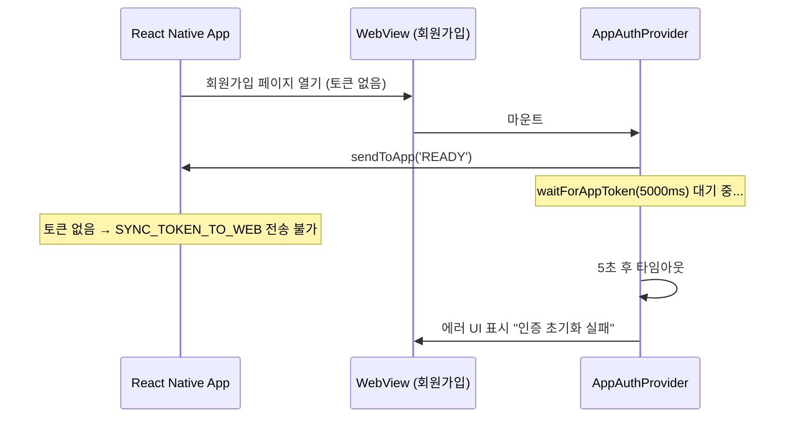
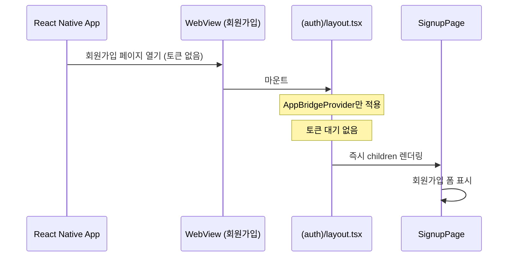
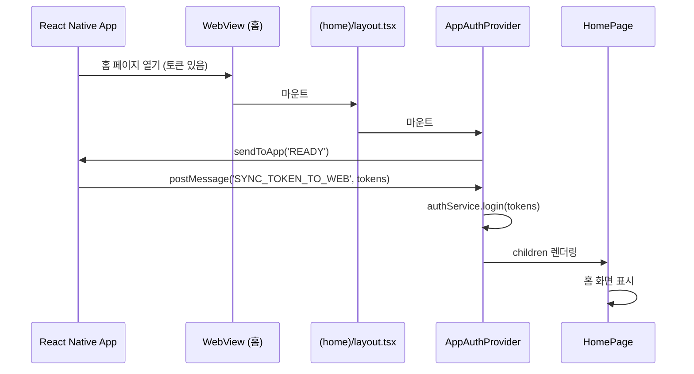

# App Bridge 비로그인 플로우 처리

## 개요

현재 `AppAuthProvider`는 앱 환경 진입 시 항상 토큰 수신을 대기합니다. 그러나 회원가입/이메일 로그인 페이지의 경우 앱이 토큰을 가지고 있지 않으므로, 5초 타임아웃 후 에러 UI가 표시되는 문제가 있습니다.

---

## 문제 상황

### 현재 동작



### 영향받는 페이지

| 페이지 | 경로 | 문제 |
|--------|------|------|
| 로그인 메인 | `/login` | 앱에서 열 때 토큰 대기 → 타임아웃 |
| 이메일 로그인 | `/login/email` | 앱에서 열 때 토큰 대기 → 타임아웃 |
| 회원가입 | `/signup` | 앱에서 열 때 토큰 대기 → 타임아웃 |

### 현재 AppAuthProvider 코드

```typescript
// src/shared/components/providers/AppAuthProvider.tsx
useEffect(() => {
  const initialize = async () => {
    // 웹 환경: 즉시 초기화 완료
    if (!appBridge.isInApp()) {
      setState({ isInitialized: true, error: null });
      return;
    }

    // 앱 환경: 토큰 수신 대기 ← 문제 발생 지점
    try {
      const tokens = await appBridge.waitForAppToken(tokenTimeout);
      authService.login(tokens);
      setState({ isInitialized: true, error: null });
    } catch (error) {
      // 토큰 없는 상황에서 여기로 진입 → 에러 UI 표시
      console.error('[AppAuthProvider] Token wait failed:', error);
      setState({
        isInitialized: true,
        error: error instanceof Error ? error : new Error('Unknown error'),
      });
    }
  };

  initialize();
}, [tokenTimeout]);
```

---

## 해결 방안

### 옵션 분석

| 옵션 | 설명 | 장점 | 단점 |
|------|------|------|------|
| **A. Auth 페이지 제외** | auth 관련 페이지는 AppAuthProvider에서 토큰 대기 스킵 | 간단, 명확 | 경로 하드코딩 필요 |
| **B. 앱에서 상태 전달** | 앱이 `NO_TOKEN` 메시지 전송 | 앱-웹 협력, 확장성 | 앱 코드 수정 필요 |
| **C. Layout 분리** | auth 페이지 그룹에 별도 layout 적용 | Next.js 패턴 활용, 깔끔 | 파일 구조 변경 |
| **D. Provider prop 추가** | `skipTokenWait` prop으로 제어 | 유연, 기존 구조 유지 | 각 페이지에서 설정 필요 |

### 권장: 옵션 C - Layout 분리

Next.js App Router의 중첩 레이아웃을 활용하여, auth 페이지 그룹에는 토큰 대기 없이 바로 렌더링되도록 합니다.

**이유:**
1. Next.js 권장 패턴 활용
2. 코드 변경 최소화 (Provider 로직 수정 없음)
3. 명시적 분리 (인증 필요 페이지 vs 불필요 페이지)
4. 향후 확장 용이 (auth 페이지에만 적용할 Provider 추가 등)
5. 기존 `(home)` 그룹 구조 활용 가능

---

## 구현 계획

### Phase 1: Layout 구조 분석

#### Task 1.1: 현재 layout 구조 파악

현재 구조:
```
src/app/
├── layout.tsx              # 루트 레이아웃 (AppAuthProvider 적용)
├── (auth)/
│   ├── login/
│   │   ├── page.tsx        # 로그인 메인
│   │   └── email/page.tsx  # 이메일 로그인
│   ├── signup/page.tsx     # 회원가입
│   └── ...
└── (home)/
    └── ...                 # 인증 필요 페이지들
```

---

### Phase 2: Auth 페이지 전용 Layout 구현

#### Task 2.1: (auth) 그룹 layout 생성

**파일**: `src/app/(auth)/layout.tsx`

```typescript
'use client';

import { ReactNode } from 'react';
import { AppBridgeProvider } from '@/shared/components/providers/AppBridgeProvider';

interface AuthLayoutProps {
  children: ReactNode;
}

/**
 * Auth 페이지 전용 레이아웃
 * - 토큰 대기 없음 (AppAuthProvider 사용 안 함)
 * - AppBridgeProvider만 적용 (로그인 성공 시 앱에 토큰 동기화 필요)
 */
export default function AuthLayout({ children }: AuthLayoutProps) {
  return (
    <AppBridgeProvider>
      {children}
    </AppBridgeProvider>
  );
}
```

**핵심 변경:**
- `AppAuthProvider` 제외 (토큰 대기 없음)
- `AppBridgeProvider`만 적용 (로그인/회원가입 성공 시 앱에 토큰 동기화 필요)

---

#### Task 2.2: 루트 layout 수정

**파일**: `src/app/layout.tsx`

**현재:**
```typescript
export default function RootLayout({ children }) {
  return (
    <html>
      <body>
        <AppAuthProvider>      {/* 모든 페이지에 적용 */}
          <AppBridgeProvider>
            <MSWClientProvider>
              <TanstackQueryWrapper>
                <ToastProvider>
                  {children}
                </ToastProvider>
              </TanstackQueryWrapper>
            </MSWClientProvider>
          </AppBridgeProvider>
        </AppAuthProvider>
      </body>
    </html>
  );
}
```

**변경 후:**
```typescript
export default function RootLayout({ children }) {
  return (
    <html>
      <body>
        <MSWClientProvider>
          <TanstackQueryWrapper>
            <ToastProvider>
              {children}  {/* AppAuthProvider, AppBridgeProvider 제거 */}
            </ToastProvider>
          </TanstackQueryWrapper>
        </MSWClientProvider>
      </body>
    </html>
  );
}
```

---

#### Task 2.3: (home) 그룹 layout 생성

인증이 필요한 페이지들을 위한 레이아웃

**파일**: `src/app/(home)/layout.tsx`

```typescript
'use client';

import { ReactNode } from 'react';
import { AppAuthProvider } from '@/shared/components/providers/AppAuthProvider';
import { AppBridgeProvider } from '@/shared/components/providers/AppBridgeProvider';

interface MainLayoutProps {
  children: ReactNode;
}

/**
 * 메인 페이지 전용 레이아웃
 * - 앱 환경: 토큰 대기 후 렌더링
 * - 웹 환경: 즉시 렌더링
 */
export default function MainLayout({ children }: MainLayoutProps) {
  return (
    <AppAuthProvider
      loadingFallback={
        <div className="flex h-screen items-center justify-center bg-normal-alternative">
          <div className="animate-spin rounded-full h-8 w-8 border-b-2 border-white" />
        </div>
      }
      errorFallback={
        <div className="flex h-screen flex-col items-center justify-center bg-normal-alternative text-white">
          <p>인증에 실패했습니다</p>
          <p className="text-sm text-gray-400 mt-2">앱을 다시 시작해주세요</p>
        </div>
      }
    >
      <AppBridgeProvider>
        {children}
      </AppBridgeProvider>
    </AppAuthProvider>
  );
}
```

---

### Phase 3: 파일 구조 정리

#### Task 3.1: 페이지 그룹 재정리

**목표 구조:**
```
src/app/
├── layout.tsx              # 루트 레이아웃 (공통 Provider만)
│
├── (auth)/                 # 인증 불필요 페이지 그룹
│   ├── layout.tsx          # AppBridgeProvider만 적용
│   ├── login/
│   │   ├── page.tsx
│   │   ├── email/page.tsx
│   │   └── KakaoLoginButton.tsx
│   ├── signup/page.tsx
│   ├── oauth/callback/page.tsx
│   └── promotion/page.tsx
│
└── (home)/                 # 인증 필요 페이지 그룹
    ├── layout.tsx          # AppAuthProvider + AppBridgeProvider 적용
    └── ...                 # 홈, 프로필 등 인증 필요 페이지들
```

**확인 필요:**
- 현재 (home) 그룹 내 페이지 목록 확인
- 기존 페이지 이동 필요 여부

---

### Phase 4: 플로우 다이어그램

#### Task 4.1: 변경 후 동작 확인

**Auth 페이지 (회원가입/로그인) 플로우:**



**Home 페이지 (홈/프로필 등) 플로우:**



---

## 체크리스트

### Phase 1: Layout 구조 분석
- [ ] 현재 layout 구조 파악
- [ ] (home) 그룹 내 페이지 목록 확인
- [ ] 인증 필요 페이지 목록 확인

### Phase 2: Auth 페이지 전용 Layout 구현
- [ ] `src/app/(auth)/layout.tsx` 생성
- [ ] 루트 `layout.tsx`에서 AppAuthProvider, AppBridgeProvider 제거
- [ ] `src/app/(home)/layout.tsx` 생성

### Phase 3: 파일 구조 정리
- [ ] 페이지 그룹 재정리 (필요시)
- [ ] 기존 페이지 이동 (필요시)

### Phase 4: 테스트
- [ ] 웹 환경: 로그인/회원가입 페이지 정상 동작 확인
- [ ] 앱 환경: 로그인/회원가입 페이지 즉시 렌더링 확인 (타임아웃 없음)
- [ ] 앱 환경: 홈 등 인증 페이지 토큰 수신 후 렌더링 확인
- [ ] 로그인 성공 시 앱에 토큰 동기화 확인 (SYNC_TOKEN_TO_APP)

---

## 대안: 옵션 B (앱에서 상태 전달)

Layout 분리가 어려운 경우, 앱이 토큰 유무를 알려주는 방식도 가능합니다.

### 메시지 타입 추가

```typescript
// src/shared/lib/appBridge/types.ts
export type AppMessageType =
  | 'READY'
  | 'SYNC_TOKEN_TO_WEB'
  | 'SYNC_TOKEN_TO_APP'
  | 'LOGOUT'
  | 'NAVIGATE_TO_NATIVE_LOGIN'
  | 'NO_TOKEN';  // App → Web: 토큰 없음 알림
```

### AppAuthProvider 수정

```typescript
// waitForAppToken 수정
waitForAppToken(timeout: number = 5000): Promise<AppTokenPayload | null> {
  return new Promise((resolve, reject) => {
    const timeoutId = setTimeout(() => {
      cleanup();
      reject(new Error(`토큰 수신 타임아웃 (${timeout}ms)`));
    }, timeout);

    const cleanup = this.onAppMessage<AppTokenPayload>((message) => {
      if (message.type === 'SYNC_TOKEN_TO_WEB' && message.payload) {
        clearTimeout(timeoutId);
        cleanup();
        resolve(message.payload);
      }
      if (message.type === 'NO_TOKEN') {
        clearTimeout(timeoutId);
        cleanup();
        resolve(null);  // 토큰 없음 → 정상 진행
      }
    });

    this.sendToApp('READY');
  });
}
```

### 앱 측 구현 (React Native)

```javascript
// React Native WebView
webViewRef.current?.injectJavaScript(`
  window.postMessage(${JSON.stringify({
    type: hasTokens ? 'SYNC_TOKEN_TO_WEB' : 'NO_TOKEN',
    payload: hasTokens ? tokens : undefined
  })});
`);
```

**단점:**
- 앱 코드 수정 필요 (React Native 측)
- 앱-웹 간 추가 프로토콜 필요

---

## 관련 문서

- [Auth 리팩토링 및 App Bridge 구현](./auth-refactoring-and-app-bridge.md)
- [App Bridge 아키텍처 옵션](./app-bridge-architecture-options.md)
