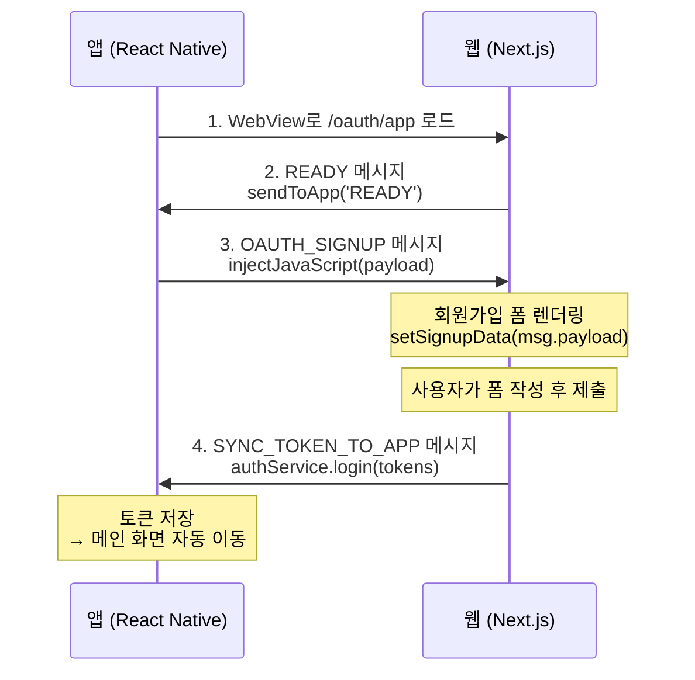

# 앱 전용 소셜 로그인 회원가입 페이지 구현

## 개요

앱(React Native)에서 소셜 로그인(Apple/Kakao) 후 추가 회원가입이 필요한 경우, WebView를 통해 회원가입 폼을 표시하는 전용 페이지를 구현합니다.

---

## 현재 구현 상황

### 이미 구현된 항목

| 항목 | 파일 | 설명 |
|------|------|------|
| `appBridge` 유틸리티 | `src/shared/lib/appBridge/` | `isInApp()`, `sendToApp()`, `onAppMessage()` 구현 완료 |
| Window 타입 선언 | `src/shared/type/global.d.ts` | `ReactNativeWebView` 타입 선언 완료 |
| `AppBridgeProvider` | `src/shared/components/providers/` | Auth 이벤트 → 앱 알림 구현 완료 |

### 신규 구현 필요 항목

| 항목 | 파일 | 설명 |
|------|------|------|
| `/oauth/app` 페이지 | `src/app/(auth)/oauth/app/page.tsx` | 앱 전용 소셜 회원가입 페이지 |
| 메시지 타입 추가 | `src/shared/lib/appBridge/types.ts` | `OAUTH_SIGNUP` 메시지 타입 추가 |

---

## 통신 플로우



---

## 구현 계획

### Phase 1: 메시지 타입 추가

#### Task 1.1: AppBridge 메시지 타입 확장

**파일**: `src/shared/lib/appBridge/types.ts`

```typescript
/**
 * App ↔ Web 메시지 타입
 */
export type AppMessageType =
  | 'READY'                    // Web → App: 웹 준비 완료
  | 'SYNC_TOKEN_TO_WEB'        // App → Web: 앱에서 웹으로 토큰 동기화
  | 'SYNC_TOKEN_TO_APP'        // Web → App: 웹에서 앱으로 토큰 동기화
  | 'LOGOUT'                   // Web → App: 로그아웃
  | 'NAVIGATE_TO_NATIVE_LOGIN' // Web → App: 네이티브 로그인 화면으로 이동
  | 'OAUTH_SIGNUP';            // App → Web: 소셜 로그인 회원가입 데이터 전달

/**
 * 소셜 로그인 회원가입 페이로드 (OAUTH_SIGNUP에서 사용)
 */
export interface OAuthSignupPayload {
  identityToken: string;
  registrationToken: string;
  socialLoginType: 'apple' | 'kakao';
}
```

---

### Phase 2: 앱 전용 회원가입 페이지 구현

#### Task 2.1: `/oauth/app` 페이지 생성

**파일**: `src/app/(auth)/oauth/app/page.tsx`

```typescript
'use client';

import { useEffect, useState } from 'react';
import { useRouter } from 'next/navigation';
import { appBridge } from '@/shared/lib/appBridge';
import type { OAuthSignupPayload } from '@/shared/lib/appBridge';

export default function OAuthAppSignupPage() {
  const router = useRouter();
  const [signupData, setSignupData] = useState<OAuthSignupPayload | null>(null);
  const [error, setError] = useState<string | null>(null);

  useEffect(() => {
    // 1. 앱 환경이 아니면 일반 웹 회원가입으로 리다이렉트
    if (!appBridge.isInApp()) {
      router.replace('/signup');
      return;
    }

    // 2. 앱에 준비 완료 알림
    appBridge.sendToApp('READY');

    // 3. 앱에서 회원가입 데이터 수신
    const unsubscribe = appBridge.onAppMessage<OAuthSignupPayload>((message) => {
      if (message.type === 'OAUTH_SIGNUP' && message.payload) {
        setSignupData(message.payload);
      }
    });

    // 4. 타임아웃 처리 (10초)
    const timeoutId = setTimeout(() => {
      if (!signupData) {
        setError('회원가입 데이터를 받지 못했습니다.');
      }
    }, 10000);

    return () => {
      unsubscribe();
      clearTimeout(timeoutId);
    };
  }, [router, signupData]);

  // 에러 상태
  if (error) {
    return (
      <div className="flex h-screen flex-col items-center justify-center bg-normal-alternative text-white">
        <p>{error}</p>
        <button
          onClick={() => appBridge.sendToApp('NAVIGATE_TO_NATIVE_LOGIN')}
          className="mt-4 px-4 py-2 bg-white text-black rounded"
        >
          돌아가기
        </button>
      </div>
    );
  }

  // 로딩 상태
  if (!signupData) {
    return (
      <div className="flex h-screen items-center justify-center bg-normal-alternative">
        <div className="animate-spin rounded-full h-8 w-8 border-b-2 border-white" />
      </div>
    );
  }

  // 회원가입 폼 렌더링
  return (
    <OAuthSignupForm
      socialLoginType={signupData.socialLoginType}
      registrationToken={signupData.registrationToken}
    />
  );
}
```

---

#### Task 2.2: 소셜 회원가입 폼 컴포넌트

**파일**: `src/app/(auth)/oauth/app/OAuthSignupForm.tsx`

기존 카카오 회원가입 폼(`KakaoSignupForm`)을 참고하여 구현합니다.

```typescript
'use client';

import { useRouter } from 'next/navigation';
import { authService } from '@/shared/lib/auth';
import { appBridge } from '@/shared/lib/appBridge';
// 기존 회원가입 폼 컴포넌트 재사용

interface OAuthSignupFormProps {
  socialLoginType: 'apple' | 'kakao';
  registrationToken: string;
}

export function OAuthSignupForm({ socialLoginType, registrationToken }: OAuthSignupFormProps) {
  const router = useRouter();

  const handleSignupSuccess = (accessToken: string, refreshToken: string) => {
    // authService.login() 호출 → AppBridgeProvider가 자동으로 앱에 토큰 전달
    authService.login({ accessToken, refreshToken });

    // 앱에서 토큰 수신 후 자동으로 메인 화면으로 이동함
    // 웹에서는 별도 처리 불필요
  };

  return (
    <div className="flex flex-col h-screen bg-normal-alternative">
      {/* 헤더 */}
      <PageHeader
        title="회원가입"
        onBackClick={() => appBridge.sendToApp('NAVIGATE_TO_NATIVE_LOGIN')}
      />

      {/* 회원가입 폼 - 기존 KakaoSignupForm 구조 재사용 */}
      {/* socialLoginType에 따라 UI 분기 가능 */}
    </div>
  );
}
```

---

### Phase 3: 기존 composite 폴더 확장

기존 `src/composite/signup/signUpForm/` 폴더의 파일들을 분석하여, 재사용 가능한 항목과 신규 추가 필요 항목을 구분하여 구현합니다.

---

#### Task 3.1: 기존 파일 분석

**폴더**: `src/composite/signup/signUpForm/`

| 파일 | 역할 | 재사용 가능 여부 |
|------|------|-----------------|
| `type.ts` | 타입 정의 (`CareerYearType`, `KakaoSignupFormData`, `KakaoSignUpRequest`) | ✅ 타입 재사용 + 신규 타입 추가 |
| `const.ts` | 연차 옵션 상수 (`CAREER_YEAR_OPTIONS`, `CAREER_YEAR_VALUES`) | ✅ 그대로 재사용 |
| `api.ts` | API 함수 (`postSignUp`, `postKakaoSignUp`) | ✅ 재사용 + 신규 API 추가 |
| `hook.ts` | 훅 (`useFetchSignUp`, `useFetchKakaoSignUp`) | ❌ 신규 훅 필요 (URL hash 대신 props로 토큰 전달) |
| `KakaoSignupForm.tsx` | 카카오 회원가입 폼 UI | ❌ 신규 컴포넌트 필요 (앱 전용 로직) |
| `component.tsx` | 이메일 회원가입 폼 UI | ❌ 관련 없음 |
| `index.ts` | 모듈 export | ✅ 신규 export 추가 |

---

#### Task 3.2: 기존 `hook.ts` 분석 및 문제점

**현재 코드** (`useFetchKakaoSignUp`):

```typescript
export function useFetchKakaoSignUp() {
  const fetchKakaoSignUp = async (data: KakaoSignupFormData) => {
    // ❌ 문제: URL hash에서 registrationToken 추출
    const hashed = window.location.hash.replace('#', '');
    const url = new URLSearchParams(hashed);
    const registrationToken = url.get('registrationToken');

    await postKakaoSignUp(data, registrationToken);
  };
}
```

**문제점:**
- 앱 환경에서는 `registrationToken`이 URL hash가 아닌 `OAUTH_SIGNUP` 메시지 payload로 전달됨
- 기존 훅 수정 시 웹 카카오 회원가입 플로우에 영향 줌

**해결 방안:**
- 앱 전용 훅 `useFetchAppSocialSignup` 신규 생성
- `registrationToken`을 props로 전달받는 구조

---

#### Task 3.3: 파일별 변경 사항

##### 1) `type.ts` - 신규 타입 추가

```typescript
// 기존 타입 유지
export type CareerYearType = 'NEWBIE' | 'JUNIOR' | 'MID' | 'SENIOR' | 'LEAD';

export interface KakaoSignupFormData {
  name: string;
  jobRoleId: string;
  careerYear: '' | CareerYearType;
  privacyPolicy: boolean;
  termsOfService: boolean;
}

export interface KakaoSignUpRequest extends Omit<KakaoSignupFormData, 'privacyPolicy' | 'termsOfService'> {
  registrationToken: string;
  requiredConsent: {
    isPrivacyPolicyAgreed: boolean;
    isServiceTermsAgreed: boolean;
  };
}

export interface KakaoSignUpResponse {}

// ✅ 신규 추가: 앱 소셜 로그인 관련 타입
export type SocialLoginType = 'kakao' | 'apple';

// 앱 소셜 회원가입은 KakaoSignupFormData와 동일한 구조
export type AppSocialSignupFormData = KakaoSignupFormData;

// 앱 소셜 회원가입 응답 (토큰 포함)
export interface AppSocialSignUpResponse {
  accessToken: string;
  refreshToken: string;
}
```

##### 2) `api.ts` - 신규 API 함수 추가

```typescript
// 기존 코드 유지
export async function postKakaoSignUp(req: KakaoSignupFormData, registrationToken: string) {
  // ... 기존 코드
}

// ✅ 신규 추가: 앱 전용 소셜 회원가입 API
export async function postAppSocialSignUp(
  req: KakaoSignupFormData,
  registrationToken: string,
  socialType: SocialLoginType
): Promise<AppSocialSignUpResponse> {
  const { privacyPolicy, termsOfService, ...rest } = req;
  const request: KakaoSignUpRequest = {
    registrationToken,
    ...rest,
    requiredConsent: {
      isPrivacyPolicyAgreed: true,
      isServiceTermsAgreed: true,
    },
  };

  // 소셜 타입별 엔드포인트 분기
  const endpoint = socialType === 'kakao'
    ? '/auth/signup/kakao'
    : '/auth/signup/apple';

  return await apiClient.post<KakaoSignUpRequest, AppSocialSignUpResponse>(
    endpoint,
    request
  );
}
```

##### 3) `hook.ts` - 신규 훅 추가

```typescript
// 기존 코드 유지
export function useFetchKakaoSignUp() {
  // ... 기존 코드 (URL hash 기반)
}

// ✅ 신규 추가: 앱 전용 소셜 회원가입 훅
import { authService } from '@/shared/lib/auth';
import { postAppSocialSignUp } from './api';
import { KakaoSignupFormData, SocialLoginType } from './type';

interface UseAppSocialSignupProps {
  registrationToken: string;
  socialType: SocialLoginType;
}

export function useFetchAppSocialSignup({
  registrationToken,
  socialType,
}: UseAppSocialSignupProps) {
  const { showToast } = useToast();
  const [isSubmitting, setSubmitting] = useState<boolean>(false);
  const [isSignupSuccess, setSignupSuccess] = useState<boolean>(false);

  const fetchAppSocialSignup = async (data: KakaoSignupFormData) => {
    try {
      setSubmitting(true);

      const response = await postAppSocialSignUp(data, registrationToken, socialType);

      // 토큰 저장 → AppBridgeProvider가 자동으로 앱에 SYNC_TOKEN_TO_APP 전송
      authService.login({
        accessToken: response.accessToken,
        refreshToken: response.refreshToken,
      });

      setSubmitting(false);
      setSignupSuccess(true);
    } catch (error) {
      const axiosError = error as AxiosError<CommonError>;
      const errorMessage =
        axiosError.response?.data.message || '회원가입에 실패했습니다.';
      showToast(errorMessage);
      setSubmitting(false);
      setSignupSuccess(false);
    }
  };

  return {
    isSubmitting,
    isSignupSuccess,
    fetchAppSocialSignup,
  };
}
```

##### 4) `AppSocialSignupForm.tsx` - 신규 컴포넌트

```typescript
'use client';

import { useForm, Controller } from 'react-hook-form';
import { Select } from '@/shared/components/input/Select';
import { InputField } from '@/shared/components/input/InputField';
import Checkbox from '@/shared/components/input/Checkbox';
import Badge from '@/shared/components/display/Badge';
import { SelectJobResponsive } from '@/feature/auth/selectJobResponsive';
import { appBridge } from '@/shared/lib/appBridge';
import { useFetchAppSocialSignup } from './hook';
import { KakaoSignupFormData, SocialLoginType } from './type';
import { CAREER_YEAR_OPTIONS, CAREER_YEAR_VALUES } from './const';

interface AppSocialSignupFormProps {
  registrationToken: string;
  socialType: SocialLoginType;
}

export const AppSocialSignupForm = ({
  registrationToken,
  socialType,
}: AppSocialSignupFormProps) => {
  const { isSubmitting, isSignupSuccess, fetchAppSocialSignup } = useFetchAppSocialSignup({
    registrationToken,
    socialType,
  });

  const {
    watch,
    setValue,
    register,
    control,
    handleSubmit,
    formState: { errors, isValid },
  } = useForm<KakaoSignupFormData>({
    mode: 'onChange',
    defaultValues: {
      name: '',
      jobRoleId: '',
      careerYear: '',
      privacyPolicy: false,
      termsOfService: false,
    },
  });

  const jobRoleId = watch('jobRoleId');

  return (
    <form className="space-y-6 w-full">
      {/* 이름 */}
      <InputField
        label="이름"
        type="text"
        placeholder="성함을 입력해주세요."
        {...register('name', {
          required: '이름을 입력해주세요.',
          maxLength: {
            value: 6,
            message: '이름은 6자 이하이어야 합니다.',
          },
        })}
        isError={!!errors.name}
        errorMessage={errors.name?.message as string}
      />

      {/* 직무 */}
      <div className="space-y-2">
        <label className="block text-sm font-medium text-gray-300">직무</label>
        <SelectJobResponsive
          selectedJobId={jobRoleId}
          onJobSelect={jobId => setValue('jobRoleId', jobId, { shouldValidate: true })}
        />
        {errors.jobRoleId && <p className="text-xs text-red-500">{errors.jobRoleId.message as string}</p>}
      </div>

      {/* 연차 */}
      <div className="space-y-2">
        <label className="block text-sm font-medium text-gray-300">연차</label>
        <Select
          options={CAREER_YEAR_OPTIONS}
          selected={(() => {
            const value = watch('careerYear');
            const label = Object.entries(CAREER_YEAR_VALUES).find(([, val]) => val === value)?.[0];
            return label || '선택';
          })()}
          onChange={value =>
            setValue('careerYear', value === '선택' ? '' : CAREER_YEAR_VALUES[value], { shouldValidate: true })
          }
          placeholder="연차를 선택해주세요"
          isError={!!errors.careerYear}
          {...(() => {
            const { onChange, ...rest } = register('careerYear', { required: '연차를 선택해주세요.' });
            return rest;
          })()}
        />
        {errors.careerYear && <p className="text-xs text-red-500">{errors.careerYear.message as string}</p>}
      </div>

      {/* 약관 동의 */}
      <div className="space-y-2">
        <label className="flex items-center space-x-2">
          <Controller
            name="privacyPolicy"
            control={control}
            rules={{ required: '개인정보 수집에 동의해주세요.' }}
            render={({ field }) => <Checkbox checked={field.value} onChange={field.onChange} />}
          />
          <Badge
            type="default"
            size="sm"
            label="필수"
            color="bg-[rgba(255,99,99,0.16)]"
            textColor="text-status-negative"
          />
          <span className="text-gray-400 text-sm">개인정보 수집 동의</span>
        </label>
        {errors.privacyPolicy && <p className="text-xs text-red-500">{errors.privacyPolicy.message as string}</p>}

        <label className="flex items-center space-x-2">
          <Controller
            name="termsOfService"
            control={control}
            rules={{ required: '이용 약관에 동의해주세요.' }}
            render={({ field }) => <Checkbox checked={field.value} onChange={field.onChange} />}
          />
          <Badge
            type="default"
            size="sm"
            label="필수"
            color="bg-[rgba(255,99,99,0.16)]"
            textColor="text-status-negative"
          />
          <span className="text-gray-400 text-sm">이용 약관 동의</span>
        </label>
        {errors.termsOfService && <p className="text-xs text-red-500">{errors.termsOfService.message as string}</p>}
      </div>

      {/* 제출 버튼 - 앱에서는 고정 버튼 대신 일반 버튼 사용 */}
      <button
        type="button"
        disabled={!isValid || isSubmitting}
        onClick={handleSubmit(fetchAppSocialSignup)}
        className={`w-full py-3 rounded-lg font-medium ${
          isValid && !isSubmitting
            ? 'bg-primary text-white'
            : 'bg-gray-600 text-gray-400 cursor-not-allowed'
        }`}
      >
        {isSubmitting ? '가입 중...' : '가입하기'}
      </button>
    </form>
  );
};
```

##### 5) `index.ts` - export 추가

```typescript
export { SignUpForm } from './component';
export { KakaoSignupForm } from './KakaoSignupForm';
export { AppSocialSignupForm } from './AppSocialSignupForm';  // ✅ 신규 추가
```

---

#### Task 3.4: 최종 파일 구조

```
src/composite/signup/signUpForm/
├── type.ts                     # 기존 + SocialLoginType, AppSocialSignUpResponse 추가
├── const.ts                    # 변경 없음 (재사용)
├── api.ts                      # 기존 + postAppSocialSignUp 추가
├── hook.ts                     # 기존 + useFetchAppSocialSignup 추가
├── component.tsx               # 변경 없음 (이메일 회원가입)
├── KakaoSignupForm.tsx         # 변경 없음 (웹 카카오 회원가입)
├── AppSocialSignupForm.tsx     # ✅ 신규 생성 (앱 소셜 회원가입)
└── index.ts                    # AppSocialSignupForm export 추가
```

---

#### Task 3.5: 페이지에서 컴포넌트 사용

**파일**: `src/app/(auth)/oauth/app/page.tsx`

```typescript
'use client';

import { useEffect, useState, useRef } from 'react';
import { useRouter } from 'next/navigation';
import { appBridge } from '@/shared/lib/appBridge';
import type { OAuthSignupPayload } from '@/shared/lib/appBridge';
import { AppSocialSignupForm } from '@/composite/signup/signUpForm';

export default function OAuthAppSignupPage() {
  const router = useRouter();
  const [signupData, setSignupData] = useState<OAuthSignupPayload | null>(null);
  const [error, setError] = useState<string | null>(null);
  const dataReceivedRef = useRef(false);

  useEffect(() => {
    // 1. 앱 환경이 아니면 일반 웹 회원가입으로 리다이렉트
    if (!appBridge.isInApp()) {
      router.replace('/signup');
      return;
    }

    // 2. 앱에 준비 완료 알림
    appBridge.sendToApp('READY');

    // 3. 앱에서 회원가입 데이터 수신
    const unsubscribe = appBridge.onAppMessage<OAuthSignupPayload>((message) => {
      if (message.type === 'OAUTH_SIGNUP' && message.payload) {
        dataReceivedRef.current = true;
        setSignupData(message.payload);
      }
    });

    // 4. 타임아웃 처리 (10초)
    const timeoutId = setTimeout(() => {
      if (!dataReceivedRef.current) {
        setError('회원가입 데이터를 받지 못했습니다.');
      }
    }, 10000);

    return () => {
      unsubscribe();
      clearTimeout(timeoutId);
    };
  }, [router]);

  // 에러 상태
  if (error) {
    return (
      <div className="flex h-screen flex-col items-center justify-center bg-normal-alternative text-white">
        <p className="text-lg mb-4">{error}</p>
        <button
          onClick={() => appBridge.sendToApp('NAVIGATE_TO_NATIVE_LOGIN')}
          className="px-6 py-3 bg-white text-black rounded-lg font-medium"
        >
          돌아가기
        </button>
      </div>
    );
  }

  // 로딩 상태
  if (!signupData) {
    return (
      <div className="flex h-screen items-center justify-center bg-normal-alternative">
        <div className="animate-spin rounded-full h-8 w-8 border-b-2 border-white" />
      </div>
    );
  }

  // 회원가입 폼 렌더링 - composite에서 import
  return (
    <div className="flex flex-col h-screen bg-normal-alternative">
      <div className="flex-1 overflow-y-auto px-5 py-6">
        <h1 className="text-xl font-bold text-white mb-6">회원가입</h1>
        <AppSocialSignupForm
          socialType={signupData.socialLoginType}
          registrationToken={signupData.registrationToken}
        />
      </div>
    </div>
  );
}
```

---

#### Task 3.6: API 엔드포인트 확인 필요

백엔드 팀에 확인 필요한 사항:

| 질문 | 현재 상황 | 확인 필요 |
|------|----------|----------|
| Apple 회원가입 엔드포인트 | `/auth/signup/kakao` 존재 | `/auth/signup/apple` 존재 여부 |
| 통합 엔드포인트 가능 여부 | 소셜 타입별 분리 | `/auth/signup/social` 가능 여부 |
| 응답에 토큰 포함 여부 | `KakaoSignUpResponse` 빈 객체 | `accessToken`, `refreshToken` 반환 여부 |

---

## 체크리스트

### Phase 1: 메시지 타입 추가
- [ ] `OAUTH_SIGNUP` 메시지 타입 추가
- [ ] `OAuthSignupPayload` 타입 정의

### Phase 2: 페이지 구현
- [ ] `/oauth/app` 페이지 생성
- [ ] 앱 환경 감지 및 리다이렉트 처리
- [ ] `READY` 메시지 전송
- [ ] `OAUTH_SIGNUP` 메시지 수신 처리
- [ ] 로딩 UI 구현
- [ ] 에러 UI 구현
- [ ] 타임아웃 처리

### Phase 3: 기존 composite 폴더 확장
- [ ] `type.ts` - `SocialLoginType`, `AppSocialSignUpResponse` 타입 추가
- [ ] `api.ts` - `postAppSocialSignUp` API 함수 추가
- [ ] `hook.ts` - `useFetchAppSocialSignup` 훅 추가
- [ ] `AppSocialSignupForm.tsx` - 앱 전용 회원가입 폼 신규 생성
- [ ] `index.ts` - `AppSocialSignupForm` export 추가
- [ ] 회원가입 성공 시 `authService.login()` 호출

### Phase 4: 테스트
- [ ] 웹 환경: `/oauth/app` 접속 시 `/signup`으로 리다이렉트 확인
- [ ] 앱 환경: `READY` → `OAUTH_SIGNUP` → 폼 렌더링 확인
- [ ] 앱 환경: 회원가입 완료 시 토큰 앱 전달 확인
- [ ] 앱 환경: 뒤로가기 시 네이티브 로그인 화면 이동 확인

---

## 주의사항

1. **앱 환경 감지**: `appBridge.isInApp()` 함수로 앱 WebView 환경인지 확인 필수
2. **READY 메시지**: 페이지 로드 완료 시 반드시 `READY` 메시지를 앱으로 전송해야 앱이 데이터를 전달함
3. **메시지 형식**: 모든 메시지는 `{ type: string, payload?: unknown }` 형식의 JSON 문자열
4. **토큰 전달**: `authService.login()` 호출 시 `AppBridgeProvider`가 자동으로 `SYNC_TOKEN_TO_APP` 메시지 전송
5. **(auth) layout 적용**: `/oauth/app` 페이지는 `(auth)` 그룹에 위치하므로 토큰 대기 없이 즉시 렌더링됨

---

## 관련 문서

- [Auth 리팩토링 및 App Bridge 구현](./auth-refactoring-and-app-bridge.md)
- [App Bridge 비로그인 플로우 처리](./app-bridge-unauthenticated-flow.md)
