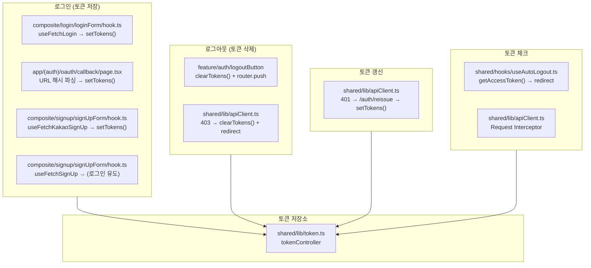
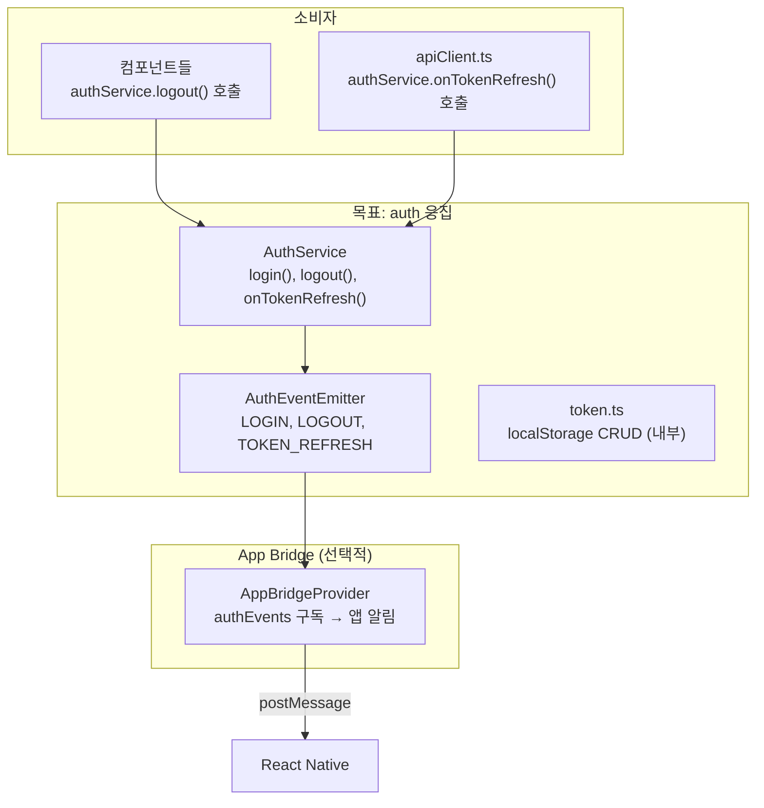
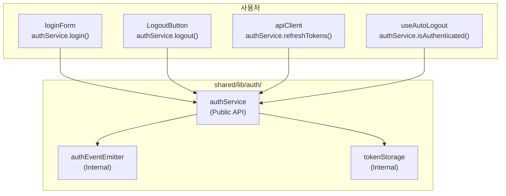
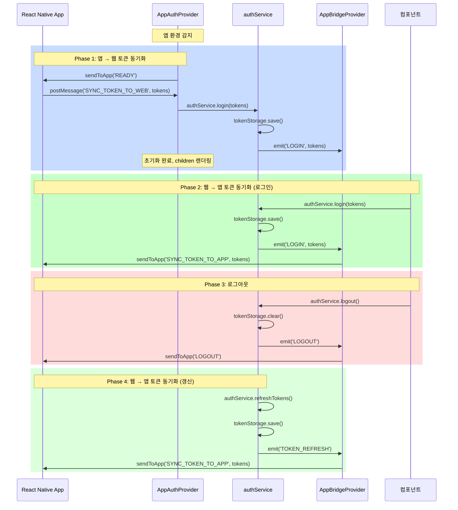
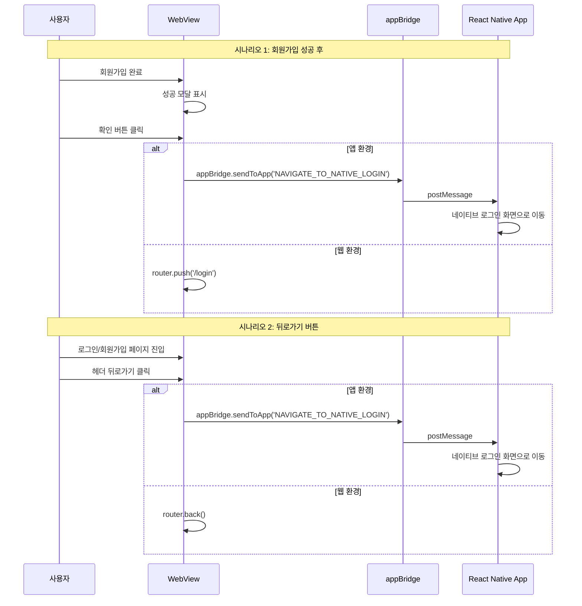
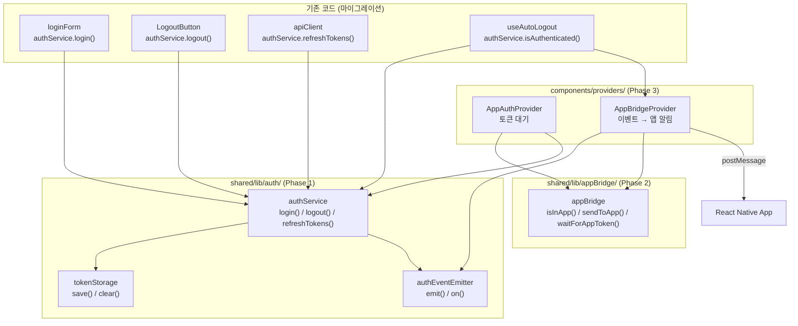
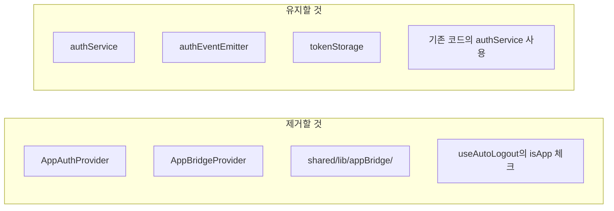

# Auth 리팩토링 및 App Bridge 구현

## 개요

App Bridge 구현 전, auth 관련 코드의 응집도를 높여 유지보수성을 개선합니다.

---

## 현재 코드베이스 분석

### 현재 폴더 구조

```
src/
├── app/(auth)/                          # Auth 관련 페이지
│   ├── login/
│   │   ├── page.tsx                     # 로그인 메인
│   │   ├── email/page.tsx               # 이메일 로그인
│   │   ├── actions.ts                   # 카카오 로그인 서버 액션
│   │   └── KakaoLoginButton.tsx
│   ├── signup/page.tsx                  # 회원가입
│   ├── oauth/callback/page.tsx          # OAuth 콜백
│   └── promotion/page.tsx               # 프로모션 코드
│
├── shared/
│   ├── lib/
│   │   ├── token.ts                     # 토큰 CRUD (tokenController)
│   │   └── apiClient.ts                 # Axios + 인터셉터
│   ├── hooks/
│   │   └── useAutoLogout.ts             # 자동 로그아웃
│   └── type/
│       └── authToken.ts                 # AuthToken 타입
│
├── feature/auth/
│   ├── logoutButton/component.tsx       # 로그아웃 버튼
│   ├── LoginButton.tsx                  # 이메일 로그인 버튼
│   ├── signUpButton/components.tsx      # 회원가입 버튼
│   ├── signupDialogButton/component.tsx # 가입 제출 버튼
│   ├── selectJobResponsive/             # 직무 선택
│   └── index.ts
│
└── composite/
    ├── login/loginForm/                 # 로그인 폼
    │   ├── component.tsx
    │   ├── hook.ts                      # useFetchLogin
    │   └── api.ts                       # postLoginApi
    └── signup/signUpForm/               # 회원가입 폼
        ├── component.tsx
        ├── KakaoSignupForm.tsx
        ├── hook.ts                      # useFetchSignUp, useFetchKakaoSignUp
        ├── api.ts                       # postSignUp, postKakaoSignUp
        ├── type.ts
        └── const.ts
```

### 현재 Auth 로직 산재 현황



### 문제점 상세

| 영역 | 파일 | 현재 코드 | 문제점 |
|------|------|----------|--------|
| **로그인** | `loginForm/hook.ts` | `tokenController.setTokens()` | 직접 호출 |
| **로그인** | `oauth/callback/page.tsx` | `tokenController.setTokens()` | 직접 호출 |
| **로그아웃** | `logoutButton/component.tsx` | `tokenController.clearTokens()` + `router.push` | 로직 중복 |
| **로그아웃** | `apiClient.ts` (403) | `tokenController.clearTokens()` + `redirect` | 로직 중복 |
| **토큰갱신** | `apiClient.ts` (401) | `tokenController.setTokens()` | 이벤트 발행 없음 |
| **토큰체크** | `useAutoLogout.ts` | `tokenController.getAccessToken()` | 앱 환경 미고려 |

### 현재 주요 파일 코드 요약

#### `shared/lib/token.ts`
```typescript
export const tokenController = {
  setTokens(accessToken: string, refreshToken: string) {
    localStorage.setItem(ACCESS_TOKEN_KEY, accessToken);
    localStorage.setItem(REFRESH_TOKEN_KEY, refreshToken);
  },
  clearTokens() {
    localStorage.removeItem(ACCESS_TOKEN_KEY);
    localStorage.removeItem(REFRESH_TOKEN_KEY);
  },
  getAccessToken(): string | null { ... },
  getRefreshToken(): string | null { ... },
};
```

#### `shared/lib/apiClient.ts`
```typescript
// Response Interceptor
if (error.response?.status === 401) {
  // 토큰 갱신
  const response = await axios.post('/auth/reissue', { refreshToken });
  tokenController.setTokens(accessToken, newRefreshToken);  // 직접 호출
  return apiClient.request(originalRequest);
}

if (error.response?.status === 403) {
  tokenController.clearTokens();  // 직접 호출
  window.location.href = '/login';
}
```

#### `feature/auth/logoutButton/component.tsx`
```typescript
const handleLogout = () => {
  tokenController.clearTokens();  // 직접 호출
  router.push('/login');
};
```

#### `shared/hooks/useAutoLogout.ts`
```typescript
useEffect(() => {
  if (isMockEnvironment) return;

  const accessToken = tokenController.getAccessToken();  // 직접 호출
  const refreshToken = tokenController.getRefreshToken();

  if (!accessToken || !refreshToken) {
    router.push('/login');
  }
}, [router, isMockEnvironment]);
```

---

## 목표 구조



---

## 단계별 구현 계획

### Phase 1: Auth 응집도 개선

#### 목표 폴더 구조

```
src/shared/lib/auth/
├── index.ts                 # Public API (authService만 export)
├── authService.ts           # 핵심 서비스 (login, logout, refresh)
├── authEventEmitter.ts      # 이벤트 발행/구독
├── tokenStorage.ts          # localStorage 접근 (내부용, 기존 token.ts 이동)
└── types.ts                 # 타입 정의
```

**설계 원칙:**
- `authService`만 외부에 노출
- `tokenStorage`는 내부에서만 사용 (직접 import 금지)
- 모든 auth 관련 동작은 `authService`를 통해 수행

---

#### Task 1.1: 타입 정의

**파일**: `src/shared/lib/auth/types.ts`

```typescript
/**
 * 토큰 페이로드
 */
export interface TokenPayload {
  accessToken: string;
  refreshToken: string;
}

/**
 * Auth 이벤트 타입
 */
export type AuthEventType = 'LOGIN' | 'LOGOUT' | 'TOKEN_REFRESH';

/**
 * Auth 이벤트 리스너
 */
export type AuthEventListener<T = void> = (payload: T) => void;
```

---

#### Task 1.2: AuthEventEmitter 구현

**파일**: `src/shared/lib/auth/authEventEmitter.ts`

```typescript
import type { AuthEventType, AuthEventListener, TokenPayload } from './types';

type EventPayloadMap = {
  LOGIN: TokenPayload;
  LOGOUT: void;
  TOKEN_REFRESH: TokenPayload;
};

class AuthEventEmitter {
  private listeners: Map<AuthEventType, Set<AuthEventListener<any>>> = new Map();

  /**
   * 이벤트 발행
   */
  emit<T extends AuthEventType>(type: T, payload?: EventPayloadMap[T]): void {
    const eventListeners = this.listeners.get(type);
    if (!eventListeners) return;

    eventListeners.forEach((listener) => {
      try {
        listener(payload);
      } catch (error) {
        console.error(`[AuthEventEmitter] Error in ${type} listener:`, error);
      }
    });
  }

  /**
   * 이벤트 구독
   * @returns 구독 해제 함수
   */
  on<T extends AuthEventType>(
    type: T,
    listener: AuthEventListener<EventPayloadMap[T]>
  ): () => void {
    if (!this.listeners.has(type)) {
      this.listeners.set(type, new Set());
    }
    this.listeners.get(type)!.add(listener);

    // 구독 해제 함수 반환
    return () => this.off(type, listener);
  }

  /**
   * 이벤트 구독 해제
   */
  off<T extends AuthEventType>(
    type: T,
    listener: AuthEventListener<EventPayloadMap[T]>
  ): void {
    this.listeners.get(type)?.delete(listener);
  }

  /**
   * 모든 리스너 제거 (테스트용)
   */
  clear(): void {
    this.listeners.clear();
  }
}

// 싱글톤 인스턴스
export const authEventEmitter = new AuthEventEmitter();
```

---

#### Task 1.3: TokenStorage 구현 (기존 token.ts 리팩토링)

**파일**: `src/shared/lib/auth/tokenStorage.ts`

```typescript
/**
 * 토큰 저장소 (내부용)
 * - localStorage 직접 접근
 * - authService 외부에서 직접 사용 금지
 */

const ACCESS_TOKEN_KEY = 'accessToken';
const REFRESH_TOKEN_KEY = 'refreshToken';

export const tokenStorage = {
  save(accessToken: string, refreshToken: string): void {
    if (typeof window === 'undefined') return;
    localStorage.setItem(ACCESS_TOKEN_KEY, accessToken);
    localStorage.setItem(REFRESH_TOKEN_KEY, refreshToken);
  },

  clear(): void {
    if (typeof window === 'undefined') return;
    localStorage.removeItem(ACCESS_TOKEN_KEY);
    localStorage.removeItem(REFRESH_TOKEN_KEY);
  },

  getAccessToken(): string | null {
    if (typeof window === 'undefined') return null;
    return localStorage.getItem(ACCESS_TOKEN_KEY);
  },

  getRefreshToken(): string | null {
    if (typeof window === 'undefined') return null;
    return localStorage.getItem(REFRESH_TOKEN_KEY);
  },

  hasTokens(): boolean {
    return !!(this.getAccessToken() && this.getRefreshToken());
  },
};
```

---

#### Task 1.4: AuthService 구현

**파일**: `src/shared/lib/auth/authService.ts`

```typescript
import { tokenStorage } from './tokenStorage';
import { authEventEmitter } from './authEventEmitter';
import type { TokenPayload, AuthEventType, AuthEventListener } from './types';

type EventPayloadMap = {
  LOGIN: TokenPayload;
  LOGOUT: void;
  TOKEN_REFRESH: TokenPayload;
};

class AuthService {
  // ============================================
  // 상태 조회
  // ============================================

  /**
   * 인증 여부 확인
   */
  isAuthenticated(): boolean {
    return tokenStorage.hasTokens();
  }

  /**
   * Access Token 조회
   */
  getAccessToken(): string | null {
    return tokenStorage.getAccessToken();
  }

  /**
   * Refresh Token 조회
   */
  getRefreshToken(): string | null {
    return tokenStorage.getRefreshToken();
  }

  // ============================================
  // 액션
  // ============================================

  /**
   * 로그인 (토큰 저장 + 이벤트 발행)
   */
  login(tokens: TokenPayload): void {
    tokenStorage.save(tokens.accessToken, tokens.refreshToken);
    authEventEmitter.emit('LOGIN', tokens);

    if (process.env.NODE_ENV === 'development') {
      console.log('[AuthService] Login');
    }
  }

  /**
   * 로그아웃 (토큰 삭제 + 이벤트 발행)
   */
  logout(): void {
    tokenStorage.clear();
    authEventEmitter.emit('LOGOUT');

    if (process.env.NODE_ENV === 'development') {
      console.log('[AuthService] Logout');
    }
  }

  /**
   * 토큰 갱신 (토큰 저장 + 이벤트 발행)
   */
  refreshTokens(tokens: TokenPayload): void {
    tokenStorage.save(tokens.accessToken, tokens.refreshToken);
    authEventEmitter.emit('TOKEN_REFRESH', tokens);

    if (process.env.NODE_ENV === 'development') {
      console.log('[AuthService] Token refreshed');
    }
  }

  // ============================================
  // 이벤트 구독
  // ============================================

  /**
   * 로그인 이벤트 구독
   */
  onLogin(callback: AuthEventListener<TokenPayload>): () => void {
    return authEventEmitter.on('LOGIN', callback);
  }

  /**
   * 로그아웃 이벤트 구독
   */
  onLogout(callback: AuthEventListener<void>): () => void {
    return authEventEmitter.on('LOGOUT', callback);
  }

  /**
   * 토큰 갱신 이벤트 구독
   */
  onTokenRefresh(callback: AuthEventListener<TokenPayload>): () => void {
    return authEventEmitter.on('TOKEN_REFRESH', callback);
  }
}

// 싱글톤 인스턴스
export const authService = new AuthService();
```

---

#### Task 1.5: Public API (index.ts)

**파일**: `src/shared/lib/auth/index.ts`

```typescript
// Public API
export { authService } from './authService';
export type { TokenPayload, AuthEventType } from './types';

// Note: tokenStorage, authEventEmitter는 내부용이므로 export하지 않음
```

---

#### Task 1.6: 기존 코드 마이그레이션

##### 마이그레이션 대상 파일

| 파일 | 변경 내용 |
|------|----------|
| `composite/login/loginForm/hook.ts` | `tokenController.setTokens()` → `authService.login()` |
| `app/(auth)/oauth/callback/page.tsx` | `tokenController.setTokens()` → `authService.login()` |
| `composite/signup/signUpForm/hook.ts` | `tokenController.setTokens()` → `authService.login()` |
| `feature/auth/logoutButton/component.tsx` | `tokenController.clearTokens()` → `authService.logout()` |
| `shared/lib/apiClient.ts` | `tokenController.setTokens()` → `authService.refreshTokens()` |
| `shared/lib/apiClient.ts` | `tokenController.clearTokens()` → `authService.logout()` |
| `shared/hooks/useAutoLogout.ts` | `tokenController.getAccessToken()` → `authService.isAuthenticated()` |

##### Before / After 예시

**1. 로그인 (loginForm/hook.ts)**

```typescript
// Before
import { tokenController } from '@/shared/lib/token';

const onSuccess = (data) => {
  tokenController.setTokens(data.accessToken, data.refreshToken);
  router.push('/home');
};

// After
import { authService } from '@/shared/lib/auth';

const onSuccess = (data) => {
  authService.login({ accessToken: data.accessToken, refreshToken: data.refreshToken });
  router.push('/home');
};
```

**2. 로그아웃 (logoutButton/component.tsx)**

```typescript
// Before
import { tokenController } from '@/shared/lib/token';

const handleLogout = () => {
  tokenController.clearTokens();
  router.push('/login');
};

// After
import { authService } from '@/shared/lib/auth';

const handleLogout = () => {
  authService.logout();
  router.push('/login');
};
```

**3. 토큰 갱신 (apiClient.ts)**

```typescript
// Before
import { tokenController } from './token';

// 401 인터셉터
const response = await axios.post('/auth/reissue', { refreshToken });
tokenController.setTokens(response.data.accessToken, response.data.refreshToken);

// After
import { authService } from './auth';

// 401 인터셉터
const response = await axios.post('/auth/reissue', { refreshToken });
authService.refreshTokens({
  accessToken: response.data.accessToken,
  refreshToken: response.data.refreshToken,
});
```

**4. 토큰 체크 (useAutoLogout.ts)**

```typescript
// Before
import { tokenController } from '@/shared/lib/token';

useEffect(() => {
  const accessToken = tokenController.getAccessToken();
  const refreshToken = tokenController.getRefreshToken();

  if (!accessToken || !refreshToken) {
    router.push('/login');
  }
}, []);

// After
import { authService } from '@/shared/lib/auth';

useEffect(() => {
  if (!authService.isAuthenticated()) {
    router.push('/login');
  }
}, []);
```

---

#### Task 1.7: 기존 token.ts 처리

**옵션 A: 삭제** (권장)
- `shared/lib/token.ts` 삭제
- 모든 import를 `authService`로 변경

**옵션 B: Deprecated 마킹**
```typescript
// shared/lib/token.ts
import { authService } from './auth';

/**
 * @deprecated authService를 사용하세요
 */
export const tokenController = {
  setTokens: (a: string, r: string) => authService.login({ accessToken: a, refreshToken: r }),
  clearTokens: () => authService.logout(),
  getAccessToken: () => authService.getAccessToken(),
  getRefreshToken: () => authService.getRefreshToken(),
};
```

---

#### Phase 1 완료 후 구조



---

### Phase 2: App 환경 관리

#### 목표 폴더 구조

```
src/shared/lib/appBridge/
├── index.ts              # Public API
├── appBridge.ts          # 환경 감지 + postMessage 통신
└── types.ts              # 타입 정의

src/shared/type/
└── global.d.ts           # Window 타입 확장 (ReactNativeWebView)
```

---

#### Task 2.1: Window 타입 확장

**파일**: `src/shared/type/global.d.ts`

```typescript
interface Window {
  /**
   * React Native WebView에서 주입하는 객체
   */
  ReactNativeWebView?: {
    postMessage: (message: string) => void;
  };
}
```

---

#### Task 2.2: 타입 정의

**파일**: `src/shared/lib/appBridge/types.ts`

```typescript
/**
 * App ↔ Web 메시지 타입
 */
export type AppMessageType =
  | 'READY'             // Web → App: 웹 준비 완료
  | 'SYNC_TOKEN_TO_WEB' // App → Web: 앱에서 웹으로 토큰 동기화
  | 'SYNC_TOKEN_TO_APP' // Web → App: 웹에서 앱으로 토큰 동기화 (로그인/갱신)
  | 'LOGOUT';           // Web → App: 로그아웃

/**
 * 메시지 구조
 */
export interface AppMessage<T = unknown> {
  type: AppMessageType;
  payload?: T;
}

/**
 * 토큰 페이로드 (SYNC_TOKEN_TO_WEB, SYNC_TOKEN_TO_APP에서 사용)
 */
export interface AppTokenPayload {
  accessToken: string;
  refreshToken: string;
}
```

---

#### Task 2.3: AppBridge 유틸리티

**파일**: `src/shared/lib/appBridge/appBridge.ts`

```typescript
import type { AppMessage, AppMessageType, AppTokenPayload } from './types';

/**
 * App Bridge - 앱과 웹 간 통신 유틸리티
 */
export const appBridge = {
  /**
   * 앱(WebView) 환경 여부 확인
   */
  isInApp(): boolean {
    if (typeof window === 'undefined') return false;
    return window.ReactNativeWebView !== undefined;
  },

  /**
   * 앱으로 메시지 전송
   */
  sendToApp<T = unknown>(type: AppMessageType, payload?: T): void {
    if (!this.isInApp()) return;

    const message: AppMessage<T> = { type, payload };
    window.ReactNativeWebView!.postMessage(JSON.stringify(message));

    if (process.env.NODE_ENV === 'development') {
      console.log('[AppBridge] Send:', type, payload);
    }
  },

  /**
   * 앱에서 메시지 수신 리스너 등록
   * @returns 구독 해제 함수
   */
  onAppMessage<T = unknown>(
    callback: (message: AppMessage<T>) => void
  ): () => void {
    const handler = (event: MessageEvent) => {
      // 객체로 온 경우 (injectJavaScript)
      if (typeof event.data === 'object' && event.data?.type) {
        callback(event.data as AppMessage<T>);
        return;
      }

      // JSON 문자열로 온 경우
      if (typeof event.data === 'string') {
        try {
          const parsed = JSON.parse(event.data);
          if (parsed.type) {
            callback(parsed as AppMessage<T>);
          }
        } catch {
          // JSON 아님 - 무시
        }
      }
    };

    window.addEventListener('message', handler);

    return () => {
      window.removeEventListener('message', handler);
    };
  },

  /**
   * 앱에서 토큰 수신 대기 (Promise)
   * - READY 전송 → SYNC_TOKEN_TO_WEB 대기
   */
  waitForAppToken(timeout: number = 5000): Promise<AppTokenPayload> {
    return new Promise((resolve, reject) => {
      const timeoutId = setTimeout(() => {
        cleanup();
        reject(new Error(`토큰 수신 타임아웃 (${timeout}ms)`));
      }, timeout);

      const cleanup = this.onAppMessage<AppTokenPayload>((message) => {
        if (message.type === 'SYNC_TOKEN_TO_WEB' && message.payload) {
          clearTimeout(timeoutId);
          cleanup();
          resolve(message.payload);
        }
      });

      // 앱에 준비 완료 알림
      this.sendToApp('READY');
    });
  },
}
```

---

#### Task 2.4: Public API

**파일**: `src/shared/lib/appBridge/index.ts`

```typescript
export { appBridge } from './appBridge';
export type { AppMessage, AppMessageType, AppTokenPayload } from './types';
```

---

### Phase 3: App Bridge Provider 구현

#### 목표 폴더 구조

```
src/shared/components/providers/
├── AppBridgeProvider.tsx    # Auth 이벤트 → 앱 알림
└── AppAuthProvider.tsx      # 앱 환경 토큰 대기 + 로딩 UI
```

---

#### Task 3.1: AppBridgeProvider 구현

**목적**: AuthService 이벤트를 구독하여 앱에 알림

**파일**: `src/shared/components/providers/AppBridgeProvider.tsx`

```typescript
'use client';

import { useEffect, createContext, useContext, ReactNode } from 'react';
import { authService } from '@/shared/lib/auth';
import { appBridge } from '@/shared/lib/appBridge';

// ============================================
// Context
// ============================================

interface AppBridgeContextValue {
  isApp: boolean;
}

const AppBridgeContext = createContext<AppBridgeContextValue>({
  isApp: false,
});

export const useAppBridge = () => useContext(AppBridgeContext);

// ============================================
// Provider
// ============================================

interface AppBridgeProviderProps {
  children: ReactNode;
}

export function AppBridgeProvider({ children }: AppBridgeProviderProps) {
  const isApp = appBridge.isInApp();

  // Auth 이벤트 구독 → 앱에 알림
  useEffect(() => {
    if (!isApp) return;

    // 로그인 이벤트 → 앱에 SYNC_TOKEN_TO_APP 전송 (웹뷰 내 로그인)
    const unsubLogin = authService.onLogin((tokens) => {
      appBridge.sendToApp('SYNC_TOKEN_TO_APP', tokens);
    });

    // 로그아웃 이벤트 → 앱에 LOGOUT 전송
    const unsubLogout = authService.onLogout(() => {
      appBridge.sendToApp('LOGOUT');
    });

    // 토큰 갱신 이벤트 → 앱에 SYNC_TOKEN_TO_APP 전송
    const unsubRefresh = authService.onTokenRefresh((tokens) => {
      appBridge.sendToApp('SYNC_TOKEN_TO_APP', tokens);
    });

    return () => {
      unsubLogin();
      unsubLogout();
      unsubRefresh();
    };
  }, [isApp]);

  return (
    <AppBridgeContext.Provider value={{ isApp }}>
      {children}
    </AppBridgeContext.Provider>
  );
}
```

**핵심**:
- `authService.onLogin()`, `authService.onLogout()`, `authService.onTokenRefresh()` 구독
- 앱 환경일 때만 `appBridge.sendToApp()` 호출
- 웹뷰 내 로그인 성공 시에도 앱에 토큰 동기화 (`SYNC_TOKEN_TO_APP`)
- 기존 auth 코드는 수정 없음 (이벤트만 발행하면 됨)

---

#### Task 3.2: AppAuthProvider 구현

**목적**: 앱 환경에서 토큰 수신 대기 + 로딩 UI 표시

**파일**: `src/shared/components/providers/AppAuthProvider.tsx`

```typescript
'use client';

import { useEffect, useState, ReactNode } from 'react';
import { authService } from '@/shared/lib/auth';
import { appBridge } from '@/shared/lib/appBridge';

// ============================================
// Props
// ============================================

interface AppAuthProviderProps {
  children: ReactNode;
  /** 토큰 대기 중 표시할 UI */
  loadingFallback?: ReactNode;
  /** 에러 발생 시 표시할 UI */
  errorFallback?: ReactNode;
  /** 토큰 대기 타임아웃 (ms) */
  tokenTimeout?: number;
}

// ============================================
// Provider
// ============================================

export function AppAuthProvider({
  children,
  loadingFallback,
  errorFallback,
  tokenTimeout = 5000,
}: AppAuthProviderProps) {
  const [state, setState] = useState<{
    isInitialized: boolean;
    error: Error | null;
  }>({
    isInitialized: false,
    error: null,
  });

  useEffect(() => {
    const initialize = async () => {
      // 웹 환경: 즉시 초기화 완료
      if (!appBridge.isInApp()) {
        setState({ isInitialized: true, error: null });
        return;
      }

      // 앱 환경: 토큰 수신 대기
      try {
        const tokens = await appBridge.waitForAppToken(tokenTimeout);

        // authService.login() 호출 → LOGIN 이벤트 발행
        authService.login(tokens);

        setState({ isInitialized: true, error: null });
      } catch (error) {
        console.error('[AppAuthProvider] Token wait failed:', error);
        setState({
          isInitialized: true,
          error: error instanceof Error ? error : new Error('Unknown error'),
        });
      }
    };

    initialize();
  }, [tokenTimeout]);

  // 초기화 중 (토큰 대기 중)
  if (!state.isInitialized) {
    return (
      <>
        {loadingFallback ?? (
          <div className="flex h-screen items-center justify-center">
            <div className="animate-spin rounded-full h-8 w-8 border-b-2 border-gray-900" />
          </div>
        )}
      </>
    );
  }

  // 에러 발생 (타임아웃 등)
  if (state.error) {
    return (
      <>
        {errorFallback ?? (
          <div className="flex h-screen flex-col items-center justify-center">
            <p className="text-lg mb-4">인증 초기화 실패</p>
            <p className="text-sm text-gray-500">{state.error.message}</p>
          </div>
        )}
      </>
    );
  }

  // 정상 렌더링
  return <>{children}</>;
}
```

**핵심**:
- 앱 환경에서만 `appBridge.waitForAppToken()` 호출
- 토큰 수신 후 `authService.login()` 호출
- 웹 환경에서는 즉시 children 렌더링

---

#### Task 3.3: 플로우 다이어그램



---

### Phase 4: 통합 및 정리

#### Task 4.1: layout.tsx에 Provider 적용

**파일**: `src/app/layout.tsx`

```typescript
import { AppAuthProvider } from '@/shared/components/providers/AppAuthProvider';
import { AppBridgeProvider } from '@/shared/components/providers/AppBridgeProvider';
import { MSWClientProvider } from '@/shared/components/providers/MSWClientProvider';
import { TanstackQueryWrapper } from '@/shared/components/providers/TanstackQueryWrapper';
import { ToastProvider } from '@/shared/components/providers/ToastProvider';

export default function RootLayout({
  children,
}: {
  children: React.ReactNode;
}) {
  return (
    <html lang="ko">
      <body>
        {/* 1. AppAuthProvider: 앱 환경 토큰 대기 */}
        <AppAuthProvider
          loadingFallback={
            <div className="flex h-screen items-center justify-center bg-normal-alternative">
              <div className="animate-spin rounded-full h-8 w-8 border-b-2 border-white" />
            </div>
          }
          errorFallback={
            <div className="flex h-screen flex-col items-center justify-center bg-normal-alternative text-white">
              <p>인증에 실패했습니다</p>
              <p className="text-sm text-gray-400 mt-2">앱을 다시 시작해주세요</p>
            </div>
          }
        >
          {/* 2. AppBridgeProvider: Auth 이벤트 → 앱 알림 */}
          <AppBridgeProvider>
            <MSWClientProvider>
              <TanstackQueryWrapper>
                <ToastProvider>
                  {children}
                </ToastProvider>
              </TanstackQueryWrapper>
            </MSWClientProvider>
          </AppBridgeProvider>
        </AppAuthProvider>
      </body>
    </html>
  );
}
```

**Provider 순서 설명**:
1. `AppAuthProvider`: 앱 환경에서 토큰 수신 대기 (가장 바깥)
2. `AppBridgeProvider`: Auth 이벤트 구독 → 앱 알림
3. 기존 Provider들: MSW, TanstackQuery, Toast 등

---

#### Task 4.2: useAutoLogout 수정

**파일**: `src/shared/hooks/useAutoLogout.ts`

```typescript
'use client';

import { useEffect } from 'react';
import { useRouter } from 'next/navigation';
import { authService } from '@/shared/lib/auth';
import { useMockEnvironment } from './useMockEnvironment';
import { useAppBridge } from '@/shared/components/providers/AppBridgeProvider';

export function useAutoLogout() {
  const router = useRouter();
  const isMockEnvironment = useMockEnvironment();
  const { isApp } = useAppBridge();

  useEffect(() => {
    // Mock 환경: 비활성화
    if (isMockEnvironment) {
      console.log('[useAutoLogout] Mock 환경 - 비활성화');
      return;
    }

    // 앱 환경: AppAuthProvider가 토큰 관리하므로 스킵
    if (isApp) {
      console.log('[useAutoLogout] 앱 환경 - 비활성화');
      return;
    }

    // 웹 환경: 토큰 없으면 로그인 페이지로
    if (!authService.isAuthenticated()) {
      router.push('/login');
    }
  }, [router, isMockEnvironment, isApp]);
}
```

**변경 사항**:
- `tokenController.getAccessToken()` → `authService.isAuthenticated()`
- `isInApp()` 직접 호출 → `useAppBridge()` 훅 사용

---

#### Task 4.3: 기존 token.ts 정리

**옵션 A: 삭제 (권장)**

```bash
# 삭제
rm src/shared/lib/token.ts

# 모든 import 변경
# tokenController → authService
```

**옵션 B: Deprecated 래퍼 유지**

```typescript
// src/shared/lib/token.ts

import { authService } from './auth';

/**
 * @deprecated authService를 직접 사용하세요
 * @see authService
 */
export const tokenController = {
  /** @deprecated authService.login() 사용 */
  setTokens(accessToken: string, refreshToken: string) {
    console.warn('[Deprecated] tokenController.setTokens → authService.login');
    authService.login({ accessToken, refreshToken });
  },

  /** @deprecated authService.logout() 사용 */
  clearTokens() {
    console.warn('[Deprecated] tokenController.clearTokens → authService.logout');
    authService.logout();
  },

  /** @deprecated authService.getAccessToken() 사용 */
  getAccessToken() {
    return authService.getAccessToken();
  },

  /** @deprecated authService.getRefreshToken() 사용 */
  getRefreshToken() {
    return authService.getRefreshToken();
  },
};
```

---

### Phase 5: 네이티브 로그인 화면 이동

#### 목표

앱 환경에서 다음 상황에 네이티브 로그인 화면으로 이동:
- 회원가입 성공 모달의 확인 버튼 클릭 시
- 회원가입/로그인 페이지 상단 헤더의 뒤로가기 버튼 클릭 시

---

#### Task 5.1: 메시지 타입 추가

**파일**: `src/shared/lib/appBridge/types.ts`

```typescript
/**
 * App ↔ Web 메시지 타입
 */
export type AppMessageType =
  | 'READY'                    // Web → App: 웹 준비 완료
  | 'SYNC_TOKEN_TO_WEB'        // App → Web: 앱에서 웹으로 토큰 동기화
  | 'SYNC_TOKEN_TO_APP'        // Web → App: 웹에서 앱으로 토큰 동기화 (로그인/갱신)
  | 'LOGOUT'                   // Web → App: 로그아웃
  | 'NAVIGATE_TO_NATIVE_LOGIN'; // Web → App: 네이티브 로그인 화면으로 이동
```

---

#### Task 5.2: 회원가입 성공 모달 수정

**파일**: `src/feature/auth/signupDialogButton/component.tsx`

**Before**:

```typescript
const handleSuccessConfirm = () => {
  setShowSuccessDialog(false);
  router.push('/login');  // 웹 로그인 페이지로 이동
};
```

**After**:

```typescript
import { appBridge } from '@/shared/lib/appBridge';

const handleSuccessConfirm = () => {
  setShowSuccessDialog(false);

  if (appBridge.isInApp()) {
    appBridge.sendToApp('NAVIGATE_TO_NATIVE_LOGIN');
  } else {
    router.push('/login');
  }
};
```

**변경 이유**:
- 앱 환경: 네이티브 로그인 화면으로 이동
- 웹 환경: 웹 로그인 페이지로 이동 (기존 동작 유지)

---

#### Task 5.3: 헤더 뒤로가기 수정

**파일**: `src/shared/components/layout/PageHeader.tsx`

**현재 구조**:
```typescript
type PageHeaderProps = {
  title?: string;
  leftSection?: React.ReactNode;
  rightSection?: React.ReactNode;
};

export const PageHeader = ({ title = '', leftSection, rightSection }: PageHeaderProps) => {
  return (
    <nav className="...">
      {leftSection ? <span>{leftSection}</span> : <PrevNavButton />}
      {/* ... */}
    </nav>
  );
};

function PrevNavButton() {
  const router = useRouter();
  return (
    <button type="button" onClick={() => router.back()} className="text-white">
      {/* SVG icon */}
    </button>
  );
}
```

**요구사항**:
- **웹 환경**: `router.back()` (히스토리 기반 뒤로가기) - 기본 동작 유지
- **앱 환경**: `appBridge.sendToApp('NAVIGATE_TO_NATIVE_LOGIN')` (네이티브 로그인 화면으로 이동)

**해결 방안: onBackClick 콜백 prop 추가**

`PageHeader`에 `onBackClick` 콜백 prop을 추가하여, 뒤로가기 동작을 커스터마이징할 수 있도록 합니다.

**1. PageHeader 컴포넌트 수정**

```typescript
// src/shared/components/layout/PageHeader.tsx
'use client';

import { useRouter } from 'next/navigation';

type PageHeaderProps = {
  title?: string;
  leftSection?: React.ReactNode;
  rightSection?: React.ReactNode;
  onBackClick?: () => void;  // 커스텀 뒤로가기 콜백
};

export const PageHeader = ({ title = '', leftSection, rightSection, onBackClick }: PageHeaderProps) => {
  return (
    <nav className="flex justify-between items-center px-6 pt-8 pb-4 w-full border-b border-line-normal">
      {leftSection ? <span>{leftSection}</span> : <PrevNavButton onBackClick={onBackClick} />}
      {title && <h1 className="heading-2-bold text-text-strong">{title}</h1>}
      {rightSection ? <span>{rightSection}</span> : <div className="w-6 invisible" aria-hidden="true" />}
    </nav>
  );
};

function PrevNavButton({ onBackClick }: { onBackClick?: () => void }) {
  const router = useRouter();

  const handleClick = () => {
    if (onBackClick) {
      onBackClick();
    } else {
      router.back();
    }
  };

  return (
    <button type="button" onClick={handleClick} className="text-white">
      <svg width="24" height="24" viewBox="0 0 24 24" fill="none" xmlns="http://www.w3.org/2000/svg">
        <path d="M15 18L9 12L15 6" stroke="currentColor" strokeWidth="2" strokeLinecap="round" strokeLinejoin="round" />
      </svg>
    </button>
  );
}
```

**2. 각 페이지에서 직접 구현**

```typescript
// src/app/(auth)/signup/page.tsx
'use client';

import { useRouter } from 'next/navigation';
import { PageHeader } from '@/shared/components/layout/PageHeader';
import { appBridge } from '@/shared/lib/appBridge';

export default function SignupPage() {
  const router = useRouter();

  const handleBack = () => {
    if (appBridge.isInApp()) {
      appBridge.sendToApp('NAVIGATE_TO_NATIVE_LOGIN');
    } else {
      router.back();
    }
  };

  return (
    <>
      <PageHeader title="회원가입" onBackClick={handleBack} />
      {/* ... */}
    </>
  );
}
```

**적용 대상 페이지**:

| 파일 | 변경 내용 |
|------|----------|
| `src/app/(auth)/login/email/page.tsx` | `onBackClick` 핸들러 추가 |
| `src/app/(auth)/signup/page.tsx` | `onBackClick` 핸들러 추가 |
| `src/app/(auth)/login/page.tsx` | (확인 필요) |

**장점**:
- 기본 동작(router.back())은 유지하면서 필요한 경우에만 커스터마이징
- 버튼 스타일/아이콘은 `PrevNavButton`에서 일관되게 관리
- 별도 훅 없이 각 페이지에서 명시적으로 처리

---

#### Task 5.4: 플로우 다이어그램



---

## 최종 구조

### 폴더 구조

```
src/shared/
├── lib/
│   ├── auth/                         # Auth 모듈 (Phase 1)
│   │   ├── index.ts                  # Public API
│   │   ├── authService.ts            # 핵심 서비스
│   │   ├── authEventEmitter.ts       # 이벤트 발행/구독
│   │   ├── tokenStorage.ts           # localStorage (내부용)
│   │   └── types.ts                  # 타입 정의
│   │
│   ├── appBridge/                    # App Bridge 모듈 (Phase 2)
│   │   ├── index.ts                  # Public API
│   │   ├── appBridge.ts              # 환경 감지 + postMessage 통신
│   │   └── types.ts                  # 타입 정의
│   │
│   ├── apiClient.ts                  # 수정됨 (authService 사용)
│   └── token.ts                      # 삭제 또는 Deprecated
│
├── hooks/
│   └── useAutoLogout.ts              # 수정됨 (authService + isApp)
│
├── type/
│   ├── global.d.ts                   # Window 타입 확장
│   └── authToken.ts                  # 기존 유지
│
└── components/
    └── providers/
        ├── AppAuthProvider.tsx       # 토큰 대기 (Phase 3)
        └── AppBridgeProvider.tsx     # 이벤트 → 앱 알림 (Phase 3)
```

### 아키텍처 다이어그램



---

## 분리 용이성

### 앱 연동 제거 시



**제거 순서:**
1. `layout.tsx`에서 `AppAuthProvider`, `AppBridgeProvider` 제거
2. `useAutoLogout`에서 `isApp` 체크 제거
3. `src/shared/lib/appBridge/` 폴더 삭제
4. `src/shared/components/providers/App*.tsx` 삭제

**AuthService는 그대로 유지** - 웹에서도 유용한 구조 (이벤트 기반)

---

## 작업 순서 및 체크리스트

### Phase 1: Auth 응집도 개선

**Phase 목적**: 산재된 auth 로직을 `authService` 한 곳으로 모아 응집도 향상

| Task | 설명 | 파일 | 목적 |
|------|------|------|------|
| 1.1 | 타입 정의 | `lib/auth/types.ts` | Auth 모듈에서 사용할 공통 타입 정의 (`TokenPayload`, `AuthEventType`) |
| 1.2 | AuthEventEmitter 구현 | `lib/auth/authEventEmitter.ts` | 로그인/로그아웃/토큰갱신 이벤트를 발행하고 구독할 수 있는 이벤트 버스 생성 |
| 1.3 | TokenStorage 구현 | `lib/auth/tokenStorage.ts` | localStorage 접근을 캡슐화하여 내부에서만 사용 (외부 직접 접근 방지) |
| 1.4 | AuthService 구현 | `lib/auth/authService.ts` | 토큰 저장 + 이벤트 발행을 하나의 메서드로 통합 (`login`, `logout`, `refreshTokens`) |
| 1.5 | Public API | `lib/auth/index.ts` | `authService`만 외부에 노출, 내부 구현 은닉 |
| 1.6 | 기존 코드 마이그레이션 | 여러 파일 | `tokenController` 직접 호출을 `authService` 사용으로 변경 |
| 1.7 | 기존 token.ts 정리 | `lib/token.ts` | 중복 코드 제거, 단일 진입점 확보 |

### Phase 2: App 환경 관리

**Phase 목적**: 앱/웹 환경 판별 및 앱과의 통신 기능 구현

| Task | 설명 | 파일 | 목적 |
|------|------|------|------|
| 2.1 | Window 타입 확장 | `type/global.d.ts` | `ReactNativeWebView` 타입을 TypeScript에서 인식하도록 선언 |
| 2.2 | 타입 정의 | `lib/appBridge/types.ts` | 앱-웹 통신 메시지 타입 정의 (`READY`, `SYNC_TOKEN_TO_WEB`, `SYNC_TOKEN_TO_APP`, `LOGOUT`) |
| 2.3 | AppBridge 유틸리티 | `lib/appBridge/appBridge.ts` | 환경 감지(`isInApp`), 앱에 메시지 전송(`sendToApp`), 앱에서 토큰 수신 대기(`waitForAppToken`) 기능 |
| 2.4 | Public API | `lib/appBridge/index.ts` | App 모듈의 공개 API 정의, 내부 구현 은닉 |

### Phase 3: App Bridge Provider

**Phase 목적**: React 컴포넌트 레벨에서 앱 연동 처리 (토큰 대기, 이벤트 → 앱 알림)

| Task | 설명 | 파일 | 목적 |
|------|------|------|------|
| 3.1 | AppBridgeProvider | `providers/AppBridgeProvider.tsx` | `authService` 이벤트를 구독하여 앱에 자동 알림 (LOGIN, LOGOUT, TOKEN_REFRESH → `SYNC_TOKEN_TO_APP`) |
| 3.2 | AppAuthProvider | `providers/AppAuthProvider.tsx` | 앱 환경 진입 시 토큰 수신까지 대기 + 로딩 UI 표시 (조기 리다이렉트 방지) |

### Phase 4: 통합

**Phase 목적**: Provider 적용 및 기존 코드 정리

| Task | 설명 | 파일 | 목적 |
|------|------|------|------|
| 4.1 | layout.tsx 적용 | `app/layout.tsx` | `AppAuthProvider`, `AppBridgeProvider`를 앱 전체에 적용 |
| 4.2 | useAutoLogout 수정 | `hooks/useAutoLogout.ts` | 앱 환경에서는 토큰 체크 스킵 (AppAuthProvider가 처리) |
| 4.3 | 기존 token.ts 정리 | `lib/token.ts` | 삭제 또는 Deprecated 처리하여 단일 진입점(`authService`) 강제 |

### Phase 5: 네이티브 로그인 화면 이동

**Phase 목적**: 앱 환경에서 회원가입 완료/뒤로가기 시 네이티브 로그인 화면으로 이동

| Task | 설명 | 파일 | 목적 |
|------|------|------|------|
| 5.1 | 메시지 타입 추가 | `lib/appBridge/types.ts` | `NAVIGATE_TO_NATIVE_LOGIN` 메시지 타입 추가 |
| 5.2 | 회원가입 성공 모달 수정 | `signupDialogButton/component.tsx` | 확인 버튼 클릭 시: 앱은 네이티브 로그인, 웹은 `/login` |
| 5.3 | 헤더 뒤로가기 수정 | `PageHeader` + 각 auth 페이지 | `onBackClick` 콜백 prop 추가, 웹은 `router.back()`, 앱은 네이티브 로그인 이동 |

---

## 다음 단계

1. 이 구조에 대한 피드백 확인
2. Phase 1부터 순차적으로 구현
3. 각 Phase 완료 후 테스트

---

## 참고 문서

- [WebView-App 토큰 플로우](../2025-02-21-webview-app-토큰-플로우.md)
- [WebView 앱 환경 토큰 대기](../2025-02-21-webview-앱-환경-토큰-대기.md)
